# Whiteboard incremental persistence: proposed entity model

This is a proposed PostgreSQL model, not the current application schema. It keeps a stable draft, appends incremental Yjs updates, periodically materializes snapshots, and publishes immutable snapshot references. The existing knowledge base is unchanged.

## Reading the diagrams

`PK` = primary key; `FK` = foreign key; `UK` = unique key; `NN` = NOT NULL. Columns without `NULL` are required. Composite constraints are spelled out in the visible column descriptions; a `PK` on several columns means one composite primary key. UUID IDs are generated by the application. Timestamps use PostgreSQL `timestamptz`.

`page_ref`, `actor_ref`, and `asset_ref` are aliases for existing application entities, not new tables. Only their integration keys are shown. Bind `actor_ref` to the application's actual user entity during implementation. `asset_ref` represents the existing page-scoped `core.whiteboard_asset` catalog; staging, quota, and other catalog columns are unchanged and omitted.

## Core entities

```mermaid
erDiagram
    direction TB

    page_ref ||--o| whiteboard : specializes
    whiteboard ||--|| whiteboard_draft : owns_stable_draft
    whiteboard ||--o{ whiteboard_update : owns_update_log
    whiteboard ||--|{ whiteboard_snapshot : owns_snapshots
    whiteboard ||--o{ whiteboard_version : owns_publications
    whiteboard_version o|..o| whiteboard : selected_as_current
    whiteboard_snapshot ||..o| whiteboard_draft : supplies_base
    whiteboard_snapshot ||..o{ whiteboard_version : supplies_published_state
    whiteboard_snapshot ||--o{ whiteboard_snapshot_asset : retains
    asset_ref ||--o{ whiteboard_snapshot_asset : referenced_by
    page_ref ||--o{ asset_ref : scopes_assets
    actor_ref ||..o{ whiteboard_update : submits
    actor_ref ||..o{ whiteboard_snapshot : attributed_to
    actor_ref ||..o{ whiteboard_version : publishes
    actor_ref ||..o{ whiteboard_draft : last_updates

    page_ref {
        bigint id PK "NN; existing core.page identity"
    }

    actor_ref {
        uuid id PK "NN; existing application actor identity"
    }

    asset_ref {
        bigint page_id PK, FK "NN; composite PK with content_hash; owning page"
        text content_hash PK "NN; lowercase SHA256 hex, 64 chars; identifies immutable image bytes"
    }

    whiteboard {
        bigint page_id PK, FK "NN; references page_ref.id; stable board identity"
        uuid published_version_id FK "NULL until first publish; FK with page_id to version page_id,id"
    }

    whiteboard_draft {
        bigint page_id PK, FK "NN; references whiteboard; at most one draft per board"
        uuid base_snapshot_id FK "NN; FK with page_id to snapshot page_id,id; replay starts here"
        bigint head_sequence "NN DEFAULT 0 CHECK >= 0; last committed update; >= base through_sequence via transaction"
        uuid updated_by FK "NN; actor_ref.id; actor of latest accepted append"
        timestamptz updated_at "NN DEFAULT now(); time of latest accepted append"
    }

    whiteboard_update {
        bigint page_id PK, FK "NN; references whiteboard; composite PK with sequence"
        bigint sequence PK "NN CHECK > 0; board-local committed log position"
        bytea update_bytes "NN CHECK octet_length > 0; incremental Yjs batch, not a full snapshot"
        text update_digest "NN; sha256: plus 64 lowercase hex; binds retries to submitted bytes"
        uuid actor_id FK "NN; actor_ref.id; authenticated submitter, not necessarily every edit author"
        uuid client_id "NN; client identity; member of UQ1"
        uuid request_id "NN; save request identity; UQ1 = page_id,actor_id,client_id,request_id"
        timestamptz created_at "NN DEFAULT now(); server acceptance time"
    }

    whiteboard_snapshot {
        uuid id PK "NN; immutable checkpoint identity; UQ2 = page_id,id"
        bigint page_id FK "NN; references whiteboard; binds snapshot to board"
        bigint through_sequence "NN CHECK >= 0; includes committed prefix through this position; UQ3 = page_id,through_sequence"
        bytea state_bytes "NN CHECK octet_length > 0; complete encoded Yjs state including valid empty document"
        text state_digest "NN; sha256: plus 64 lowercase hex; verifies complete encoded state"
        text title "NN; title captured at this log boundary; empty allowed for untitled board"
        uuid created_by FK "NN; actor_ref.id; actor requesting snapshot or triggering creation"
        timestamptz created_at "NN DEFAULT now(); materialization time"
    }

    whiteboard_version {
        uuid id PK "NN; publication identity; UQ4 = page_id,id"
        bigint page_id FK "NN; references whiteboard; owning board"
        uuid snapshot_id FK "NN; FK with page_id to snapshot page_id,id; immutable published content"
        bigint version_number "NN CHECK > 0; UQ5 = page_id,version_number; human-facing publication number"
        uuid published_by FK "NN; actor_ref.id; authenticated publisher"
        timestamptz published_at "NN DEFAULT now(); publication time"
    }

    whiteboard_snapshot_asset {
        bigint page_id FK "NN; participates in both FKs; prevents cross-board asset references"
        uuid snapshot_id PK, FK "NN; PK with asset_hash; FK page_id,snapshot_id to snapshot page_id,id"
        text asset_hash PK, FK "NN; FK page_id,asset_hash to asset_ref page_id,content_hash; retained image"
    }
```



The relationship between updates and snapshots is a sequence boundary, not a foreign key: a snapshot contains the document obtained by applying the accepted update prefix through `through_sequence`. The draft contains that base plus updates after the base through its `head_sequence`.

Each version has exactly one snapshot; the same snapshot can be published more than once under different version records. Only zero or one version is selected by a whiteboard's current publication pointer. The same-board composite FK makes a version ineligible to be selected by a different board.

## Operational entities

These entities handle retries, safe retention, and asynchronous previews. The abbreviated whiteboard, snapshot, version, and actor boxes below refer to the full entities above.

```mermaid
erDiagram
    direction TB

    whiteboard ||--o{ whiteboard_operation : records_idempotent_results
    actor_ref ||..o{ whiteboard_operation : performs
    whiteboard_snapshot ||--o{ whiteboard_snapshot_pin : temporarily_protects
    whiteboard_version ||--|| whiteboard_version_preview : has_preview_job_state
    whiteboard_version ||--o{ whiteboard_preview_outbox : schedules_preview

    whiteboard {
        bigint page_id PK "Existing entity in core diagram"
    }
    whiteboard_snapshot {
        uuid id PK "Existing entity in core diagram"
    }
    whiteboard_version {
        uuid id PK "Existing entity in core diagram"
    }
    actor_ref {
        uuid id PK "Existing application actor entity"
    }

    whiteboard_operation {
        bigint page_id PK, FK "NN; references whiteboard; part of composite receipt key"
        uuid actor_id PK, FK "NN; actor_ref.id; isolates receipts by authenticated actor"
        uuid client_id PK "NN; isolates receipts by client"
        uuid request_id PK "NN; logical operation identity; reuse with different request rejected"
        text operation_type "NN CHECK IN append,publish; binds receipt to operation kind"
        text request_hash "NN; sha256: plus 64 lowercase hex; covers operation kind and canonical request"
        jsonb result "NN CHECK jsonb_typeof = object; original append sequence or publication response"
        timestamptz created_at "NN DEFAULT now(); operation commit time"
        timestamptz expires_at "NN CHECK > created_at; earliest permitted receipt cleanup"
    }

    whiteboard_snapshot_pin {
        uuid id PK "NN; independent retention lease identity"
        uuid snapshot_id FK "NN; references snapshot.id; prevents deletion while lease is active"
        text reason "NN CHECK IN publish,recovery; explains temporary retention"
        timestamptz created_at "NN DEFAULT now(); lease creation time"
        timestamptz expires_at "NN CHECK > created_at; lease stops protecting snapshot after expiry"
    }

    whiteboard_version_preview {
        uuid version_id PK, FK "NN; references version.id; at most one preview state per publication"
        text status "NN DEFAULT pending; CHECK IN pending,processing,ready,failed; generation lifecycle"
        text storage_key "NULL until generated; CHECK status not ready OR key is nonempty; stored SVG location"
        integer attempts "NN DEFAULT 0 CHECK >= 0; number of generation attempts"
        text last_error "NULL; diagnostic for latest failed attempt"
        timestamptz updated_at "NN DEFAULT now(); last preview state change"
    }

    whiteboard_preview_outbox {
        uuid id PK "NN; worker job identity; delivered at least once"
        uuid version_id FK "NN; references version.id; fixes snapshot via immutable publication"
        text status "NN DEFAULT pending; CHECK IN pending,processing,done,failed; queue lifecycle"
        integer attempts "NN DEFAULT 0 CHECK >= 0; delivery attempt count"
        timestamptz available_at "NN DEFAULT now(); next time worker may claim job"
        timestamptz lease_expires_at "NULL; CHECK processing requires nonnull lease; recovers abandoned jobs"
        text last_error "NULL; latest delivery or generation error"
        timestamptz created_at "NN DEFAULT now(); transaction that enqueued preview work"
    }
```



This proposal specializes the previously discussed generic outbox as `whiteboard_preview_outbox`. A version FK gives stronger referential integrity than a generic aggregate ID. If the application already has a reliable generic outbox, reuse it with equivalent semantics instead of adding another queue.

## Constraints shown in the diagrams: exact interpretation

Mermaid supports PK/FK/UK markers but not executable PostgreSQL constraint declarations. Descriptions inside the diagrams show the composite keys and checks; the following list makes their implementation unambiguous.

| Entity | Constraint |
| --- | --- |
| `whiteboard_update` | `PRIMARY KEY (page_id, sequence)` and `UNIQUE (page_id, actor_id, client_id, request_id)` (UQ1) |
| `whiteboard_snapshot` | `PRIMARY KEY (id)`, `UNIQUE (page_id, id)` (UQ2), `UNIQUE (page_id, through_sequence)` (UQ3) |
| `whiteboard_version` | `PRIMARY KEY (id)`, `UNIQUE (page_id, id)` (UQ4), `UNIQUE (page_id, version_number)` (UQ5) |
| `whiteboard_draft` | `FOREIGN KEY (page_id, base_snapshot_id) REFERENCES whiteboard_snapshot(page_id, id)` |
| `whiteboard` | `FOREIGN KEY (page_id, published_version_id) REFERENCES whiteboard_version(page_id, id)`; default MATCH SIMPLE allows null pointer before first publication |
| `whiteboard_version` | `FOREIGN KEY (page_id, snapshot_id) REFERENCES whiteboard_snapshot(page_id, id)` |
| `whiteboard_snapshot_asset` | `PRIMARY KEY (snapshot_id, asset_hash)`; `FOREIGN KEY (page_id, snapshot_id) REFERENCES whiteboard_snapshot(page_id, id)`; `FOREIGN KEY (page_id, asset_hash) REFERENCES whiteboard_asset(page_id, content_hash)` |
| `whiteboard_operation` | `PRIMARY KEY (page_id, actor_id, client_id, request_id)`; operation type deliberately excluded so cross-operation reuse of a request ID is rejected |
| Digest columns | `CHECK (column_name ~ '^sha256:[0-9a-f]{64}$')`; server recomputes hashes rather than trusting supplied text |
| Asset hash | `CHECK (content_hash ~ '^[0-9a-f]{64}$')` on asset catalog; referenced values inherit that validity through FK |
| `whiteboard_version_preview` | `CHECK (status <> 'ready' OR (storage_key IS NOT NULL AND length(storage_key) > 0))` |
| `whiteboard_preview_outbox` | `CHECK (status <> 'processing' OR lease_expires_at IS NOT NULL)` |

All depicted foreign keys use `ON DELETE NO ACTION` unless a migration explicitly implements an equivalent safe deletion policy. This protects snapshots, publications, and referenced assets from accidental independent deletion. Whole-whiteboard deletion must clear the current publication pointer and remove dependent rows in a deliberate order. Object deletion is a separate retryable operation. Referenced actor accounts must be retained or anonymized rather than blindly hard-deleted.

## Rules requiring a transaction or service enforcement

PostgreSQL CHECK constraints cannot enforce comparisons against another table. These are explicit invariants, not ordinary row CHECKs:

- **Exactly one draft:** the PK enforces at most one. Whiteboard creation must insert the initial snapshot through sequence zero and draft in the same transaction before exposing the board.
- **Contiguous log:** lock the draft, assign `head_sequence + 1`, insert the update, advance the head, and insert the operation receipt in one transaction. Do not use an independent PostgreSQL sequence generator for board log positions. Compaction may remove a covered prefix; all updates after the base through the head must remain available.
- **Base validity:** `base_snapshot.through_sequence <= draft.head_sequence`. Compaction may advance the base only to a fully stored snapshot and must never move it backward.
- **Complete snapshot:** publish a snapshot row only after its state bytes, title, and asset-reference set are complete. Validate and reconstruct Yjs content using a Yjs-aware component; a hash alone does not validate an update.
- **Title at a boundary:** this design requires title changes to participate in the same ordered document state, for example as a Yjs metadata field. Copying today's mutable page title into an older boundary would violate UQ3's meaning. For a separate metadata stream, add an explicit metadata revision to the snapshot identity.
- **Snapshot attribution:** a background compactor attributes `created_by` to the actor associated with its captured log head; the initial snapshot uses the creator. This is provenance, not a claim that the actor authored all content. Worker identity belongs in operational logs.
- **Immutable history:** appending update rows, inserting snapshots, and creating version records are allowed; changing their accepted content is forbidden. Enforce through database privileges and/or triggers. Controlled retention deletes are separate from content updates.
- **Monotonic publication numbering:** serialize publication on the whiteboard row before allocating its next version number. UQ5 is the final uniqueness guard.
- **Atomic publication:** insert the version, move the whiteboard publication pointer, create pending preview state, insert its outbox job, and save the idempotency receipt in one transaction.
- **Reliable retries:** receipts survive removal of compacted update rows. A receipt with a different request hash must be rejected. The API must define a retry window and reject expired identities if receipts are purged; expiry alone is not a safe late-retry protocol. Until then, retain receipts.
- **Asset safety before compaction:** recent incremental updates can refer to assets not yet listed on any snapshot. Keep committed whiteboard assets while their page exists until live-draft reference tracking can prove they are unused. Snapshot references alone do not justify deleting assets used by the update tail.
- **Retention:** a snapshot remains protected by a draft base, any version, or an unexpired pin. A garbage collector must serialize with pin acquisition and pointer changes before deleting. Published-version and operation retention policies must be coordinated.
- **Preview worker leases:** jobs may be delivered more than once; generation must be idempotent. Workers claim jobs transactionally and finish only while holding the matching lease, so a stale worker cannot overwrite a newer attempt.

## Example

```text
whiteboard 42
  draft.base_snapshot_id -> S100 (through_sequence = 100)
  draft.head_sequence    = 103
  update log tail        = 101, 102, 103
  published_version_id   -> V3 -> S90

Compaction through 103:
  create S103 with full state and asset references
  move draft.base_snapshot_id to S103
  keep draft.head_sequence unchanged

Publish boundary 103 while updates continue to 108:
  create V4 -> S103
  move whiteboard.published_version_id to V4
  draft remains at head_sequence 108
```

This document is a schema proposal for review. It does not introduce database migrations or change runtime behavior.
