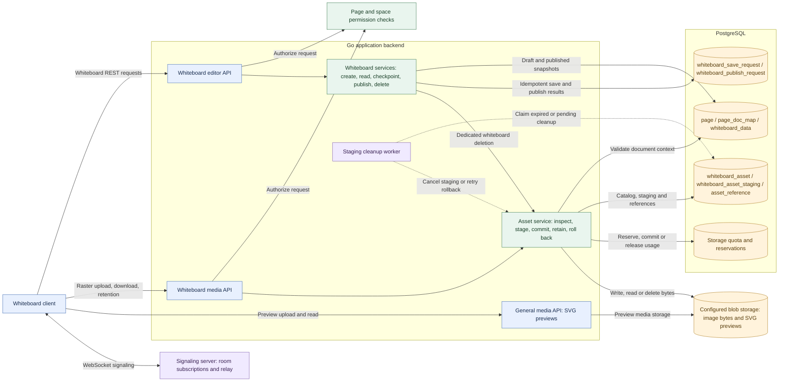

# Whiteboarding in Beskar: UI and backend knowledge base

Based on the repository implementation inspected on 11 September 2026. This document describes application integration: navigation, editor hosting, collaboration, persistence, publishing, assets, permissions, and operations. Glideboard and Glideline drawing tools, rendering, geometry, and package internals are outside scope. Package APIs appear only where the application calls them.

## What a whiteboard is in the application

A whiteboard is a space page with `core.page.type = 'whiteboard'`. It participates in the page hierarchy, sidebar, page permissions, and shared view shell. Its content is a Yjs binary snapshot stored separately from rich-text document content.

Three independent mechanisms govern what users see:

| Mechanism | Purpose | Authority |
| --- | --- | --- |
| Live collaboration | Exchange changes and participant awareness among editors | The editing session's Yjs document and WebRTC peers |
| Draft checkpoints | Recover and durably save ongoing work | Browser IndexedDB for local recovery; PostgreSQL for acknowledged saves |
| Publishing | Make a saved state available to viewers and history | A published `page_doc_map` row and its `whiteboard_data` |

Seeing a collaborator's change does not establish that the server has saved it. Saving a draft does not publish it. Close saves the draft and navigates to the published view; Publish creates a published version and keeps the editor open on a new draft.

## Backend architecture visual

This view covers the backend used by whiteboarding. The client is shown only as a request boundary. Boxes inside the Go application are code modules in the same backend, not separate microservices. PostgreSQL boxes group tables by responsibility; they do not represent separate databases.



Solid arrows show request or storage dependencies; dashed arrows show background cleanup. The signaling server helps peers connect and exchange signaling messages; it does not save whiteboard snapshots. The asset catalog stores metadata and references, while blob storage holds image bytes. SVG previews use the general media path; that path's own metadata tables are omitted here to keep the diagram focused.

The diagram shows the dedicated whiteboard delete service. The shared page view currently invokes the generic page-delete path instead; see **Current integration caveats** for that distinction and for signaling authorization limits.

### Backend checkpoint and publish sequence

This sequence expands the durable write path. Permission, mutable-space, and payload validation occur before the database operations. Each successful write transaction also records its idempotency result, so an identical retry can return the previous acknowledgement.

```mermaid
sequenceDiagram
    participant client as Whiteboard client
    participant api as Whiteboard API and services
    participant db as PostgreSQL

    client->>api: PUT checkpoint: draft ID, expected revision, bytes, digest, request ID
    api->>api: Check permissions, mutable space and payload digest
    api->>db: Begin transaction; check request replay; lock active draft
    alt Expected revision differs
        db-->>api: Current revision and snapshot
        api-->>client: 409 conflict with authoritative state
        client->>client: Merge Yjs state and capture a newer checkpoint
    else Revision matches
        api->>db: Write snapshot; increment revision and sequence; record request result
        api->>db: Commit checkpoint transaction
        api-->>client: Acknowledge draft, revision, sequence and digest
    end

    client->>api: PUT publish using a successfully acknowledged checkpoint
    api->>api: Check permissions, mutable space and payload digest
    api->>db: Begin transaction; check request replay; lock source draft
    alt Saved revision, sequence, bytes or digest differ
        db-->>api: Authoritative checkpoint differs
        api-->>client: 409 conflict; publication stops
    else Checkpoint matches
        api->>db: Mark source draft published; store preview name
        api->>db: Create next draft with the same snapshot at revision zero
        api->>db: Record publish result and commit transaction
        api-->>client: Published document ID, next draft ID, next revision
    end
```

The optional SVG upload happens through the media API before the publish request and outside the publish transaction. After publication, other editors discover the new draft through a peer hint verified by the edit endpoint, or through polling. Full error and retry behavior is described in **Draft saving and recovery** and **Publish and the next draft** below.

Source anchors: `server/editor/editorController.go`, `whiteboardController.go`, `whiteboardService.go`, `whiteboardDurability.go`, `queries.go`; `server/media/controller/mediaController.go`; `server/media/services/whiteboardAssetService.go`, `whiteboardAssetStagingCleanup.go`; `signalserver/main.go`.

## Application entry points

| Entry point | Behavior |
| --- | --- |
| Add Page dialog | Choose Whiteboard, supply a title and optional parent, then create and open the editor |
| `/space/:spaceId/edit/:page` | Fetch page metadata; mount `WhiteboardEditor` when `type` is `whiteboard` |
| `/edit/:spaceId/:page` | Alternate edit entry implemented by `ui/app/edit/[...slug]/page.tsx`; also dispatches by metadata |
| `/space/:spaceId/view/:page` | Load shared page information and capabilities, then embed the whiteboard in read-only mode |
| `/space/:spaceId/whiteboard/:pageId/versions` | List published versions with timestamps and optional preview thumbnails |
| `/space/:spaceId/whiteboard/:pageId/versions/:versionId` | Load one published `docId` into an isolated read-only canvas |

The web and desktop routers both register the history pages. Sidebar page types and internal editor links distinguish whiteboards from documents. The shared view explicitly disables commenting for whiteboards. Its canvas occupies a bordered panel; the edit screen uses a full-height workspace with a title, collaborator indicators, save status, Publish, and Close controls. The home icon follows the same save-before-close flow as Close.

Creation calls `POST /editor/space/{spaceId}/whiteboard/create` with `{title, spaceId, parentId}`. The controller validates identity and title, uses the URL's space ID, checks space `edit_page` permission and mutable-space status, then calls `CreateWhiteboard`. A transaction inserts the page and initial `draft = 1` document mapping. The service also creates the page-to-space permission relationship. No content row is required until the first checkpoint. The response's `data.page` is the page ID used to navigate into editing.

Sources: `ui/app/components/addPage.tsx`, `ui/src/App.tsx`, `ui/src/App.desktop.tsx`, the route components above, and `server/editor/whiteboardController.go` / `whiteboardService.go`.

## How the UI hosts a board

`ui/app/components/WhiteboardEditor.tsx` owns the application session. Its main responsibilities are loading the correct document, owning a `Y.Doc`, establishing collaboration, constructing persistence and asset adapters, handling Publish/Close, and showing status.

Startup proceeds as follows:

1. Derive `spaceId` and `pageId` from the route and use `spaceId:pageId` as the board session key.
2. Fetch `/whiteboard/{pageId}/edit` for editing or `/whiteboard/{pageId}` for viewing, using the configured API base and credentials.
3. Reject a response whose page or space identity does not match the requested session.
4. For editing, hydrate local recovery for the returned draft `docId`. Merge the server's base64-decoded Yjs update into the document.
5. Construct the durability coordinator using the draft ID, server revision, digest, server update sequence, HTTP adapter, and recovery adapter.
6. After database hydration, establish the editing collaboration provider. Attach the board's checkpoint stream once its imperative handle becomes available.

The host passes the board its Yjs document, provider, user identity, board identity, bootstrap revision, `readOnly` policy, asset storage adapter, and document context for asset resolution. Global styles import the board stylesheet through `ui/app/global.css`.

Loading is session-scoped. Aborted or stale responses cannot populate a newly selected board. Cleanup disconnects and destroys the provider, cancels the durability session, and destroys the Yjs document with protection against React StrictMode effect replay. Ordinary unmount uses cancellation; only the explicit Close/Home action guarantees an awaited server flush before navigation.

## Live collaboration and presence

Editable boards use `y-webrtc` with room name `{pageId}-space-{spaceId}` and `filterBcConns: false`. `getSignalingUrl()` uses `VITE_SIGNALING_URL` when set; otherwise it builds a WebSocket URL ending in `/ws` from `VITE_USER_SERVER_URL` or the browser location. This integration does not use the separate `/collab` helper.

The UI fetches `profile/details`, constructs the collaboration identity and display color, and reads provider awareness to display participants. Entries are deduplicated by user ID; up to three avatars are shown alongside the editing count.

The signaling implementation in `signalserver/main.go` manages topic subscriptions and relays signaling messages. Database checkpoint writes go directly from the UI to the editor API. Although the signaling service contains leader election support, this whiteboard host does not gate checkpoint saves on a leader; concurrent editors are reconciled through checkpoint revision checks.

Read-only current views and historical views do not join a live WebRTC provider. They display loaded published state rather than continuously tracking the editing room.

## Draft saving and recovery

The host uses three application classes under `ui/app/core/whiteboard/durability/`:

| Component | Responsibility |
| --- | --- |
| `YjsDurabilityCoordinator` | Track projected state, local recovery, save scheduling, acknowledgements, conflicts, and draft transitions |
| `IndexedDbYjsRecoveryAdapter` | Store and recover local checkpoints in database `beskar-whiteboard-recovery`, object store `checkpoints` |
| `WhiteboardCheckpointHttpAdapter` | Encode state and send revisioned checkpoint requests |

The coordinator consumes checkpoint bytes supplied by the board's projection API, verifies their digest, and tracks the corresponding target and generation. It starts local recovery persistence and normally debounces server saves by 750 ms. Only one save is in flight; a response for older work cannot mark newer work clean.

Local recovery is scoped by API base, space, page, and draft ID. Startup reads the newest recovery generation for that draft. Successful server acknowledgement clears recovery records through the acknowledged generation. If IndexedDB fails, the host uses `UnavailableYjsRecoveryAdapter`; server saving can continue, but local recovery is unavailable. This is not a complete offline-open feature: initial loading still requires the server response to establish the active draft.

### Checkpoint contract

`PUT /editor/space/{spaceId}/whiteboard/{pageId}/checkpoint` accepts:

| Field | Meaning |
| --- | --- |
| `draftId` | Active `page_doc_map.doc_id`, sent as a JSON number |
| `data` | Base64-encoded Yjs state; Go decodes it into `[]byte` |
| `transactionSequence` | Sequence identifying the client projection |
| `stateDigest` | SHA-256 digest of the decoded state |
| `expectedRevision` | Server revision the client expects, represented as a string |
| `clientId`, `requestId` | Client identity and retry identity |

The client ID is persisted under localStorage key `beskar:whiteboard-client-id`, with an in-memory fallback when storage is unavailable.

The backend checks edit permission and mutable-space status, bounds the JSON request to 16 MiB, validates identity and digest, and enters a database transaction. It locks the active draft mapping for the requested page and space. If `expectedRevision` matches, it upserts the snapshot, increments revision and server update sequence, and stores the request result in `core.whiteboard_save_request`.

An identical retry returns the recorded result. Reusing the same request identity with different content returns HTTP 422. A revision mismatch returns HTTP 409 with authoritative revision and state; an inactive draft also returns 409, through a different error response path. Success returns `draftId`, `revision`, and `acknowledgedCheckpoint` containing transaction sequence, digest, and server update sequence. The coordinator validates this acknowledgement before marking the state saved.

The server treats board content as binary state and validates its digest; it does not perform the client-side Yjs conflict merge. When a conflict includes remote state, the host merges remote and local updates, captures a new projection, and retries against the new revision. The coordinator allows up to three merge attempts in one save operation. Unresolved conflicts stop automatic retry. Other save failures use exponential retry with a 500 ms base, a 10-second base-delay cap, and jitter.

### Save indicators

| UI label | Coordinator phase and interpretation |
| --- | --- |
| Saved | `clean`: current tracked generation is acknowledged |
| Saving… | `saving`: checkpoint persistence is in progress |
| Unsaved | `dirty`: newer work awaits acknowledgement |
| Saved locally | `offline`: save failed while the browser reports offline |
| Save conflict | `conflict`: automatic reconciliation did not complete |
| Editing paused | `quarantined`: projection health prevents normal durability processing |
| Save error | `error`: persistence or recovery encountered an error |

The label mapping only reads `phase`. In particular, “Saved locally” is not an independent check that IndexedDB acknowledged the latest write; diagnostics must also inspect `localRecovery` and the recorded error.

## Publish and the next draft

Publishing establishes a specific saved boundary:

1. Acquire a mutation fence, settle the active edit, capture a projection target, and flush that target to the server.
2. If the board contains shapes, export an SVG for that target and upload it to `/api/v1/media/upload` with `pageId`. This preview uses the general media API, separate from whiteboard raster assets.
3. Obtain the acknowledged Yjs bytes and send `PUT /whiteboard/{pageId}/publish` with `data`, `previewAssetName`, `draftId`, `expectedDraftRevision`, `checkpoint`, `clientId`, and `requestId`.
4. Retry an ambiguous transport failure once with the same publish request identity. A 409 stops publishing and tells the user to reload.
5. On success, advance the durability session to the returned next draft and remain in editing mode.

Within one transaction, `PublishWhiteboard` locks the source draft and verifies revision, server sequence, bytes, and digest against the acknowledged checkpoint. It changes that mapping to `draft = 0`, records its preview, creates a new draft mapping, seeds it with the published bytes and digest at revision/sequence zero, and persists an idempotent result in `core.whiteboard_publish_request`. The result contains `publishedDocId`, `nextDraftId`, and `nextRevision`.

The publisher writes a `draftTransition` hint into the shared `glideboard-meta` Yjs map. Other editors verify this hint by fetching the edit endpoint. A five-second poll also checks for an authoritative draft change. The host merges the returned state and adopts the new draft before saving again. The peer message is a hint; the backend response establishes the draft identity.

An HTTP error from the preview upload does not itself stop publication: the UI can publish with an empty preview name. A thrown upload/network error does stop the surrounding publish operation. Preview upload occurs before the publish transaction, so it is not atomic with publication.

## Published views and version history

The current view fetches the newest `draft = 0` mapping ordered by version timestamp. The shared page shell loads title, breadcrumbs, capabilities, space status, and other metadata separately; `WhiteboardEditor` then fetches the whiteboard snapshot.

The history list also selects only `draft = 0` rows, newest first. It shows a preview from `/media/image/{previewAssetName}` or “No Preview.” In history URLs, `versionId` is a document mapping ID, not a revision counter.

The historical viewer validates page, space, and document identity, creates a fresh Yjs document, applies the stored update, and mounts the board read-only. It provides a download-only asset adapter and historical document/version context. Invalid Yjs data produces an explicit corrupt-version message. No restore action is implemented by these history components.

## Image assets and media backend

Images on the board use page-scoped immutable identities: `asset:sha256:{64 lowercase hex characters}`. The host resolves them to `/media/whiteboard-asset/{pageId}/{hash}`. The binary object key is `whiteboard-assets/{pageId}/sha256/{hash}`; PostgreSQL stores metadata in `core.whiteboard_asset`.

The current UI uses a staged upload protocol:

| Method and path under `/media` | Purpose |
| --- | --- |
| `POST /whiteboard-asset/{pageId}/{hash}/staging` | Prepare an upload and obtain an ownership token |
| `PUT /whiteboard-asset/{pageId}/{hash}/staging/{token}` | Upload bytes for inspection and staging |
| `POST /whiteboard-asset/{pageId}/{hash}/staging/{token}/commit` | Commit the staged asset to durable storage/catalog |
| `DELETE /whiteboard-asset/{pageId}/{hash}/staging/{token}` | Cancel or compensate the upload |
| `GET /whiteboard-asset/{pageId}/{hash}` | Read an authorized asset |
| `POST /whiteboard-asset/{pageId}/retain` | Retain asset IDs for the document context |
| `DELETE /whiteboard-asset/{pageId}/{hash}` | Roll back an owned, unreferenced durable asset |

The adapter handles retryable commit failures, respects Retry-After, and attempts compensation when completion cannot be established. Cleanup failures are surfaced rather than treated as successful rollback. Portable embedded assets are decoded and imported through the same pipeline. Portable URL references must match a canonical same-origin whiteboard media path without query or fragment before the host sends credentials.

The backend accepts PNG, JPEG, and WebP. It verifies encoded bytes against MIME type, SHA-256 identity, and image dimensions. Limits are 20 MiB encoded bytes, 16,384 pixels per dimension, and 64,000,000 total pixels. Asset storage participates in space quota reservation/accounting. Asset reads require page view permission; upload, retention, and rollback routes require edit permission, with ownership checks for token operations and rollback.

`RetainWhiteboardAssetReferences` verifies that the document belongs to the page and that each asset exists, then upserts `core.asset_reference` entries for draft or published documents. Retention is additive here: removing a shape does not automatically delete its media object. Rollback refuses to delete referenced assets, protecting content needed by retained documents/history.

`WhiteboardAssetStagingCleanupWorker`, started by `server/main.go`, processes abandoned staging and pending durable cleanup with persisted retry metadata. Defaults:

| Environment variable | Default |
| --- | --- |
| `WHITEBOARD_STAGING_CLEANUP_ENABLED` | `true` |
| `WHITEBOARD_STAGING_CLEANUP_INTERVAL` | `1m` |
| `WHITEBOARD_STAGING_CLEANUP_EXPIRY` | `30m` |
| `WHITEBOARD_STAGING_CLEANUP_BATCH_SIZE` | `100` |
| `WHITEBOARD_STAGING_CLEANUP_MAX_ATTEMPTS` | `8` |
| `WHITEBOARD_STAGING_CLEANUP_MAX_BACKOFF` | `1h` |
| `WHITEBOARD_STAGING_CLEANUP_DRAIN_TIMEOUT` | `5s` |

Sources: `WhiteboardEditor.tsx`, `server/media/controller/mediaController.go`, `server/media/services/whiteboardAssetService.go`, `whiteboardAssetStagingCleanup.go`, and `server/storage/keys.go`.

## Backend API and data model reference

Editor routes below are relative to `/api/v1/editor/space/{spaceId}` in the normal deployment. UI API helpers can resolve a configured base.

| Method | Path | Required permission |
| --- | --- | --- |
| POST | `/whiteboard/create` | Space `edit_page` |
| GET | `/whiteboard/{pageId}` | Page `view` |
| GET | `/whiteboard/{pageId}/edit` | Page `edit`; mutable space |
| PUT | `/whiteboard/{pageId}/checkpoint` | Page `edit`; mutable space |
| PUT | `/whiteboard/{pageId}/publish` | Page `edit`; mutable space |
| GET | `/whiteboard/{pageId}/versions` | Page `view` |
| GET | `/whiteboard/{pageId}/versions/{docId}` | Page `view` |
| DELETE | `/whiteboard/{pageId}` | Page `delete`; mutable space |

| Table | Role |
| --- | --- |
| `core.page` | Stable page ID, space, owner, hierarchy, whiteboard type |
| `core.page_doc_map` | Title, owner, version timestamp, and draft/published identity; partial unique index permits one active draft per page |
| `core.whiteboard_data` | Snapshot bytes, preview name, revision, digest, server update sequence, update timestamp, keyed by document mapping |
| `core.whiteboard_save_request` | Checkpoint replay result, scoped by draft, owner, client, request |
| `core.whiteboard_publish_request` | Publish replay result, scoped by page, owner, client, request |
| `core.whiteboard_asset` | Immutable asset metadata keyed by page and content hash |
| `core.whiteboard_asset_staging` | Token ownership, staged upload state, quota and cleanup metadata |
| `core.asset_reference` | Retained media references for document contexts |

The base whiteboard schema is in `db/beskar/updates/space.xml`. Versioning, durability, and assets are extended by `whiteboard_versioning.xml`, `whiteboard_durability.xml`, and `whiteboard_assets.xml`, included from `db/beskar/update.xml`. `version` is a timestamp; `revision` is a per-draft concurrency counter. Page ID remains stable as each publication creates a new draft `docId`.

## Current integration caveats

These are observations from source inspection, not results of a deployment test:

- **Never-published view:** the published endpoint returns title-only data or null when no published version exists. The whiteboard host requires matching `pageId` and `spaceId`, so this response currently reaches its load-error path. Closing a newly created but unpublished board can therefore show “Error loading whiteboard.”
- **Older update code:** `updateWhiteboard` / `UpdateWhiteboard` still exist, but the editor router registers the checkpoint endpoint and no legacy update route. Comments describing draft creation on the next autosave describe the older path. Current publishing creates the next draft transactionally. The edit loader's published fallback does not itself create a missing draft.
- **History authorization binding:** the version controller checks permission for URL `pageId`, but the version query filters by `docId`, `spaceId`, and published status without binding the queried document to that page ID. The frontend rejects mismatched identities, but that is not a server authorization boundary.
- **Signaling authorization:** `signalserver/main.go` makes connection authentication conditional on `AUTH_SERVER_URL`; when absent it skips that check. Its topic-subscribe branch does not perform a page permission check. Do not assume the editor REST permission checks also authorize room membership.
- **Deletion paths differ:** the shared view's Delete action calls `/editor/space/{spaceId}/page/{pageId}/delete`, which invokes `DeleteDocument`. The dedicated whiteboard delete service separately enumerates asset object keys, releases quota, deletes the page transactionally, and attempts object cleanup after commit. The shared delete service does not call that dedicated cleanup path; equivalent object cleanup should not be assumed.
- **History navigation:** the inspected shared view/editor controls do not expose a history action. History routes exist, but the historical viewer's Back button targets `/space/{spaceId}/whiteboard/{pageId}`, which is not registered as a base whiteboard route in the inspected web/desktop routers.
- **Recovery and navigation:** explicit Close awaits a server checkpoint and stays in the editor on failure. Tab closure or arbitrary route unmount has no equivalent awaited save guarantee. Recovery is draft-scoped and is not automatically loaded from a superseded draft ID.

## Troubleshooting guide

| Symptom | First checks |
| --- | --- |
| Board fails to load | Metadata dispatch; published versus edit endpoint; response identity; permissions; never-published caveat |
| Peers do not appear | Resolved signaling URL, `/ws` connection, room identity, signaling authentication; confirm the board finished hydration |
| Changes appear live but disappear on reopening | Check checkpoint responses and acknowledgements independently of WebRTC; inspect recovery state and active draft ID |
| Repeated 409s | Compare draft ID and expected revision with the edit response; check peer transition verification/polling and conflict response shape |
| Publish stops | Inspect the preceding checkpoint, SVG upload, publish precondition response, and whether another editor advanced the draft |
| Blank history thumbnail | Check `preview_asset_name` and general media upload; a missing preview does not establish missing board content |
| Historical images fail | Inspect page/hash media requests, view permission, asset catalog/storage object, and retained document references |
| Upload rollback or quota remains pending | Inspect staging status, cleanup attempts/errors, object storage availability, quota records, and cleanup-worker logs |

## Source and verification map

Start with `ui/app/components/WhiteboardEditor.tsx` for orchestration, then follow the durability directory, `server/editor/whiteboardController.go`, `whiteboardService.go`, `whiteboardDurability.go`, `whiteboardValidations.go`, and `queries.go`. Media integration lives in the controller and services listed above. Shared deletion is in `server/editor/editorService.go`.

Existing tests provide executable examples of intended behavior:

- `ui/app/components/__tests__/WhiteboardEditor.test.tsx`: load modes, session changes, staged media, retry/compensation, autosave, and Close/Publish integration.
- `ui/app/core/whiteboard/durability/YjsDurabilityCoordinator.test.ts`: acknowledgement ordering, idempotency, conflicts, and draft transitions.
- `server/editor/whiteboardDurability_test.go`: checkpoint/publish validation and request hashing.
- `server/media/services/whiteboardAssetService_test.go`, `whiteboardAssetService_phase3_coverage_test.go`, and `whiteboardAssetStagingCleanup_test.go`: asset validation/storage, retention/rollback, and cleanup behavior.

This documentation change was checked against source and route registrations. The application and test suites were not run as part of writing it.
