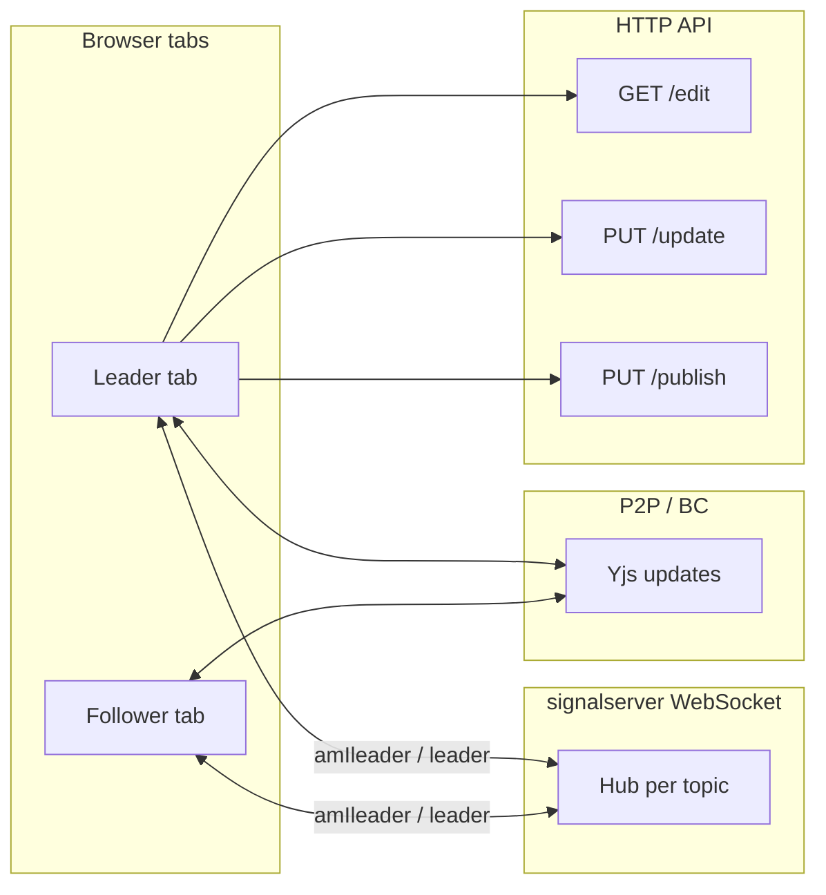
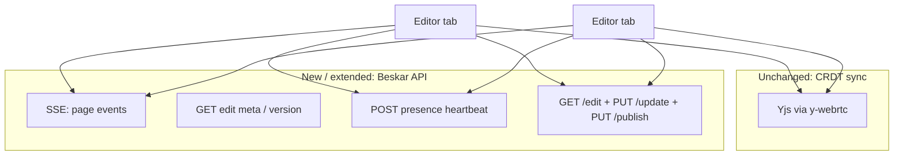

# Document collaboration: leader election, draft sync, and UI awareness

This document captures the **issues** observed when multiple users edit the same document over **Yjs + y-webrtc**, the **root causes** in the Beskar stack (`ui`, `signalserver`, editor APIs), and **recommended fixes** that do **not** require moving document sync onto a dedicated WebSocket document channel (see [§8. Constraints and non-goals](#8-constraints-and-non-goals)). It also specifies **server → client control events** via **SSE (Server-Sent Events)** with **portable fallbacks** for proxies and for **mobile / desktop** shells, plus **client → server heartbeats** for presence and stale-leader detection—without using SSE for Yjs bytes.

**Primary code touchpoints**

| Area | Path |
|------|------|
| Editor shell, leader gate, fetch/save | `ui/app/components/DocumentEditor.tsx` |
| Header / collaborator pills | `ui/app/core/editor/header/header.tsx` |
| Signaling hub, leader election | `signalserver/main.go` |
| Draft load / update / publish APIs | `server/editor/` (controllers + `editorService.go`) |
| Yjs transport | `y-webrtc` (signaling over WebSocket; updates over WebRTC / BroadcastChannel) |
| Control-plane push (proposed) | Beskar **app** HTTP: SSE stream + optional meta/presence endpoints (not `signalserver`) |

---

## 1. Executive summary

Today, **only the client that believes it is `isLeader`** loads the canonical draft from `GET …/edit` (once per local fetch gate) and persists via `PUT editor/update`. Other participants rely on **Yjs** replicated over **WebRTC** (and optionally BroadcastChannel). Leadership is decided by **`signalserver`** using a **non-deterministic** “first client in a Go map” rule, and re-election runs on **every** `amIleader` poll. The header shows a **leader star only on the current user when they are leader**, not on the actual leader’s avatar for everyone else. After **publish** or **leader disconnect**, there is **no mandatory HTTP resync** for the remaining editor, so **stale Yjs vs server draft** is possible. A **zombie leader** (tab frozen but signaling TCP still open) may never unregister, blocking handoff and persistence from others.

**Recommended direction (no new document WebSocket):**

1. **Signalserver:** deterministic, sticky leader; re-elect only when membership changes; optional **application ping** to evict unresponsive signaling clients; include **`leaderId`** (or stable session id) in `leader` messages; always serialize **`isLeader` true/false** explicitly.
2. **Beskar app server (control plane):** **SSE** (or equivalent) subscription per **page** (or space) so the server can push **`document.published`**, **`draft.version`** (or new `docId` / etag), and optionally **coarse presence**—driving **metadata sync** and optional **meta `GET`**; **body** stays **collaborative `ydoc`** (implementation-plan **§14.1**). Implement **`subscribePageEvents`** with SSE and **falls back** to long poll or short poll (see [§6](#6-server-push-sse-presence-heartbeats-and-portable-fallbacks)).
3. **Client → server heartbeats:** **POST presence** (or extend existing authenticated APIs) while the editor is focused / foregrounded so the **app server** can detect inactive or zombie editors and emit **`editor.inactive`** or bump **draft generation**—complements WebRTC-only liveness.
4. **UI (`DocumentEditor`):** on **`document.published`** (SSE or fallback) and **leadership transitions**, sync **ids/generation** (and **meta `GET`** as needed); **do not** rebuild body from published doc—**`ydoc` wins** in edit (§14.1); relax **`isDocumentFetched`** when resyncing metadata; **local publish success** only if publisher stays on edit (not current product).
5. **UI (header + awareness):** derive **`leaderUserId`** for pills from **Yjs awareness** (elected leader’s tab sets a flag + already exposes `user.id`); optional **`leaderClientId`** from signaling for debug only. App-server events are unrelated to “who gets the star.”
6. **Ported clients (mobile / desktop):** use the same **version / event contract** over SSE **or** polling; **refetch on app resume** when SSE cannot run in background.
7. **Testing:** matrix for two-browser publish, leader tab close, signaling drop, frozen tab, **SSE disconnect + fallback**, **mobile background/resume**.

---

## 2. Goals and success criteria

| Goal | Success criterion |
|------|-------------------|
| Stable leadership | With two healthy clients, **one** deterministic leader; no flapping on `amIleader` interval alone. |
| Visible leader | Any user sees **which collaborator** is leader (not only “I am leader”). |
| Draft accuracy | After **any user publishes** (publisher goes to view) or leader **leaves**, **remaining** editors can **reconcile** with server draft without a full page reload. |
| Zombie / stale leader | If leader cannot respond on signaling within **T** seconds, they are removed from the room and another client becomes leader (or solo session persists). **App-level presence** (heartbeats) can surface the same story to the **app server** even when signaling TCP stays open. |
| No doc WebSocket | Document updates stay on **WebRTC/BC + Yjs**; **control** uses **signaling WS** + **HTTP** (load/save) + **SSE (optional)** for server-originated events—not a second socket for Yjs updates. |
| Portable push | **Web:** SSE with polling/long-poll fallback. **Mobile / native shells:** same **event contract** without assuming `EventSource`; **refetch on resume** when push is suspended. |

---

## 3. Current architecture (as implemented)

### 3.1 Data planes

1. **Yjs document (`ydoc`)**  
   Shared CRDT: TipTap collaboration field `default`, plus auxiliary types (`title`, `docId`, `parentId`, `dbLoaded`, etc.).

2. **y-webrtc `WebrtcProvider`**  
   - **Signaling:** JSON messages over **WebSocket** to `signalserver` (subscribe, publish, custom `amIleader`, y-webrtc announce/signal).  
   - **Sync:** Yjs updates between peers over **WebRTC** (and BroadcastChannel when enabled).

3. **HTTP APIs**  
   - `GET editor/space/{space}/page/{page}/edit` — load edit payload (draft Yjs base64 and/or `nodeData`).  
   - `PUT editor/update` — persist draft (leader sends `y.encodeStateAsUpdate(ydoc)` as base64).  
   - `PUT editor/publish` — publish document (WASM-prepared `nodeData` path).

### 3.2 Leader in the UI

- `DocumentEditor` maintains `isLeader` state updated from signaling messages `{ type: "leader", isLeader: bool, topic: string }` received on the raw signaling `WebSocket` (alongside y-webrtc’s use of the same socket via `lib0/websocket`).
- Clients periodically send `{ type: "amIleader", topic: "<pageId>-space-<spaceId>" }` (immediately on connect and every **10 seconds** per signaling connection).

### 3.3 Leader-only server I/O

- **`fetchData()`** (load `/edit`) is invoked only when `isLeader && !isDocumentLoading && !isDocumentFetched` (see `DocumentEditor.tsx`).
- **`updateContent`** → `updateDraftData` (`PUT editor/update`) runs only when `isLeader && isEditorReady`; **only the signaling leader** persists the **draft** snapshot to the backend.

### 3.3a Publish vs draft persist (product rules)

| Action | Who | Server API | UI after success |
|--------|-----|------------|------------------|
| **Publish** | **Any user** in the editor session who triggers publish (same control today: **Update** runs the publish pipeline for whoever clicks it, not leader-gated in the header). | `PUT editor/publish` | **That user** is navigated to the **view** page (`DocumentEditor` redirect on publish success). |
| **Draft autosave / persist** | **Leader only** (`isLeader`). | `PUT editor/update` | Stays on edit (leader continues syncing draft). |

**Implication:** When a **non-leader** publishes, they **leave** edit mode while **others (including the leader) remain in edit**. **Remaining** tabs must handle **`document.published`** by updating **`docId` / draft generation** (and related metadata) while **keeping collaborative `ydoc` as body source of truth**—today this path is easy to miss because the publishing tab unmounts and only **followers** need the update.

### 3.4 Non-leader editor unlock

- Non-leaders set `isEditorReady` when they receive Yjs updates with `origin === provider` (remote WebRTC), or after a timeout fallback.

### 3.5 Mermaid: high-level flow

### 3.6 Target architecture (proposed): app SSE + existing P2P

Yjs **content** stays on WebRTC/BC. **Authoritative server events** (publish, draft generation, optional presence summaries) use a **separate Beskar app HTTP** channel so followers do not depend solely on the leader’s tab for “something changed on the server.”

---

## 4. Observed issues (symptoms)

1. **Stale draft**  
   Two or more users edit; **one user publishes** (leader or not) and **navigates to view** while **others stay in edit**. Remaining editors keep a Yjs session that **does not match** the latest server draft / `docId` after publish, and further work does not align with the latest draft on the server.

2. **Leader not visible on pills**  
   Non-leader users do not see **who** is leader on collaborator avatars.

3. **Follower never becomes leader (or leadership feels random)**  
   After leader leaves or in steady state, the other user sometimes **does not** get persistence/fetch behavior, or leadership **appears unstable**.

4. **Stale / zombie leader**  
   If the leader’s tab **hangs** but the signaling connection stays open, others may remain followers with **no saves** indefinitely.

---

## 5. Root cause analysis

### 5.1 Non-deterministic leader on the hub

**Location:** `signalserver/main.go` — `electLeaderInternal`.

The hub chooses the leader by iterating `map[*Client]bool` and taking the **first** entry, then breaking. In Go, **map iteration order is randomized** and is **not** stable across calls.

**Consequences**

- Every call to `electLeaderInternal` (on `subscribe`, **`amIleader`**, and `unregister`) may pick a **different** `*Client` as leader even if the **same set** of clients is still connected.
- With a **10s** `amIleader` poll per signaling socket, leadership can **flip** between users without disconnects, which breaks mental model (“who saves?”) and interacts badly with **`isDocumentFetched`** and “fetch once” patterns.

### 5.2 Leader-only load and save

**Location:** `DocumentEditor.tsx`.

- Non-leaders **never** call `fetchData()` under the current leader gate.
- Non-leaders **never** call `updateDraftData`.

**Consequences**

- Server draft truth is **only** advanced by the leader’s Yjs snapshot when they save.
- After **publish** (by **any** user), the server’s published (and possibly draft) state can change **without** **remaining** edit tabs re-reading `/edit`—especially when the **publisher** left the page (no local “publish success” handler on that client for others).
- If the follower **never** becomes leader (or becomes leader late / incorrectly), they lack both **authoritative merge** from the API and **persist** capability.

### 5.3 No lifecycle-driven HTTP resync

There is no dedicated path that says: “**someone** published (while I stayed in edit),” “leader signaling client left,” or “I just became leader → **force** `GET …/edit` and merge.”

The leader effect depends on `isDocumentFetched`; a user who was briefly non-leader may have state that does not align with “I must refetch now that I am the only writer.”

### 5.4 Header UI only marks self

**Location:** `ui/app/core/editor/header/header.tsx`.

The star renders when `isLeader && collaborator.id === currentUserId`. There is **no** `leaderUserId` (or equivalent) for other collaborators.

**Consequence:** Non-leaders never see a leader badge on the **actual** leader’s pill.

### 5.5 JSON `omitempty` on `IsLeader`

**Location:** `signalserver/main.go` — `Message` struct `IsLeader bool \`json:"isLeader,omitempty"\``.

For `false`, the field may be **omitted**. In JavaScript, missing reads as `undefined` (falsy), so `setIsLeader(false)` still works in the typical `if (data.isLeader) … else …` pattern. This is a **contract clarity** issue more than a primary bug, but explicit `false` is safer for logging and future clients.

### 5.6 Stale leader without signaling disconnect

**Location:** behavior of hub + browser.

The hub only removes a client when the WebSocket **read pump exits** (close/error). A **frozen** tab may keep the socket **open**, so the leader remains in the map → **no** `unregister` → **no** re-election → followers stay `isLeader: false` → **no** `PUT /update`.

There is **no** separate “leader liveness” or “document heartbeat” in `DocumentEditor`; liveness is implicit in **TCP/WS + polling**.

---

## 6. Server push (SSE), presence heartbeats, and portable fallbacks

This section folds in the **SSE** approach, **why it does not replace WebRTC**, **client → server presence**, **when SSE fails**, and **mobile / desktop ports**—so implementation can proceed without assuming every shell has `EventSource` or streaming-friendly proxies.

### 6.1 Problem SSE solves here

SSE gives the **Beskar app server** a way to **push** small, authoritative facts to every subscribed editor for a page:

- **Publish completed** → remaining tabs: sync **`docId` / generation / title** from event or **meta** `GET`; **collaborative `ydoc` remains source of truth for body** (no default rebuild from published `nodeData`); optional additive **`safeMerge`** only if ingesting server draft Yjs (see implementation-plan **§14.1**).
- **Draft generation changed** (new row, version bump, etag) → any tab whose local state may be stale should **refetch or at least compare** server meta before persisting.

SSE is **one-way (server → browser)**. It does **not** carry Yjs binary updates; **y-webrtc** remains the CRDT transport.

### 6.2 Suggested event contract (illustrative)

Define a stable **JSON payload** per `event:` line (or single `data:` JSON) so **web, mobile, and desktop** can share parsers:

| Event name | When emitted | Payload (example fields) | Client action |
|------------|--------------|---------------------------|---------------|
| `document.published` | After successful `PUT /publish` | `pageId`, `spaceId`, `docId`, `draftVersion` or `contentGeneration` | Refetch `/edit`, merge, refresh header state. |
| `draft.updated` | After **each** successful `PUT /update` (UI already **~10s debounces** before calling update—see `ui/app/core/editor/tiptap.tsx` `useDebounce(..., 10000)`); avoid a **second** 10s server debounce unless non-UI clients burst saves | `pageId`, `draftVersion`, `updatedAt` | If local draft generation lags server: refetch or warn before next save. |
| `presence.summary` (optional) | Throttled | Active editor count, optional `activeUserIds` | UI only; does not replace y-webrtc awareness cursors. |
| `editor.inactive` (optional) | Heartbeat timeout for a session | `userId` or opaque session id | Product policy (e.g. banner “co-editor may be offline”). |

Exact names and fields are product decisions; the important part is a **versioned contract** reused by **SSE and polling fallbacks**.

### 6.3 Client → server: presence and “active”

Because SSE does not accept client uploads on the same connection, **activity** must use separate HTTP calls:

- **`POST …/pages/{id}/presence`** (or heartbeat on an existing session endpoint) on an interval while the editor is **focused / foregrounded**, with **backoff** when hidden.
- Server stores **lastSeen** per `(userId, pageId)` or per **opaque edit session**.
- Server may emit **`editor.inactive`** over SSE to other subscribers after threshold **T**.

This addresses **zombie leader** in the **product** sense: even if **signaling WebSocket** stays open, the **app server** can mark the leader’s edit session stale and drive UX or **policy** (e.g. suggest refetch, or coordinate with improved signalserver eviction—both layers are complementary).

### 6.4 Client abstraction: one API, multiple transports

Implement **`subscribePageEvents({ pageId, spaceId, onEvent, onTransport })`** (name illustrative) in shared client code:

1. **Try SSE** (`EventSource` or `fetch` + `ReadableStream` line parser) to `GET /api/.../pages/{id}/events` with auth cookies / bearer as appropriate.
2. **Detect failure:** connection error, no events within timeout, or **first-line** health check fails → fall back.
3. **Fallback A — long poll:** `GET .../events?wait=25s` returns when something changed or times out; loop.
4. **Fallback B — short poll:** `GET .../edit/meta` (or `/edit` with `Prefer: minimal` if added) every **N** seconds while editor mounted and visible.

All transports **normalize** to the same **`onEvent({ type, ...payload })`** shape as in §6.2.

### 6.5 When SSE is “not supported” (web and infra)

| Class | What goes wrong | Mitigation |
|-------|------------------|------------|
| **Browser has no `EventSource`** | Rare in modern desktop browsers; possible in some embedded WebViews | Use **fetch streaming** parser or go straight to **long poll / short poll** (§6.4). |
| **Proxy / nginx buffering** | `text/event-stream` buffered until disconnect; events appear late or batched | **Nginx:** `proxy_buffering off` (and related) for the SSE route; confirm **chunked** delivery in staging. |
| **Corporate middleboxes** | Long-lived GET distrusted | Same as **fallback** path; treat as ops requirement, not code-only. |
| **HTTP/1.1 connection limits** | Many tabs × SSE | Prefer **HTTP/2** to origin; cap concurrent editor SSEs per tab policy. |

Correctness must not depend on SSE alone: **fallback must deliver the same semantic events**, only with higher latency or cost.

### 6.6 Mobile apps and desktop ports (React Native, Flutter, Electron, WebView)

| Shell | Typical `EventSource` | Recommended approach |
|-------|----------------------|------------------------|
| **Desktop Electron** | Chromium — usually **yes** | SSE primary + fallback as in §6.4. |
| **Tauri / WebView2 / WKWebView** | Often **yes** (engine-dependent) | Same; validate in CI on target WebView versions. |
| **React Native** | **No** standard `window.EventSource` | **Polyfill**, **fetch stream**, or **default to long/short poll** for the same event JSON. |
| **Flutter / native** | **No** built-in SSE | **Dart HTTP** stream reader or **poll** the meta endpoint. |
| **Capacitor / Ionic** | WebView — often **yes** | Still add **resume refetch** (below). |

**Background / suspend:** On mobile, **SSE pauses or dies** when the app is backgrounded. Always **refetch `/edit` (or meta) on `resume` / foreground** and reconcile with `ydoc` so correctness holds even if zero SSE events were delivered while backgrounded.

**Optional:** For “document published” while app was killed, **push notifications** (APNs / FCM) can deep-link to view mode; in-editor recovery remains **HTTP refetch**.

### 6.7 Relation to phased work elsewhere

- **§7 Phase A** (signalserver) remains the source of **P2P room leader** for who may hit **`PUT /update`** in today’s model unless product moves write authority to the app server.
- **§7 Phase B** should treat **SSE (or fallback) `document.published` / `draft.updated`** as first-class triggers alongside leadership transitions (publisher’s **local** publish callback is secondary—see §3.3a).
- **§7 Phase D** formalizes **Beskar app** SSE stream, meta endpoint, presence heartbeat, nginx, and shared **`subscribePageEvents`** (§6.4).
- **§7 Phase E** is the expanded **testing / rollout** matrix (SSE failure, mobile resume, idempotent double triggers).

---

## 7. Recommended fixes (phased)

### Phase A — Signalserver (highest leverage, smallest UX dependency)

| Item | Description |
|------|-------------|
| **A1. Deterministic election** | Define a total order over clients in a topic (e.g. stable `clientId` assigned at hub on register, or first-seen monotonic order). Elect `min(id)` or “longest connected.” **Do not** use `for range map` break as the sole rule. |
| **A2. Sticky re-election** | Recompute leader only when **membership changes** (join/leave) or when **explicit** `amIleader` is desired for recovery—not necessarily on every periodic poll if leader unchanged. |
| **A3. Leader identity in message** | Extend `leader` JSON with **`leaderClientId`** (hub-assigned) and optionally map to **`userId`** if the hub can authenticate and attach it later; at minimum, pills can show “session leader” or correlate after login metadata. |
| **A4. Explicit `isLeader`** | Remove `omitempty` from `isLeader` or always send both `isLeader` and `leaderClientId` so payloads are self-describing. |
| **A5. Signaling liveness** | Require periodic **ping/pong** or `amIalive` on the signaling connection; if no response within **T**, **close** the connection server-side or mark client dead and **unregister**. This addresses **zombie** leaders without a document WebSocket. |

**Note:** y-webrtc’s `lib0/websocket` already implements ping/pong toward the signaling server; validate whether Beskar’s `signalserver` answers `ping` with `pong` and whether timeouts evict dead peers. If not, align hub behavior with that client or add a parallel app-level ping.

### Phase B — `DocumentEditor.tsx` (draft truth and handoff)

| Item | Description |
|------|-------------|
| **B1. Refetch on leadership gain** | When `isLeader` transitions **false → true**, call **`fetchData()`** (or equivalent) even if `isDocumentFetched` was previously true, **unless** you can prove `ydoc` is already aligned (version vector / `docId` / server etag). Pragmatic approach: **refetch whenever becoming leader** and merge via existing `safeMerge` rules, with care for duplicate empty paragraph cases already handled. |
| **B2. After publish (remaining editors)** | **`document.published`** from SSE (or poll) is the **primary** signal. Apply **metadata** from payload / **meta `GET`**; **do not** replace body from published snapshot (**§14.1**). Optional **local** handler if publisher ever stays on edit; **`visibilitychange` / app resume`** + meta as backup. |
| **B3. Refetch on peer loss (optional)** | On y-webrtc `peers` / awareness drop suggesting the last known leader left, trigger refetch for the tab that becomes leader (pairs with Phase A). |
| **B4. Document version / etag (optional, server)** | Return a **monotonic draft version** or `updatedAt` from `/edit`; UI refetches when version changes. Reduces blind merges. |

### Phase C — Header and awareness (who is leader)

| Item | Description |
|------|-------------|
| **C1. Resolve `leaderUserId` for pills** | **Primary:** when `isLeader`, set **`saveLeader` (or similar) in `provider.awareness`**; followers scan awareness states and take **`user.id`** from the peer with that flag → **`leaderUserId`**. **Secondary:** parse **`leaderClientId`** from signaling JSON only for debugging—not required to match pills to avatars. |
| **C2. Awareness consistency** | Same as C1; optional extra **`leaderId` string** in awareness if you want redundancy—keep one source of truth to avoid drift. |
| **C3. Header change** | Render star when `collaborator.id === leaderUserId` (or matches session id), not only `isLeader && self`. |

### Phase D — Beskar app server: SSE, meta, presence (control plane)

| Item | Description |
|------|-------------|
| **D1. SSE stream** | Authenticated `GET` stream (`text/event-stream`) scoped by **page** (and tenant/space); emit **`document.published`** after publish transaction commits; emit **`draft.updated`** after **each** successful **`PUT /update`** (client already throttles saves—see implementation-plan **§8.4** / **E.4**). |
| **D2. Fan-out** | On publish/update, **`PUBLISH`** to **Redis Pub/Sub** (existing stack); each API instance **subscribes** and forwards to **local** SSE connections only—in-memory map per process for active writers. |
| **D3. Meta / version endpoint** | Lightweight **`GET …/edit/meta`** (or headers on `/edit`) returning **`draftVersion`**, **`docId`**, **`updatedAt`** for cheap polling fallback and client-side “do I need full refetch?” |
| **D4. Presence heartbeat** | **`POST …/presence`** (or reuse session API) from editor while active; drive optional SSE **`editor.inactive`** and product UX; complements signalserver-only liveness. |
| **D5. Infra** | **Nginx (or proxy):** disable buffering for SSE route; verify chunked delivery in staging. **Auth:** SSE must use same session model as API (cookies or bearer). |
| **D6. Client module** | Shared **`subscribePageEvents`** (§6.4): SSE → long poll → short poll; identical event JSON for **web and ported apps**. |

### Phase E — Testing and rollout

| Scenario | Expected |
|----------|----------|
| Two users, steady edit | One stable leader; star on leader pill for both; follower edits appear in leader Yjs; **leader** `PUT /update` updates DB draft. |
| **Anyone** publishes and navigates away | **SSE `document.published`** reaches **remaining** editors; **ids/generation** match server; **body remains live `ydoc`** (§14.1). |
| Publisher would stay on edit | **Not in current product:** every publisher navigates to view; idempotent merge still matters for **SSE + refetch** race on **followers**. |
| SSE blocked / buffered | Client falls back to **long or short poll**; eventual refetch still correct. |
| Leader closes tab | Re-election; new leader refetches and can save. |
| Leader frozen 30s+ | Signaling liveness **and/or** presence heartbeat gap; follower becomes leader or at least **warn + refetch** per product policy. |
| Rapid reconnect | No duplicate paragraphs; `safeMerge` / `dbLoaded` invariants hold. |
| **Mobile: background then resume** | After resume, **meta or full `/edit` refetch** runs even if SSE missed events while suspended. |
| **React Native / Flutter** | Polling or stream parser receives same events as web SSE path. |

---

## 8. Constraints and non-goals

- **In scope:** Fixes using **existing signaling WebSocket**, **WebRTC/BC**, **HTTP** load/save, and **Beskar app SSE (or equivalent push)** for **control events only** (publish, draft version, optional presence)—plus **portable fallbacks** (§6).
- **Still out of scope:** Using SSE (or any HTTP stream) to ship **Yjs update bytes** at volume; CRDT sync remains **y-webrtc** (or a future dedicated sync server if product chooses).
- **Out of scope for this doc (optional later):** Replacing y-webrtc with **Hocuspocus** or a **central Yjs sync server** over a dedicated document WebSocket—valuable for strict server authority, but not required to fix election + resync + UI gaps described here.

---

## 9. Risks and mitigations

| Risk | Mitigation |
|------|------------|
| **Double content** after refetch | Reuse and harden `safeMerge` / `dbLoaded` / fragment clear paths; add tests for “became leader twice” and **SSE + local publish both firing**. |
| **Edit vs view divergence** | **Resolved policy:** in **edit**, **`ydoc` wins** for body; **view** reads published server truth—document for users if they compare tabs until leader **`PUT /update`**. |
| **Awareness vs malicious client** | Any peer could spoof `saveLeader` in theory; **save authority** still gated by **`isLeader` from signalserver** + **`PUT /update`**. For pills, awareness is enough for trusted collaborators; add server-attested leader only if product requires anti-tamper display. |
| **SSE never connects in prod** | Treat as **P1** ops issue; **fallback** must pass CI; monitor transport mode (`sse` vs `poll`) in analytics. |
| **Duplicate SSE + tab sleep** | **Idempotent** event handling (`eventId` / monotonic generation in payload); **resume refetch** on mobile/desktop. |
| **Subscriber scale** | Fan-out cost per event; use **shared pub/sub** if many editors per page or many pages. |

---

## 10. Related internal documents

- Inline comments / editor package work under `new-features/inline-comments/` (orthogonal but same editor surface).
- `new-features/document-version-cleanup/` if draft/version semantics evolve alongside refetch.

---

## 11. Revision history

| Date | Author | Notes |
|------|--------|-------|
| 2026-05-04 | Engineering | Initial document from collaboration incident analysis (leader election, stale draft, UI pills, zombie leader). |
| 2026-05-04 | Engineering | Added §6 SSE + presence + portable fallbacks (web infra, mobile/desktop ports); Phase D/E split for app control plane; expanded goals, risks, constraints, and target diagram §3.6. |
| 2026-05-04 | Engineering | Phase **D2** fan-out: standardize on **existing Redis Pub/Sub** for multi-replica SSE (aligned with implementation-plan.md). |
| 2026-05-04 | Engineering | **Phase C / pills:** `leaderUserId` for UI resolved via **awareness** (leader’s `user.id`); signalserver **`leaderUserId` not required** (see implementation-plan open decision #2). |
| 2026-05-04 | Engineering | **§3.3a Publish vs draft:** anyone may **publish** (→ view); only **leader** `PUT /update`; symptoms + Phase E + exec summary aligned. |
| 2026-05-04 | Engineering | **`draft.updated`:** emit **per successful `Update()`**; UI already **~10s debounces** before `PUT` (`tiptap.tsx`); **no** default second server debounce (§6.2 + Phase **D1**). |
| 2026-05-04 | Engineering | **Merge / publish:** **`ydoc` source of truth** in edit—no default rebuild from published; implementation-plan **§14.1**; §6.1 publish bullet + risks. |
