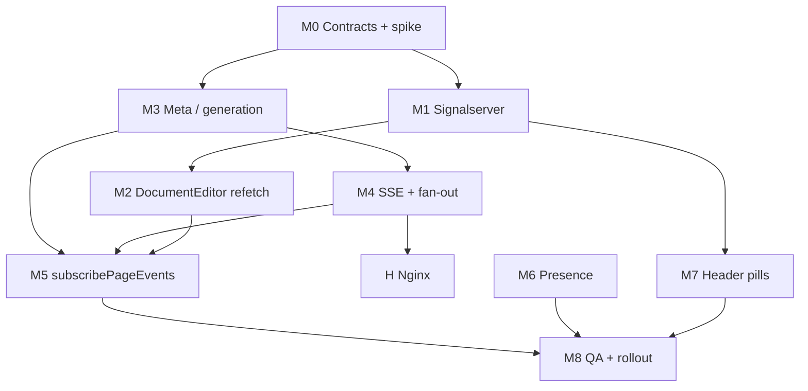

# Implementation plan: document collaboration (leader, draft sync, SSE control plane)

This document is the **execution-oriented** companion to [design-leader-election-draft-sync.md](./design-leader-election-draft-sync.md). It orders work, defines deliverables and acceptance criteria, and calls out dependencies, rollout, and open decisions.

**Design reference:** [design-leader-election-draft-sync.md](./design-leader-election-draft-sync.md) (root causes, target architecture §3.6, SSE §6, phased recommendations §7).

**Primary repos / packages**

| Layer | Location |
|-------|----------|
| Signaling | `signalserver/main.go` |
| Editor HTTP API | `server/editor/` (`editorController.go`, `editorService.go`, `Router()` mounted at `/api/v1/editor` in `server/main.go`) |
| Next.js UI | `ui/app/components/DocumentEditor.tsx`, `ui/app/core/editor/header/header.tsx` |
| Reverse proxy | `docker/templates/nginx*.conf.tmpl` (or equivalent for your env) |
| **Page events fan-out** | **Redis Pub/Sub** (existing stack)—see §8 |

---

## 1. Guiding principles

1. **Ship signalserver + UI refetch fixes first** where possible—they remove nondeterministic leadership and stale state without depending on SSE.
2. **SSE and meta are additive:** correctness must hold when **feature flag disables SSE** (fallback = poll or “refetch on leadership + publish callback only”).
3. **One event JSON contract** for `EventSource`, long poll, short poll, and future native apps (version field on every payload).
4. **Do not stream Yjs** over SSE; control events only.
5. **Use Redis for page-event fan-out from day one:** `PUBLISH` after publish/update so **every API replica** receives the same message and forwards only to **local** SSE connections (see §8.3).
6. **Collaborative `ydoc` is the source of truth for document body** while in edit: after **`document.published`**, sync **server metadata** (`docId`, generation, title if needed)—**do not** rebuild the editor from the published snapshot or replace the ProseMirror fragment wholesale by default (see **§14.1**).

### 1.1 Product rules (authoritative for this initiative)

| Rule | Detail |
|------|--------|
| **Publish** | **Any** user in the editor may complete **publish** (`PUT editor/publish`). On success, **that user’s** app **navigates to the view** page. |
| **Co-editors** | **All other** users **remain in edit** mode when someone else publishes. |
| **Draft persist** | Only the **signaling leader** (`isLeader`) may call **`PUT editor/update`** (draft Yjs snapshot). Non-leaders never hit this API in the current model. |
| **Why SSE / refetch** | The **publisher** unmounts edit UI; **remaining** tabs do not run the publisher’s “success” callback—they need **`document.published`** (or poll/meta) to **refetch `/edit`** and merge. |

---

## 2. Milestones at a glance

| Milestone | Goal | Depends on |
|-----------|------|--------------|
| **M0** | Contracts frozen (event schema v1, meta shape); spike: signalserver `ping`/`pong` vs lib0 client | — |
| **M1** | Deterministic sticky leader + leader id in JSON + explicit `isLeader` | M0 spike |
| **M2** | `DocumentEditor` refetch/merge on leadership gain, publish (local), optional visibility/resume | M1 (for leader flip); partially parallel with M3 |
| **M3** | `GET …/edit/meta` (or extended `GET …/edit`) with `draftGeneration` / `docId` / `updatedAt` | DB/service clarity |
| **M4** | SSE hub + **Redis Pub/Sub** fan-out + publish/update notify + nginx | M3 for meta; **reuse existing Redis** in `server/`; auth reuse from editor routes |
| **M5** | `subscribePageEvents` + wire into `DocumentEditor` + idempotent handlers | M2, M4 |
| **M6** | Presence `POST` + optional `editor.inactive` SSE | M4 |
| **M7** | Header `leaderUserId` / `leaderClientId` pills | M1 (signalserver fields) |
| **M8** | QA matrix + rollout flags + monitoring | M5–M7 |

Suggested **vertical slice order** for earliest user value: **M1 → M2 (minimal) → M7 → M3 → M4 → M5 → M6 → M8**. Alternative: **M1 → M7 → M2 → M3 → M4 → M5** if UI clarity is prioritized before SSE.

---

## 3. Phase 0 — Discovery and contracts (M0)

### 3.1 Tasks

| ID | Task | Output |
|----|------|--------|
| **0.1** | Read `lib0/websocket` + y-webrtc: confirm signaling client sends `ping` and expects `pong` from server. | Short note in repo wiki or appendix in design doc. |
| **0.2** | Audit `signalserver`: today’s handling of `ping` / `pong` (if any); measure whether unanswered ping can evict a client. | Go/no-go for **A5** (server-side eviction) vs client-only timeout. |
| **0.3** | Inspect `GET …/edit` response today: identify existing `docId`, `draft`, timestamps. | Field list for **B4 / D3** (avoid duplicate `docId` semantics). |
| **0.4** | Decide **draft generation** source: DB column (migration), hash of `updated_at`, or monotonic counter updated on each draft write. | ADR or subsection in design doc. |
| **0.5** | Freeze **PageEvent v1** JSON schema (see §10 Appendix). | `docs/` snippet or `server/editor/events/schema.json` (optional). |

### 3.2 Acceptance criteria (M0)

- [ ] Written decision on **draftGeneration** (name and semantics).
- [ ] Written **PageEvent v1** example payloads for `document.published` and `draft.updated`.
- [ ] Signalserver ping/pong gap documented with owner for **0.2** follow-up.

---

## 4. Workstream A — Signalserver (M1)

**File:** `signalserver/main.go` (and tests if package has them; add `_test.go` if not).

### 4.1 Tasks

| ID | Task | Detail |
|----|------|--------|
| **A.1** | Assign each `Client` a **stable `ClientID`** (UUID on register / upgrade). | Store on `Client` struct; never reuse ID for same connection reuse if you reconnect—new WS = new ID is fine. |
| **A.2** | Replace map-order leader pick with **deterministic order**: e.g. leader = client with **minimum `ClientID` lexicographic** among members of topic. | Same rule on every `electLeaderInternal` call → stable while set unchanged. |
| **A.3** | **Sticky re-election:** only call full broadcast when **membership set** changes, or on first `subscribe` for a client. For `amIleader`, if topic unchanged and leader unchanged, **no-op** or send **single** cached leader state (avoid map re-walk flipping). | Reduces 10s poll churn. |
| **A.4** | Extend `leader` message JSON: `leaderClientId` string, `isLeader` always present (`omitempty` removed for bool or use pointer with explicit false). | UI + future native clients. |
| **A.5** | **Optional `leaderUserId` on WS:** **not needed for avatar pills** if §6 **C1** (awareness) is implemented. Defer unless audit/logging requires hub to echo canonical user id. | |
| **A.6** | Implement **pong** for `ping` from client (per **0.2**); optionally **server-initiated** ping and close on miss. | Aligns with lib0 client behavior. |

### 4.2 Acceptance criteria (M1)

- [ ] Two browsers on same topic: **leader does not flip** when idle for >2× `amIleader` interval.
- [ ] On leader **disconnect**, remaining client receives `isLeader: true` exactly once (no oscillation) for stable membership.
- [ ] Non-leader receives `leaderClientId` matching leader’s socket id (or documented mapping).
- [ ] Unit test: given fixed set of fake `Client` with known IDs, leader is always the **same** ID.

### 4.3 Risks

- **Breaking change** for any client that assumed unstable behavior (none expected). Document JSON field additions as backward compatible.

---

## 5. Workstream B — `DocumentEditor.tsx` (M2)

**File:** `ui/app/components/DocumentEditor.tsx` (and small hooks/helpers if split).

### 5.1 Tasks

| ID | Task | Detail |
|----|------|--------|
| **B.1** | Track **previous** `isLeader`; on transition `false → true`, invoke **`fetchData()`** and reset or bypass **`isDocumentFetched`** gate for this transition (e.g. `forceRefetchReason` ref or reset `isDocumentFetched` to false only when becoming leader). | Pragmatic: always refetch on become-leader until meta comparison exists. |
| **B.2** | **Local publish success:** today the **publisher always navigates to view**, so this path mainly matters for **tests** or future product changes. If the tab ever **stays** mounted, call **`refetchEditAndMerge()`** once. | See **§1.1**: remaining editors rely on **B.3** / SSE, not the publisher’s local callback. |
| **B.3** | **`document.published` / `draft.updated` handlers** (stub behind feature flag until M5): per **§14.1**, apply **`docId` / `draftGeneration` / title** from the event or a **lightweight meta** `GET` into React + `ydoc` text fields; **keep `default` fragment as the collaborative truth`**—no **full** reload from published `nodeData`. Optionally run **`safeMerge`** only if you intentionally ingest a **draft Yjs blob** that may contain ops absent from peers (use existing `localHasNew` / `dbHasNew` guards so local session is not wiped). | Idempotent: ignore if `incomingGeneration <= lastAppliedGeneration`. |
| **B.4** | **`visibilitychange` / `pageshow`:** optional meta check (after M3) to refetch if server ahead. | Mobile-friendly when SSE absent. |
| **B.5** | **y-webrtc `peers` listener (optional):** when peer count drops to 0 or leader identity lost, optional refetch for new leader. | Lower priority than B1–B3. |

### 5.2 Acceptance criteria (M2)

- [ ] Manual: **non-leader B** publishes and navigates to view; **leader A** stays on edit; A receives **`document.published`** (or fallback), **`docId`/generation** update, and **body stays the live `ydoc`** (no forced rebuild from published doc) while IDs stay correct (once M3/M5 exist, generation gate passes).
- [ ] Manual: **leader A** publishes and leaves; **follower B** stays on edit; same refetch behavior for B.
- [ ] Manual: B becomes leader after A disconnects; B’s **first** save hits `PUT /update` successfully.
- [ ] Automated (if e2e exists): minimal test for `isLeader` transition triggers refetch mock.

### 5.3 Dependencies

- **B1** best validated after **M1**.
- **B3** fully validated after **M4/M5** and **M3** for generation id.

---

## 6. Workstream C — Header (M7)

**File:** `ui/app/core/editor/header/header.tsx`, props from `DocumentEditor.tsx`.

### 6.1 Tasks

| ID | Task | Detail |
|----|------|--------|
| **C.1** | Derive **`leaderUserId` for pills from Yjs awareness**, not from signalserver user id. When `isLeader === true`, leader tab sets e.g. `awareness.setLocalStateField('saveLeader', true)` (or `documentSaveLeader: true`) alongside existing `user: { id, name, color }`. Other tabs scan **`provider.awareness.getStates()`** for the peer with `saveLeader === true` and read that peer’s **`user.id`** → pass as **`leaderUserId`** to the header. | **No signalserver change required** for user display: every browser already has profile `id`; only the elected leader’s tab publishes “I am save leader” into awareness. Optional: keep **`leaderClientId`** from WS JSON for logs/debug only. |
| **C.2** | Change star condition to **`collaborator.id === leaderUserId`**; fallback **`isLeader && self`** if awareness not yet synced (cold start). | |
| **C.3** | Tooltip or aria-label: “Document save leader” (copy review). | Accessibility. |

### 6.2 Acceptance criteria

- [ ] Two users: both see star on **same** pill (the leader’s), not only on self.

---

## 7. Workstream D — Editor API: meta + generation (M3)

**Package:** `server/editor/` — new route alongside existing `Router()` patterns in `editorController.go`.

### 7.1 Tasks

| ID | Task | Detail |
|----|------|--------|
| **D.1** | Add **`draftGeneration`** (int64 or ULID) to draft row or derive consistently per **0.4**. | Migration if new column. |
| **D.2** | Implement **`GET /api/v1/editor/space/{spaceId}/page/{pageId}/edit/meta`** (exact path to match UI client) returning JSON: `{ docId, draftGeneration, updatedAt, title? }` with same **permission checks** as full edit. | Keep response small. |
| **D.3** | Optionally embed **`draftGeneration`** in full **`GET …/edit`** response to avoid double round-trip. | UI prefers single source of truth. |
| **D.4** | On **`PUT /update`** success, increment or bump **`draftGeneration`** transactionally. | Enables follower to detect staleness. |

### 7.2 Acceptance criteria

- [ ] Unauthorized user receives 403 same as full edit.
- [ ] After draft save, meta reflects **strictly greater** generation than before save.

---

## 8. Workstream E — SSE hub and fan-out (M4)

**Package:** Prefer `server/editor/` or new `server/editor/events/` to colocate with publish/update; avoid cyclic imports.

### 8.1 Tasks

| ID | Task | Detail |
|----|------|--------|
| **E.0** | Reuse **existing Redis** client / connection pool from the Beskar server (same as caches, sessions, or queues—follow project patterns). | Fail startup or SSE path gracefully if Redis unavailable (log + degrade to poll-only client behavior). |
| **E.1** | **Per API process:** in-memory **local registry** `(spaceId, pageId) → set of active SSE connections`** (still required—`http.ResponseWriter` cannot live in Redis). Register on SSE open; unregister on client disconnect; mutex-safe. | |
| **E.1b** | **Per API process:** one long-lived **`PSUBSCRIBE`** (or `SUBSCRIBE` set) goroutine on Redis, e.g. pattern `beskar:pageevents:*`, parse `spaceId`/`pageId` from channel suffix **or** embed routing key in message body and use a single global channel `beskar:pageevents:broadcast` with JSON including `spaceId`/`pageId`. | **Recommendation:** `PUBLISH beskar:pageevents:{spaceId}:{pageId} <json>` and **`PSUBSCRIBE beskar:pageevents:*`** so each instance receives only relevant traffic after parse, or subscribe per-page on demand if connection budget is tight (document tradeoff in ADR). |
| **E.1c** | On Redis message: deserialize **PageEvent v1**, look up **local** subscribers for that page; write `data: …\n\n` to each flusher; drop dead connections. | |
| **E.2** | Implement **`GET /api/v1/editor/space/{spaceId}/page/{pageId}/events`** with `Content-Type: text/event-stream`, `Cache-Control: no-cache`, `Connection: keep-alive`, periodic **comment heartbeat** (`: ping` SSE comments) every 15–30s. | |
| **E.3** | After **`publishDoc`** success, **`PUBLISH`** Redis channel **`beskar:pageevents:{spaceId}:{pageId}`** with **PageEvent v1** JSON (same bytes every replica consumes). | Transaction commit **before** `PUBLISH`. |
| **E.4** | After **`Update()`** draft success, **`PUBLISH`** **`draft.updated`** (same channel pattern as other page events). **Default:** emit **on every successful draft save**—the Beskar editor UI already applies a **~10s trailing debounce** before `PUT /update` (§8.4), so an extra 10s server debounce would **stack delay** (worst case ~20s before followers hear an update). **Optional:** add a short server-side debounce or rate limit **only** if non-UI clients call `Update()` at high frequency. | **Revised from “server 10s debounce”** after code review: client throttling is sufficient for human editing; server debounce is optional guardrail, not the default product delay. |

### 8.4 Observed client behavior — draft save frequency (code)

**Conclusion:** Beskar’s document editor does **not** call `PUT editor/update` on every keystroke. It uses a **10 second trailing debounce** on both body JSON and title before invoking `updateContent` → `updateDraftData`.

| Piece | Location | Behavior |
|-------|----------|----------|
| Debounce hook | `ui/app/core/hooks/debounce.ts` | On each `value` change, previous timer cleared; after `delay` ms **without** further changes, `debouncedValue` updates to `value` (trailing-edge). |
| Body | `ui/app/core/editor/tiptap.tsx` | `editedData` updated on every `EditorBeskar` **`onUpdate`** (`editedDataFn`). `debouncedValue = useDebounce(editedData, **10000**)`. |
| Title | `ui/app/core/editor/tiptap.tsx` | `debouncedTitle = useDebounce(title, **10000**)` where `title` is the prop from `DocumentEditor`. |
| Persist | `ui/app/core/editor/tiptap.tsx` | `useEffect` on `[debouncedValue, debouncedTitle]`: if `updated && editable`, calls **`updateContent(debouncedValue, debouncedTitle)`**. |
| Leader gate | `ui/app/components/DocumentEditor.tsx` | `updateContent` returns early unless **`isLeader && isEditorReady`**, then `updateDraftData` (`PUT editor/update`). |

**Implication for `draft.updated`:** Under typical editing, the API already receives **at most about one draft save per ~10s of idle time** per leader session (body and title each have their own 10s timer; either can trigger `updateContent`, so two PUTs can land close together if both stabilize at different times—still low rate). **Recommendation:** emit **`draft.updated` per successful `Update()`**; do **not** add a matching 10s debounce on the server unless you need a guardrail for non-UI writers (would **stack** on top of the client’s 10s).

**Note:** `@durgakiran/editor` package `Editor.tsx` uses **`useDebounce(content, 2000)`** for a different `onUpdate` path; **`DocumentEditor`** uses **`ui/app/core/editor/tiptap.tsx`** with **10000** ms for the live collaboration editor.
| **E.5** | **Subscribe:** verify **edit permission** for SSE same as read meta; close stream on client disconnect and remove from local registry. | |
| **E.6** | **Long-poll variant** (query `?wait=1` or separate path): block up to N seconds, return **JSON array of events** or single event; same payload shape as SSE `data:`. | For fallback client; may **listen on same Redis** or short-timeout poll meta—document choice. |

### 8.2 Acceptance criteria

- [ ] `curl -N` with auth shows events immediately after publish from another session.
- [ ] No event delivered before DB commit (manual or integration test).
- [ ] **Two API replicas:** publish handled on instance A, SSE client connected to instance B → B still receives event within **1s** (Redis latency budget).

### 8.3 Redis fan-out architecture (decided)

**Stack assumption:** Redis is already available—use it **from the first merge** of page events, not as a later migration.

| Component | Responsibility |
|-----------|----------------|
| **Redis** | Fan-out only: **`PUBLISH channel payload`**. No SSE state stored in Redis. |
| **Publisher** (`NotifyPage*`) | Runs on whichever instance handled `PUT /publish` or `PUT /update`; always **`PUBLISH` after successful commit**. |
| **Subscriber** (each API process) | **One** (or pooled) Redis Pub/Sub connection with **`PSUBSCRIBE`** (or equivalent); on message, dispatch to **in-memory** map of local SSE clients for that page. |
| **SSE handler** | Registers `Flusher` in local map; on unregister, unsubscribe from map only (not from Redis—global subscriber stays). |

**Channel naming (illustrative):** `beskar:pageevents:{spaceId}:{pageId}` — keep under Redis key length limits; normalize `spaceId` to the same string the API uses elsewhere.

**Operational notes**

- Pub/Sub is **at-most-once**; if a consumer is down, it misses messages. Mitigations: client **meta poll** on reconnect + **`draftGeneration`** comparison; optional short retention in **Redis Stream** later if you need replay (out of scope for v1).
- **Connection count:** prefer **one** `PSUBSCRIBE` per process over per-SSE `SUBSCRIBE` to avoid Redis connection explosion.
- **Graceful shutdown:** unsubscribe Redis on process exit to avoid leaked connections in rolling deploys.

---

## 9. Workstream F — Presence (M6)

### 9.1 Tasks

| ID | Task | Detail |
|----|------|--------|
| **F.1** | **`POST /api/v1/editor/space/{spaceId}/page/{pageId}/presence`** body `{ clientTime?: string }` or empty; updates `lastSeen(userId, pageId)` in Redis or DB. | Rate-limit per user. |
| **F.2** | Background worker or inline check: if **leader’s** `lastSeen` older than **T**, emit **`editor.inactive`** on SSE (optional) and/or set flag for UI. | Product: banner vs auto-demote (auto-demote is risky without signalserver change). |
| **F.3** | UI: heartbeat every **30s** while editor focused; pause when `document.hidden`. | |

### 9.2 Acceptance criteria

- [ ] Heartbeats visible in logs or metrics; no 429 under normal edit session.

---

## 10. Workstream G — Client `subscribePageEvents` (M5)

**Suggested location:** `ui/app/core/editor/pageEvents/` or `ui/app/core/http/pageEventsClient.ts` (match project conventions).

### 10.1 Tasks

| ID | Task | Detail |
|----|------|--------|
| **G.1** | Implement transport **SSE** using `EventSource` with cookie credentials if same-origin; handle `onerror` with exponential backoff and max retries → degrade. | |
| **G.2** | Implement **long poll** client calling **E.6** endpoint. | |
| **G.3** | Implement **short poll** meta every **N** seconds (N configurable, e.g. 45s fallback). | |
| **G.4** | Normalize all to **`(event: PageEventV1) => void`**; expose **`transport: 'sse' \| 'longpoll' \| 'shortpoll'`** for telemetry. | |
| **G.5** | **Feature flag** e.g. `NEXT_PUBLIC_PAGE_EVENTS_SSE=1` or remote config. | |

### 10.2 Acceptance criteria

- [ ] With SSE disabled or blocked, client still receives `document.published` within **2× poll interval** in test env.

---

## 11. Workstream H — Infra and nginx (M4/M8)

### 11.1 Tasks

| ID | Task | Detail |
|----|------|--------|
| **H.1** | Add location block for `/api/v1/editor/*/page/*/events` (or precise path): **`proxy_buffering off`**, appropriate **`proxy_read_timeout`** (e.g. 1h for SSE). | Files: `docker/templates/nginx.http.conf.tmpl`, `nginx.https.conf.tmpl`. |
| **H.2** | Staging verification checklist: `curl -N` through same nginx path as browser. | |

---

## 12. Workstream I — QA, rollout, observability (M8)

### 12.1 Manual / E2E matrix (from design §7 Phase E)

Execute and record pass/fail per release candidate:

| # | Scenario | Owner |
|---|----------|-------|
| 1 | Two users steady edit + save | QA |
| 2 | **Non-leader** publishes, navigates to view; **leader** stays on edit and receives SSE / refetch | QA |
| 3 | **Leader** publishes, navigates to view; **follower** stays on edit and receives SSE / refetch | QA |
| 4 | SSE disabled → fallback poll delivers publish | Eng |
| 5 | Leader closes tab → handoff | QA |
| 6 | Simulated frozen tab (pause JS in DevTools?) + signaling behavior | Eng best-effort |
| 7 | Rapid reconnect / duplicate paragraphs | QA |
| 8 | Mobile browser background 60s → foreground → refetch | QA |
| 9 | Idempotent: double `document.published` same generation | Eng unit test |

### 12.2 Observability

| ID | Task |
|----|------|
| **I.1** | Log or metric: `page_events_transport` = sse \| longpoll \| shortpoll |
| **I.2** | Metric: active SSE connections per instance; alert threshold |
| **I.3** | Counter: `page_events_published_emitted` per publish |
| **I.4** | Optional: Redis **`PUBLISH`** count / failures (alert on spike or error rate) |

### 12.3 Rollout

1. Deploy **M1** (signalserver) — low risk to Web app if backward compatible JSON.
2. Deploy **M2 + M7** (UI refetch + pills) behind flag if needed.
3. Deploy **M3** (meta API).
4. Deploy **M4 + H** (SSE + **Redis subscriber** + nginx); confirm **Redis reachable from all API replicas**; enable flag for internal dogfood.
5. Enable **G** + wire **B3** for GA.
6. **M6** presence optional second wave.

---

## 13. Dependency graph



---

## 14. Open decisions (resolve before or during M0–M3)

| # | Question | Options |
|---|----------|---------|
| 1 | ~~**Single-node SSE first?**~~ | **Resolved:** use **Redis Pub/Sub** for cross-replica fan-out from day one (see §8.3). |
| 2 | ~~**`leaderUserId` on signalserver**~~ | **Resolved:** **not required** for UI. Use **awareness** (leader sets a boolean + already publishes `user.id`); followers resolve **`leaderUserId`** from the peer whose awareness marks them as save leader. Signalserver stays **`isLeader` + optional opaque `leaderClientId`** only. Server-attested `leaderUserId` on WS remains optional if audit or anti-tamper is needed later. |
| 3 | ~~**Publish navigation**~~ | **Resolved (product):** **whoever publishes** navigates to **view**; **others stay in edit**. No SKU keeps the **publisher** on the editor post-publish. SSE / refetch is required for **remaining** editors, not for the publisher’s tab. |
| 4 | ~~**`draft.updated` frequency**~~ | **Resolved (revised):** emit **`draft.updated` on each successful `PUT /update`** by default. The **UI already debounces ~10s** before calling `Update()` (`tiptap.tsx`, §8.4), so a **second** 10s server debounce is redundant and worsens latency. Add server-side coalesce/rate-limit only if other API clients burst updates. |
| 5 | ~~**Merge policy on refetch**~~ | **Resolved:** see **§14.1** — **collaborative `ydoc` is source of truth** for body while in edit; **no default rebuild** from published doc. **§14.2** = CRDT background / deferred options. |

### 14.1 Product decision — **`ydoc` source of truth** (no rebuild from published)

**Chosen policy:** While users remain in **edit** mode, the **live collaborative `ydoc`** (TipTap `default` fragment + Yjs sync over WebRTC) is the **canonical document body**. When someone else **publishes** (or **`draft.updated`** fires), **remaining** tabs **must not** replace the editor by rebuilding from **published `nodeData`** or by wholesale applying server draft as if the user had hard-refreshed.

**Implementation intent**

| Concern | Approach |
|--------|----------|
| **Ids / versioning** | Apply **`docId`**, **`draftGeneration`**, **`parentId`**, title from **`document.published`** payload and/or **`GET …/edit/meta`** (or minimal `GET …/edit`) so routing, saves, and idempotency stay correct. |
| **Body content** | **Leave `ydoc` fragment** driven by collaboration; update shared **`docId`/`title` Y.Text`** fields if the app uses them for sync across peers. |
| **Optional ingest of server draft Yjs** | If product later wants server deltas, use **`safeMerge`** only as an **additive** path (existing `localHasNew` / `dbHasNew` logic)—never “server wins” full replace unless an explicit **escape hatch** (e.g. support tool) is added later. |

**Tradeoffs (accepted unless product revisits)**

- **View** page reads **published** truth from the server; **edit** session may **differ** from published until the **leader** persists (`PUT /update`)—align messaging or docs if users compare tabs.
- **Non-leader** edits exist in **`ydoc`** until the leader saves; publish used **publisher’s** snapshot—rare edge mismatches are mitigated by collaboration + leader save, not by nuking `ydoc` after publish.

**ADR:** Record **#5** + this subsection in the formal ADR index when created.

---

### 14.2 Merge policy on refetch — background (CRDT vs product)

**Context:** After **`document.published`**, **`draft.updated`**, or **`GET …/edit`**, the client may need to reconcile **server** state with the **live `ydoc`**.

**`draftGeneration` “jumps”** means: the server’s monotonic draft generation (or equivalent) is **strictly ahead** of what this tab last applied (`lastAppliedDraftGeneration`). That usually implies someone else **published**, the **leader saved** a new draft snapshot, or an **admin/tool** changed the draft.

**§14.1 supersedes** the “server wins + banner” default below; options remain as **reference** if compliance later requires a forced reload path.

---

#### Option A — **Extend `safeMerge` only** (`DocumentEditor.tsx` today) — **aligned with §14.1**

**What it does:** Keep using (and hardening) **`safeMerge(base64)`**: decode server Yjs into a temp doc, compare state vectors, apply **`dbDelta`** = “what the DB has that we don’t,” and **skip** applying if the local CRDT is strictly “ahead” of the DB snapshot (`localHasNew && !dbHasNew`).

**Pros**

- Stays inside **Yjs semantics**: concurrent edits from peers can merge with inbound server updates without always wiping the tab.
- **No extra UX** for the common case of small drift.

**Cons / limits**

- **`safeMerge` is not a product policy**—it is a **CRDT merge heuristic**. If the server change is **not** representable as “missing Yjs ops” (e.g. publish side effects, draft row replaced, content repair), the merge can look **subtle or wrong** (duplicated blocks, odd ordering) while still “technically” merged.
- When **generation jumps a lot** (especially after **publish**), treating it like a small delta merge may be **the wrong mental model**: product may want “**server snapshot is truth** for this event.”

**When it fits:** Cooperative editing, leader saves ~10s debounced, followers mostly receive **incremental** draft updates.

---

#### Option B — **“Server wins” + banner** — **not default** (see §14.1)

**What it would mean:** Define a rule such as:

- If **`incomingGeneration`** is more than **one** ahead of **`lastApplied`** (or your chosen rule), or **`event.type === document.published`**, or a heuristic flags a **large jump**: treat as a **structural** server change.
- **UI:** show a **banner** (non-blocking or blocking, product choice), e.g. *“This document was updated on the server. [Reload latest] [Review differences].”*
- **“Server wins”** implementation (pick one strictness):
  - **Hard:** replace local fragment / re-apply full draft blob from `GET …/edit` like a **fresh load** (clear `default`, apply server update, reset `dbLoaded` / generation cursor)—**local-only ops not on server are discarded** unless you snapshot them first.
  - **Soft:** still run `safeMerge`, but banner forces user **acknowledgment** before they keep typing, or offers **one-click** “accept server version.”

**Pros**

- Clear **user-visible story** when publish or big server moves happen: less “ghost” content and fewer unexplained merges.
- Easier to **justify** with security / compliance if server is source of truth after publish.

**Cons**

- More **engineering** (banner state, conflict copy, optional diff).
- **Hard server wins** can **discard** in-flight local edits on a follower tab if they never made it to a leader `PUT /update`—must align with product (usually acceptable after **publish**; trickier after **`draft.updated`** only).

**When it fits:** **`document.published`** to remaining editors; large **generation** gaps; or when support sees too many `safeMerge` oddities.

---

#### Hybrid (reference — optional later)

If telemetry shows merge oddities, consider a **non-default** banner or opt-in “reload from server draft” **without** changing the default **§14.1** policy.

---

## 15. Appendix — PageEvent v1 (illustrative, freeze in M0)

All events include:

```json
{
  "schemaVersion": 1,
  "type": "document.published",
  "spaceId": "uuid-or-slug",
  "pageId": 123,
  "docId": 456,
  "draftGeneration": 789,
  "occurredAt": "2026-05-04T12:00:00.000Z"
}
```

```json
{
  "schemaVersion": 1,
  "type": "draft.updated",
  "spaceId": "...",
  "pageId": 123,
  "docId": 456,
  "draftGeneration": 790,
  "occurredAt": "..."
}
```

**Idempotency:** clients store `lastAppliedDraftGeneration` (or monotonic `eventId` if added); ignore stale events.

---

## 16. Revision history

| Date | Author | Notes |
|------|--------|-------|
| 2026-05-04 | Engineering | Initial implementation plan from design-leader-election-draft-sync.md. |
| 2026-05-04 | Engineering | **Redis Pub/Sub** adopted for page-event fan-out from day one (§8); open decision #1 resolved; principles + M4 + rollout + observability updated. |
| 2026-05-04 | Engineering | Open decision #2: **`leaderUserId` not on signalserver**—use **awareness** for pill `leaderUserId`; §6 C1 + design Phase C updated. |
| 2026-05-04 | Engineering | **§1.1 Product rules:** anyone may **publish** (→ view); only **leader** `PUT /update`; open decision #3 resolved; design §3.3a + symptoms + Phase E matrix. |
| 2026-05-04 | Engineering | Open decision #4 + **§8.4:** client **`tiptap.tsx`** already **~10s debounces** before `PUT /update`; **`draft.updated`** = **emit per successful `Update()`** (no default server 10s debounce—avoids delay stack); E.4 + design §6.2. |
| 2026-05-04 | Engineering | **§14.1** explainer for open decision #5: **`safeMerge` only** vs **server wins / banner** when generation jumps. |
| 2026-05-04 | Engineering | **§14.1 + open #5:** **`ydoc` source of truth** while in edit—no default rebuild from published; metadata + optional additive `safeMerge`; guiding principle **#6**. |
