# Signaling leader, draft saves, and presence

This document is the authoritative reference for **how Beskar decides who persists drafts**, how leader identity propagates from signaling → UI → presence, and every scenario where leadership can change, stall, or silently misbehave.

It complements [implementation-plan.md](./implementation-plan.md) and [design-leader-election-draft-sync.md](./design-leader-election-draft-sync.md).

---

## Product rule

| Rule | Detail |
|------|--------|
| **Draft persist** | Only the **signaling leader** tab for the document room calls **`PUT /editor/update`**. Other collaborators edit via Yjs/WebRTC but do **not** hit the draft-save API. |
| **Publish** | Any editor with permission may **`PUT /editor/publish`** (existing product rule — not leader-gated). |
| **Draft leader UX** | Header collaborator pills show the save leader via awareness (`isDraftLeader`), aligned with **`isLeader`** from the signaling server. |

Implementation gate (UI): `DocumentEditor.tsx` → `updateContent` returns early unless `isLeader && isEditorReady`.

---

## How leader is identified

### 1. Signaling server

- Each browser opens one WebSocket per session on `GET /ws`.
- On upgrade, a stable **`clientID`** (16-byte random hex) is assigned to the connection.
- For each **topic** (the y-webrtc room string, format `<pageId>-space-<spaceId>`), membership is the set of connected clients that sent `{ type: "subscribe", topics: [...] }`.
- **Election rule**: the member with the **lexicographically smallest `clientID`** is the leader (`electLeaderInternal` sorts the member slice and picks index 0).
- **Trigger**: election runs (and a `leader` broadcast fires) on **subscribe** and **unregister**. On `amIleader`, it runs but may be requester-only if the leader is unchanged (churn reduction).
- **Message emitted**: `{ type: "leader", topic, isLeader: bool, leaderClientId: string }` — one per member, each receives the correct `isLeader` value for themselves.

`clientID` is ephemeral and per-connection, not per user. Reloading the tab, reconnecting after a disconnect, or the y-webrtc provider reconnecting all produce a **new `clientID`**.

### 2. UI: tracking across multiple signaling sockets

y-webrtc may open **multiple** signaling WebSocket connections (one per signaling URL in the provider config). `DocumentEditor` handles this:

- **`leaderBySignalingSocketRef`**: `Map<WebSocket, boolean>` — one entry per attached signaling socket, value = `isLeader` for that socket.
- **`isLeader` state**: `[...leaderBySignalingSocketRef.values()].some(Boolean)` — `true` if **any** active socket says the tab is leader.
- **`attachSignalingSocket`**: attaches `message` + `close` handlers to a newly-opened socket; immediately sends `amIleader` and repeats every **3 s**.
- **`scanSignalingConnections`**: called at mount and every **2 s** to pick up sockets that y-webrtc opened or reopened after a reconnect.
- **Cleanup on unmount**: awareness `isDraftLeader` set to `null`, `leaderBySignalingSocketRef` cleared, `isLeader` forced `false`.

### 3. UI: what `isLeader` drives

| Effect | Code location |
|--------|---------------|
| Gate `PUT /editor/update` | `updateContent` returns if `!isLeader \|\| !isEditorReady` |
| Initial DB load | `fetchData()` called when `isLeader && !isDocumentFetched` |
| Re-fetch after regaining leadership | `hadLeadershipRef` + `lostLeadershipRef` reset `isDocumentFetched → false` so `fetchData` re-triggers |
| Awareness save-leader pill | `provider.awareness.setLocalStateField("isDraftLeader", isLeader)` |
| Presence heartbeat flag | `useEditorPresenceHeartbeat` prop `isDraftLeader: isLeader` |

---

## Diagrams

### 1. Leader election flow (signalserver)

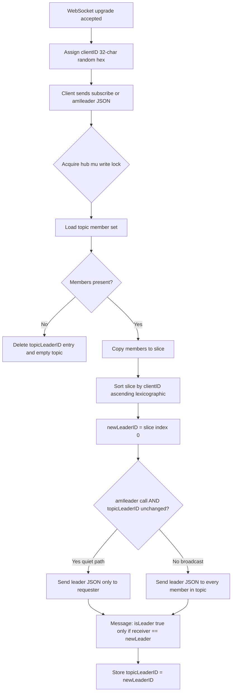

### 2. Normal join: follower subscribes (leader unchanged)

The existing leader keeps leadership because their `clientID` stays the smallest.

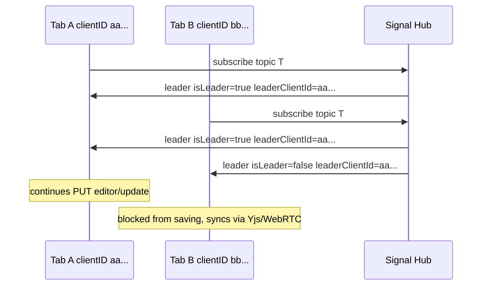

### 3. Join: new tab steals leadership (smaller clientID)

Leadership is not sticky. A late joiner with a lexicographically smaller random ID becomes leader immediately.

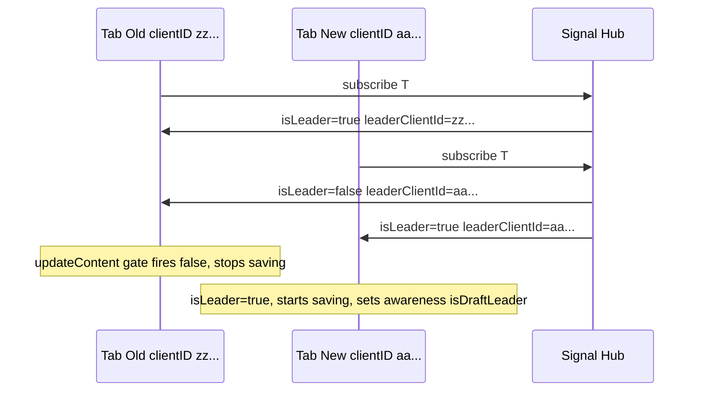

### 4. Leader tab cleanly disconnects

Browser closes, navigates away, or JS calls `ws.close()` — `readPump` returns → `handleUnregister` runs.

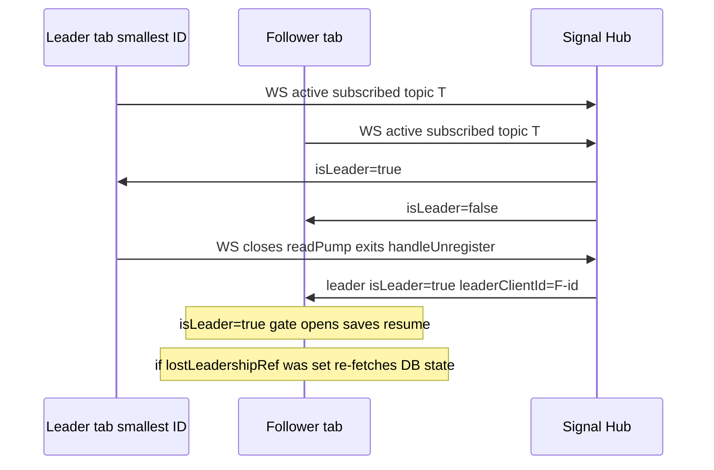

### 5. Last tab closes (topic drained)

No `leader` broadcast fires — the room is empty and `topicLeaderID` is deleted. The next tab to subscribe starts a fresh election.

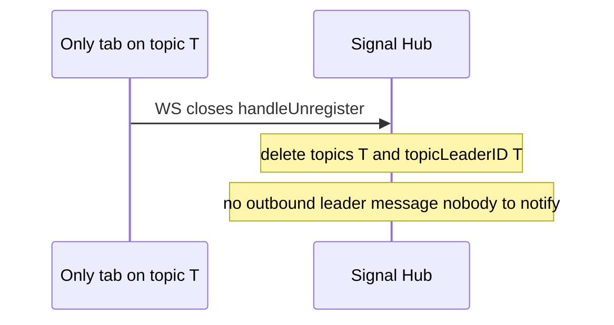

### 6. `amIleader` polling — churn reduction

UI sends `amIleader` every **3 s** per socket. If the computed leader is unchanged, only the requester is notified (no broadcast to the whole room).

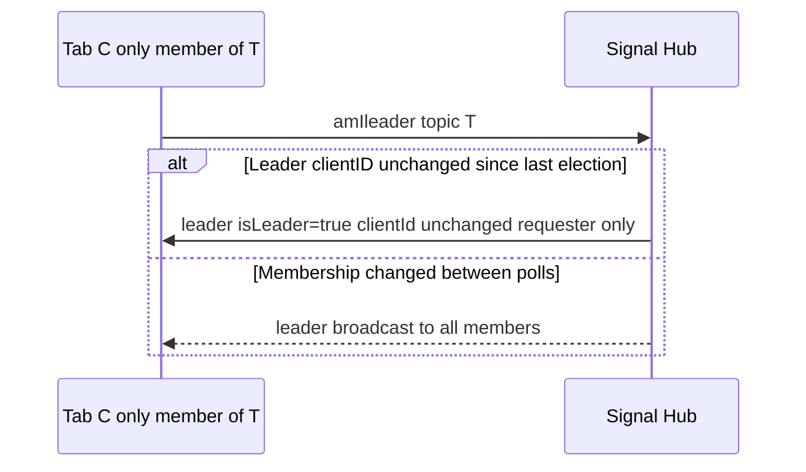

### 7. Signaling socket reconnect / UI churn

y-webrtc reconnects its WebSocket when the connection drops. `scanSignalingConnections` (2 s loop) picks up the new socket.

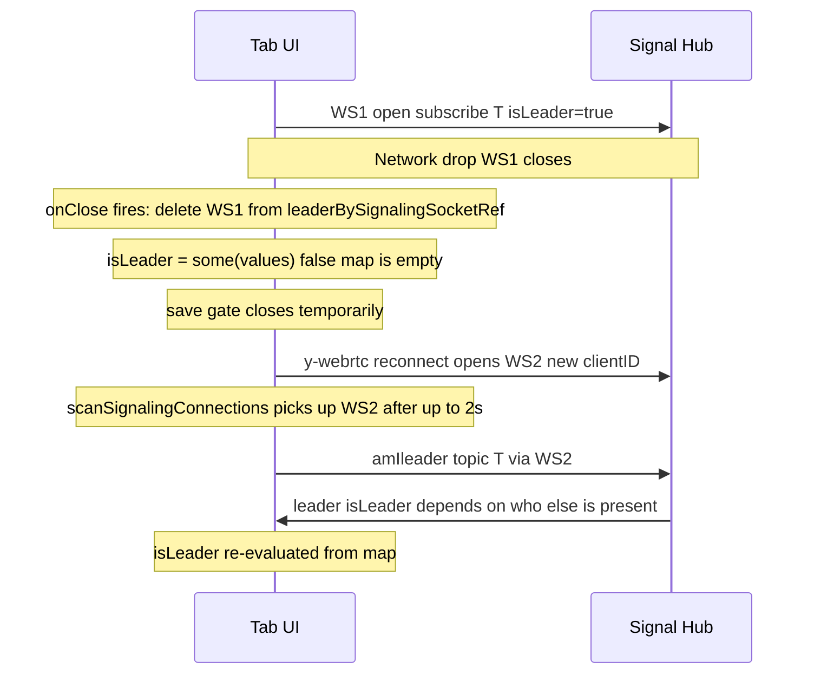

**Important**: the new `clientID` on WS2 is random — leadership is **not** guaranteed to remain with this tab after a reconnect. If a follower reconnected first with a smaller ID, they become leader.

### 8. Leadership regain after handoff

When a tab loses then regains `isLeader`, `DocumentEditor` re-fetches the DB state. In the **normal case** (tab stayed connected to WebRTC peers the whole time) this is a **no-op**: `safeMerge` compares state vectors, finds ydoc already ahead, and does nothing. The re-fetch is a **safety net** for the isolation edge case only.

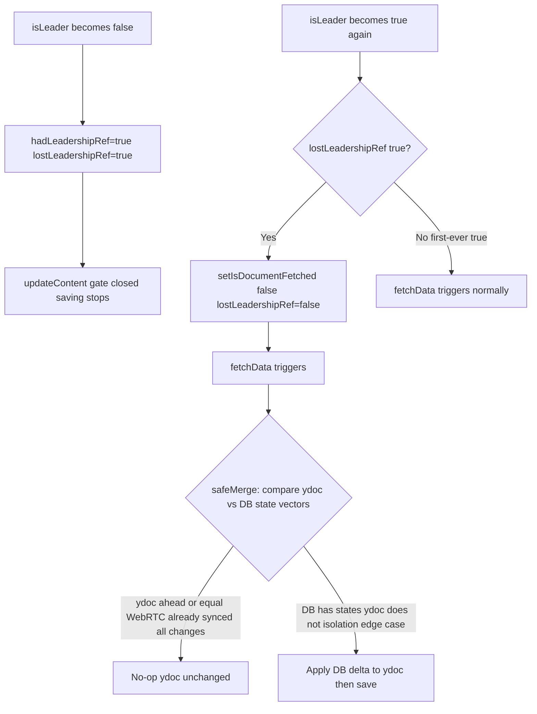

**Normal path** (tab stayed in WebRTC room during handoff):
WebRTC synced the other leader's edits → ydoc state vector is ahead of or equal to DB → `safeMerge` hits the `localHasNew && !dbHasNew` branch → does nothing → re-fetch was harmless overhead.

**Isolation edge case** (tab lost both signaling AND WebRTC during handoff):
While offline, another leader saved edits to DB that never reached this tab's ydoc. On reconnect, the offline tab regains leadership (other leader left). Without re-fetching, it would save a stale ydoc and overwrite those edits. `safeMerge` recovers by applying only the delta (DB states not yet in ydoc).

> The re-fetch is not needed when WebRTC is healthy. It only matters when the tab was fully isolated during the period it was not the leader.

### 9. Tab hidden: saves pause but leadership stays

`useEditorPresenceHeartbeat` skips heartbeats when `document.visibilityState !== "visible"`. The signaling WebSocket stays open — **leadership is not transferred**.

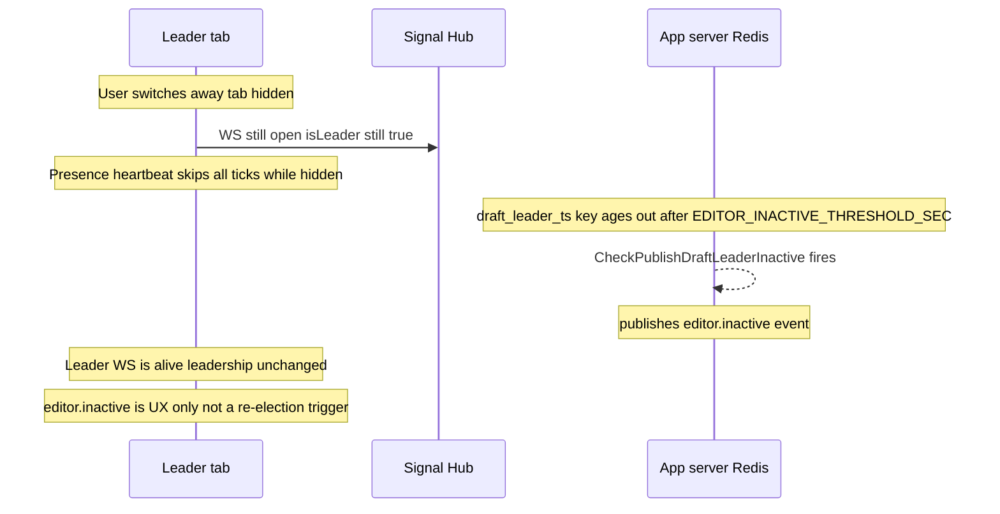

> **Gap**: a hidden-but-alive leader stops posting `isDraftLeader=true` presence. The server cannot distinguish "leader is dead" from "leader is alive but hidden". `editor.inactive` banner fires in either case. Leadership itself does not move.

### 10. Multiple signaling URLs — isLeader union

If y-webrtc is configured with more than one signaling URL, each creates its own WebSocket. The UI takes the **union**: `isLeader = any socket says isLeader`.

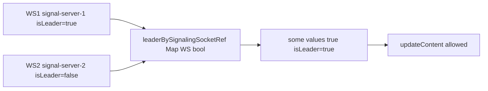

If WS1 closes, the map loses that entry. `isLeader = some(values)` may flip to `false` until WS1 reconnects or WS2 also becomes leader.

### 11. `send` channel drop and recovery

`electLeaderInternal` uses a non-blocking send into `client.send` (buffered 2048). If the channel is full, the `leader` message is **silently dropped**. The UI recovers via the 3 s `amIleader` poll.

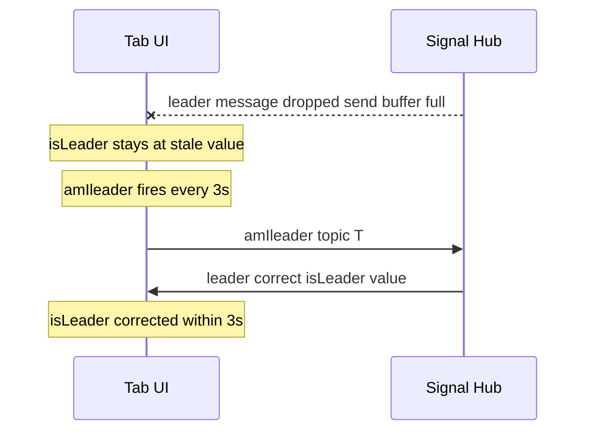

### 12. Hanging / zombie leader (current gap)

The leader's JS thread freezes but the OS keeps the TCP connection alive. The server cannot detect this.

```mermaid
flowchart TD
    subgraph Today["Today: no idle eviction"]
        H1[Leader JS frozen TCP still open]
        H1 --> H2[Hub: clientID still smallest member no unregister has run]
        H2 --> H3[Followers remain non-leaders saves blocked]
        H3 --> H4[Presence heartbeat stops JS thread not running]
        H4 --> H5[editor.inactive fires after EDITOR_INACTIVE_THRESHOLD_SEC]
        H5 --> H6[Banner shown UX only leadership NOT transferred]
    end

    subgraph Target["Target: signalserver idle eviction — NOT YET SHIPPED"]
        T1[Env SIGNAL_READ_DEADLINE_SEC]
        T1 --> T2[SetReadDeadline refreshed on each valid message]
        T2 --> T3[Idle leader no messages in window ReadMessage deadline exceeded]
        T3 --> T4[readPump exits handleUnregister]
        T4 --> T5[electLeaderInternal broadcast]
        T5 --> T6[Smallest remaining clientID becomes leader]
        T6 --> T7[Follower isLeader=true saves resume]
    end
```

Sequence for the target path:

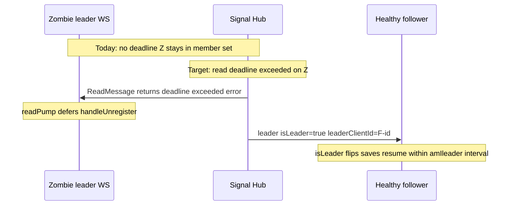

### 13. Signalserver restart burst

All WebSocket connections drop simultaneously. All tabs briefly have `isLeader=false`. The first tab to reconnect and subscribe wins the initial election.

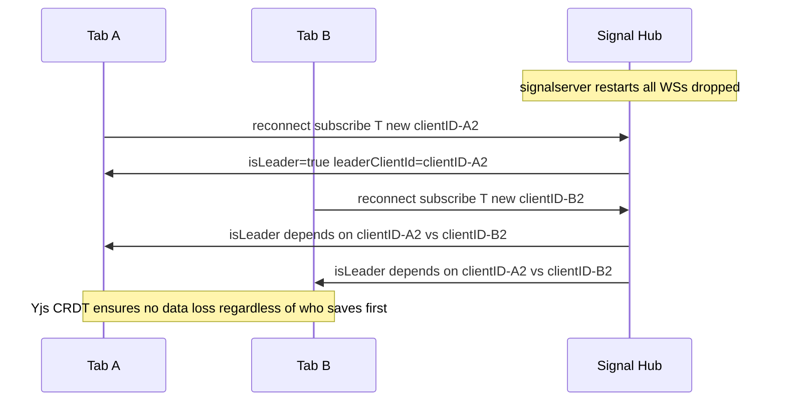

### 14. Edge cases summary

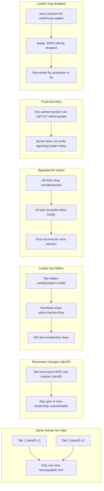

### 15. Should this tab save? (full decision gate)

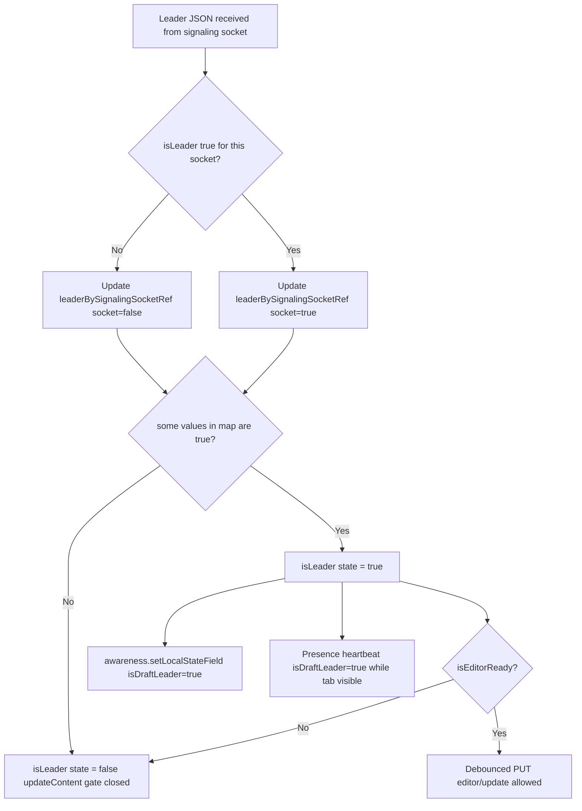

---

## Presence and `editor.inactive`

### Heartbeat flow

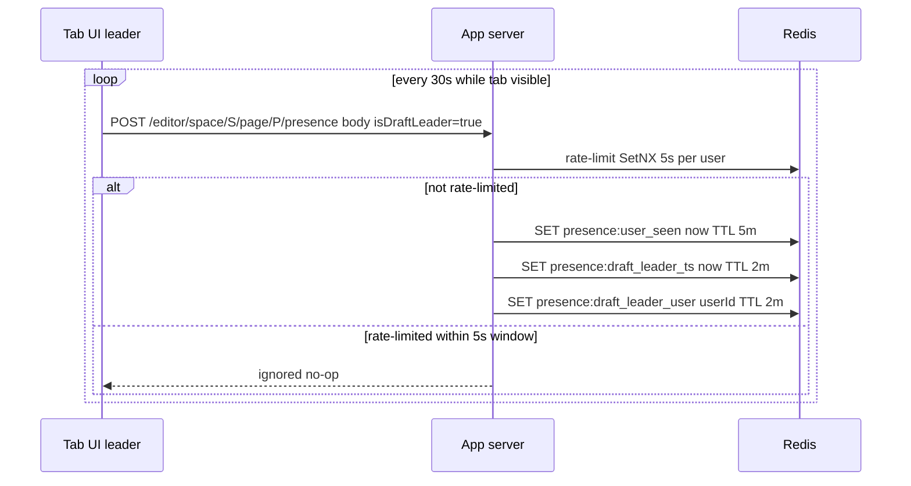

### `editor.inactive` detection flow

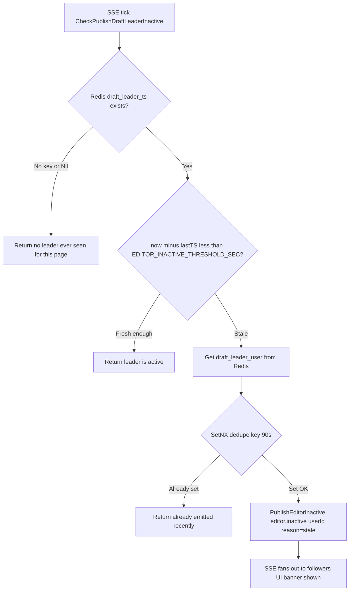

### Scenarios: what `editor.inactive` detects vs misses

| Scenario | Heartbeat stops? | `editor.inactive` fires? | Leadership transferred? |
|----------|-----------------|--------------------------|------------------------|
| Leader tab frozen (JS hung) | Yes | Yes after threshold | **No** — WS still open |
| Leader tab hidden by user | Yes (visibility gate) | Yes after threshold | **No** — WS still open |
| Leader tab cleanly closed | Yes | Yes | **Yes** — `handleUnregister` → new election |
| Leader network cut (TCP closed by OS) | Yes | Yes | **Yes** — `readPump` error → unregister |
| Leader network cut (TCP half-open zombie) | Yes | Yes | **No** — WS appears open to server |
| Redis disabled | N/A | Never | N/A — presence is a no-op |

---

## Proposed: Redis-backed room state + signalserver watchdog

This section designs a **cross-process liveness system** that closes Gap 1 (zombie/hung leader), Gap 2 (hidden tab false-positive), and lays groundwork for Gap 6 (server-side enforcement).

### Core idea

```
┌─────────────────────────────────────────────────────────────────┐
│  Today                                                          │
│  Signalserver ────── in-memory hub only                        │
│  App server   ────── writes Redis presence (draft_leader_ts)   │
│  No connection between these two                               │
└─────────────────────────────────────────────────────────────────┘

┌─────────────────────────────────────────────────────────────────┐
│  Proposed                                                       │
│  Signalserver ────── writes room state to Redis                │
│              ────── reads draft_leader_ts (written by app srv) │
│              ────── watchdog goroutine evicts stale leader WS  │
│  App server   ────── writes draft_leader_ts on presence AND    │
│                      on PUT /editor/update (new)               │
└─────────────────────────────────────────────────────────────────┘
```

The key insight: the **existing** `beskar:presence:draft_leader_ts:<spaceId>:<pageId>` key, already written by the app server, is the correct liveness signal. The signalserver watchdog just needs to **read it**. No new key schema required for the health check — only the room membership keys are new.

### Redis key schema

| Key | Written by | Read by | TTL | Value |
|-----|------------|---------|-----|-------|
| `beskar:room:<topic>:leader` | Signalserver | Signalserver (watchdog, amIleader) | None | Current leader `clientID` string |
| `beskar:room:<topic>:members` | Signalserver | Signalserver | None | Redis HSET: `clientID → userID` |
| `beskar:presence:draft_leader_ts:<spaceId>:<pageId>` | **App server** (existing) | **Signalserver watchdog** (new reader) | 2 min | Unix timestamp of last leader activity |

Topic → spaceId/pageId extraction: topic string is `<pageId>-space-<spaceId>`. Split on `-space-` to get the two parts; the existing Redis key format (`%s:%d` spaceId+pageId) then matches exactly.

### What counts as leader activity

Both of these update `draft_leader_ts`:

| Source | Currently updates ts? | Proposed |
|--------|-----------------------|----------|
| `POST /presence` with `isDraftLeader=true` | Yes (existing) | Keep |
| `PUT /editor/update` (successful draft save) | No | **Add** — a leader actively saving should never be evicted |

The second write is one extra Redis SET per save. It makes the liveness signal robust: a leader whose presence heartbeat is delayed for any reason (slow network, brief hide) but is actively saving will not be evicted.

### Architecture diagram

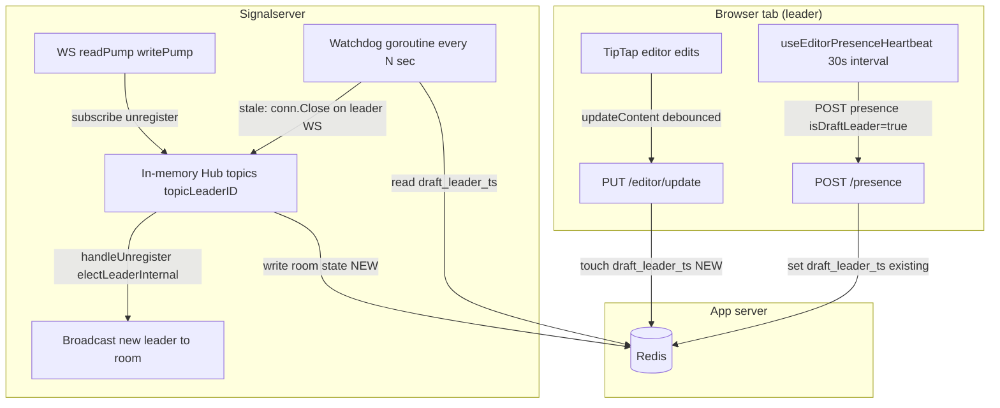

### Watchdog flow

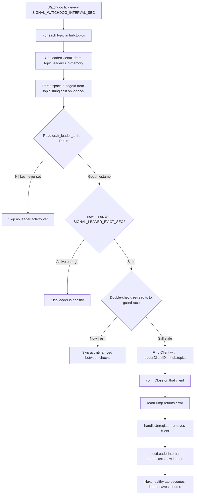

### Watchdog sequence (zombie leader eviction)

```mermaid
sequenceDiagram
    participant Z as Zombie leader WS
    participant H as Signal Hub watchdog
    participant R as Redis
    participant F as Healthy follower

    Note over Z: JS frozen no saves no presence
    loop every SIGNAL_WATCHDOG_INTERVAL_SEC
        H->>R: GET draft_leader_ts spaceId pageId
        R-->>H: timestamp 95s ago
        Note over H: 95s > SIGNAL_LEADER_EVICT_SEC 90s threshold exceeded
        H->>R: GET draft_leader_ts again double check
        R-->>H: still stale
        H->>Z: conn.Close
        Note over Z: readPump exits handleUnregister fires
        H->>F: leader isLeader=true new leaderClientId
        Note over F: isLeader flips saves resume
    end
```

### Watchdog sequence (hidden tab: correct eviction)

```mermaid
sequenceDiagram
    participant L as Leader tab hidden
    participant H as Signal Hub watchdog
    participant R as Redis
    participant F as Follower tab visible

    Note over L: User hides tab, stops editing
    Note over L: Presence heartbeat paused no saves
    Note over R: draft_leader_ts TTL 2min expires

    H->>R: GET draft_leader_ts
    R-->>H: Nil or stale
    H->>L: conn.Close
    Note over L: WS disconnects readPump exits
    H->>F: leader isLeader=true
    Note over F: Visible follower becomes leader saves resume
    Note over L: If user returns tab shows offline reconnects as follower
```

> **This resolves Gap 2**: a hidden tab that is not saving is correctly identified as an inactive leader. The visible, active follower takes over. No data loss — Yjs CRDT merges the hidden tab's edits when it reconnects.

### Sequence: active but hidden leader (should NOT be evicted)

If the leader is hidden but still making saves (`updateContent` runs on programmatic changes, e.g. live sync from followers), the `PUT /editor/update` path touches `draft_leader_ts` and keeps the watchdog satisfied.

```mermaid
sequenceDiagram
    participant L as Leader tab hidden but active
    participant A as App server
    participant R as Redis
    participant H as Signal Hub watchdog

    Note over L: Tab hidden but receiving Yjs sync from follower
    L->>A: PUT /editor/update leader persists Yjs change
    A->>R: SET draft_leader_ts now TTL 2min
    H->>R: GET draft_leader_ts
    R-->>H: fresh timestamp
    Note over H: Under threshold skip eviction
```

### Threshold recommendations

```
Presence heartbeat interval          30 s   (NEXT_PUBLIC_EDITOR_PRESENCE default)
editor.inactive banner threshold     75 s   (EDITOR_INACTIVE_THRESHOLD_SEC default)
draft_leader_ts Redis TTL            2 min  (hardcoded in presence.go)
Leader eviction threshold            90 s   (SIGNAL_LEADER_EVICT_SEC proposed)
Watchdog interval                    15 s   (SIGNAL_WATCHDOG_INTERVAL_SEC proposed)
```

Ordering must hold: `heartbeat interval` < `inactive threshold` < `leader eviction threshold` < `draft_leader_ts TTL`. If the eviction threshold exceeds the TTL, the key will be gone before the watchdog can read it — use TTL ≥ eviction threshold + watchdog interval + buffer.

### Implementation plan (signalserver changes)

1. Add optional Redis client (`SIGNAL_REDIS_URL` env; if absent, watchdog disabled).
2. On `subscribe`: write `HSET beskar:room:<topic>:members <clientID> <userID>` (userID available from auth token at upgrade time — needs auth middleware enhancement to pass userId into `Client`).
3. On `handleUnregister`: `HDEL beskar:room:<topic>:members <clientID>`; if topic drained, `DEL beskar:room:<topic>:leader`.
4. After `electLeaderInternal`: `SET beskar:room:<topic>:leader <newLeaderClientID>`.
5. Add watchdog goroutine (see flow above).
6. Parse topic helper: `strings.SplitN(topic, "-space-", 2)` → `[pageIdStr, spaceIdStr]`.

### Implementation plan (app server changes)

1. In `PUT /editor/update` handler: after successful DB write, if caller is draft leader (check `isLeader` from request or use the presence Redis key), `SET beskar:presence:draft_leader_ts:<spaceId>:<pageId> <now> EX 120`.
2. No changes needed to `POST /presence` path.

### Gaps this closes

| Gap | Status before | Status after |
|-----|--------------|--------------|
| 1 — Zombie leader | Open: no eviction | **Closed** — watchdog evicts via stale ts |
| 2 — Hidden tab false-positive banner | Open: banner but no action | **Closed** — watchdog evicts hidden inactive leader |
| 6 — Server-side save enforcement | Open | **Partial** — room state in Redis enables future lookup of leader userId before allowing `PUT /editor/update` |

### Gaps NOT closed by this proposal

| Gap | Why not covered |
|-----|----------------|
| 3 — clientID changes on reconnect | Inherent to random clientID design; watchdog doesn't affect election algorithm |
| 4 — Signalserver restart burst | All connections drop simultaneously; watchdog can't act on a room with no members |
| 5 — `send` buffer drop | In-process messaging issue; Redis doesn't help; `amIleader` poll remains the recovery path |
| 7 — Multi-replica debounce | App server concern; not related to signaling or watchdog |

### Accepted trade-off: signalserver depends on app server liveness

The watchdog's eviction decision depends on `draft_leader_ts` written by the app server. If the app server goes down (or Redis is unreachable), no presence writes happen → key expires → watchdog evicts all leaders → leadership churns while Yjs collaboration continues working via WebRTC.

**This trade-off is accepted.** WebRTC collaboration is CRDT-based and survives leadership churn without data loss. A brief eviction storm during an app server outage is a recoverable nuisance, not a correctness failure.

The watchdog must still **fail open on Redis errors** (skip eviction, do not evict) to avoid a Redis blip cascading into unnecessary churn:

```go
ts, err := redisClient.Get(ctx, tsKey).Result()
if err != nil && !errors.Is(err, redis.Nil) {
    log.Printf("watchdog: redis error for %s, skipping", topic)
    continue  // do NOT evict on Redis error
}
```

App server down → `draft_leader_ts` naturally expires → Nil → watchdog skips (no key = no activity record yet). This is the graceful degradation path: signalserver keeps leaders in place until Redis has evidence of staleness, not on absence of evidence.

### Deployment constraint: single signalserver instance

The proposal works correctly with **one signalserver instance**. With multiple instances, each has a partial in-memory hub — they run independent elections on different member subsets and may elect different leaders per-instance. Watchdog runs would also be independent.

Multi-instance support requires distributed election coordination (e.g. atomic leader claim in Redis with a lock, or Redis pub/sub for cross-instance unregister events) — that is a separate design and out of scope here.

**This must be an explicit deployment constraint in `docker/` config** until distributed coordination is designed.

### Implementation notes

These are standard coding details, not design concerns:

| Note | Detail |
|------|--------|
| Nil key vs expired key | Extend `draft_leader_ts` TTL to 10 min (well above eviction threshold) so Nil reliably means "never set" not "expired". Watchdog skips on Nil cleanly. |
| `isDraftLeader` in `PUT /editor/update` body | Add the same `isDraftLeader: bool` field used in `POST /presence`. App server only touches `draft_leader_ts` when `true`. Prevents a rogue non-leader save from masking a dead real leader. |
| `inactive_emit` dedupe on new election | When signalserver writes a new leader to Redis after eviction, also `DEL beskar:presence:inactive_emit:<spaceId>:<pageId>` so followers can receive a fresh `editor.inactive` if the new leader also goes quiet. |

---

## All gaps and risks

| # | Gap | Impact | Status | Mitigation |
|---|-----|--------|--------|------------|
| 1 | **No idle eviction on signaling** | Hung/zombie leader holds topic slot; followers save-blocked indefinitely | **Open → Proposed** | Redis-backed watchdog (see §Proposed above): stale `draft_leader_ts` → `conn.Close` → re-elect |
| 2 | **Hidden tab triggers `editor.inactive` but is alive** | False-positive inactive banner; leader WS stays open | **Open → Proposed** | Watchdog evicts hidden+inactive leader correctly; visible follower takes over |
| 3 | **Leader `clientID` changes on reconnect** | After y-webrtc socket reconnect, tab may lose or gain leadership unpredictably | **Accepted** | Random IDs by design; document and test; optional future: sticky leader ID per page+session |
| 4 | **Signaling server restart burst** | All tabs drop to `isLeader=false` simultaneously; first reconnector starts saving | **Accepted** | Client gate prevents double-saves; Yjs CRDT merges fine; reduce impact with graceful restart (drain before kill) |
| 5 | **`leader` message silently dropped (send buffer full)** | Tab holds stale `isLeader` until next `amIleader` poll (≤ 3 s) | **Accepted** | Recovery via 3 s `amIleader` is fast enough; buffer sized 2048 |
| 6 | **Server does not enforce leader-only save** | Malicious or buggy client can call `PUT /editor/update` without being signaling leader | **Open → Partial** | Room state in Redis (`beskar:room:<topic>:leader`) enables future enforcement: verify caller's session maps to current leader |
| 7 | **Multi-API-replica debounce is per-process** | Under load with multiple API instances, debounce is not shared | **Accepted** | Leader single-writer means only one process typically receives calls; tune `EDITOR_DRAFT_DEBOUNCE_SEC` |
| 8 | **Tab visibility stop not communicated to followers** | Followers see save-leader go stale without knowing if leader is just hidden vs dead | **Resolved by proposal** | Watchdog evicts the hidden inactive leader; followers see new `leader` message; no need for separate `editor.hidden` awareness event |

---

## Solidification checklist

| Item | Status |
|------|--------|
| `updateContent` gated on `isLeader && isEditorReady` | Done |
| `isDraftLeader` in awareness `=== isLeader` | Done |
| `useEditorPresenceHeartbeat` passes `isDraftLeader: isLeader` | Done |
| Manual QA: DevTools confirms only leader tab hits `editor/update` | Pending |
| Manual QA: close leader tab → follower becomes leader → saves resume | Pending |
| Signalserver: `SetReadDeadline` idle eviction | **Not done** (Gap 1) |
| Signalserver: server-side ping with eviction on no pong | **Not done** (Gap 1 alternative) |
| Server-side leader enforcement via signaling bridge | Not done (Gap 6, lower priority) |

---

## Related env vars

| Variable | Layer | Default | Role |
|----------|-------|---------|------|
| `EDITOR_INACTIVE_THRESHOLD_SEC` | App server | 75 s | Seconds of stale draft-leader heartbeat before `editor.inactive` fires |
| `NEXT_PUBLIC_EDITOR_PRESENCE` | UI | enabled | Set `"0"` to disable all `POST /presence` calls |
| `EDITOR_DRAFT_DEBOUNCE_SEC` | App server | 2 s | Coalesce window for `PUT /editor/update` per user+page |
| `AUTH_SERVER_URL` | Signalserver | — | URL for WS upgrade session validation; if unset, auth is skipped |
| `CORS_ALLOWED_ORIGINS` | Signalserver | localhost | Comma-separated allowed origins for WS upgrade |
| *(proposed)* `SIGNAL_REDIS_URL` | Signalserver | — | Redis URL for room state + watchdog; if absent, watchdog is disabled |
| *(proposed)* `SIGNAL_LEADER_EVICT_SEC` | Signalserver | 90 s | Seconds of stale `draft_leader_ts` before watchdog closes the leader WS |
| *(proposed)* `SIGNAL_WATCHDOG_INTERVAL_SEC` | Signalserver | 15 s | How often the watchdog goroutine checks each room |

---

## Revision history

| Date | Notes |
|------|--------|
| 2026-05-06 | Initial document: product rule, leader identification, basic diagrams, hanging-leader section. |
| 2026-05-06 | Full rewrite: 15 scenario diagrams covering all election, reconnect, visibility, regain, multi-socket, buffer-drop, and restart scenarios; `editor.inactive` flow + detection table; 8-item gap register; consolidated checklist. |
| 2026-05-06 | Added §Proposed: Redis-backed room state + signalserver watchdog — architecture, Redis key schema, watchdog flow + 4 scenario sequences, threshold recommendations, implementation plan for signalserver and app server, gap closure table. |
| 2026-05-06 | App server dependency accepted; simplified watchdog to single Redis signal with fail-open on errors; removed dual-signal complexity. |
