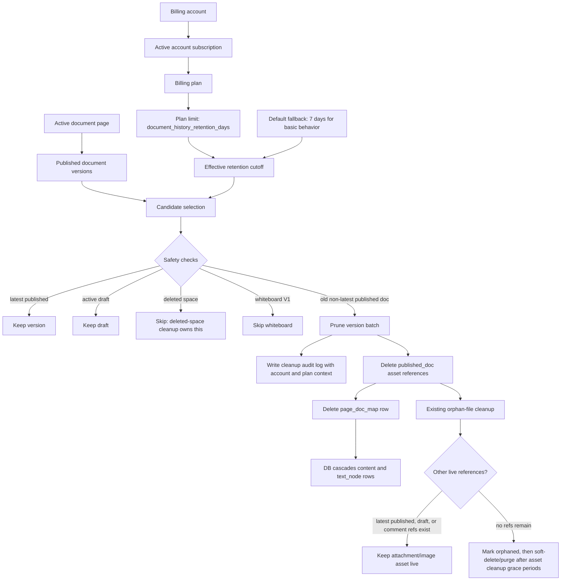

# Design Doc: Document Version Retention Cleanup

## Summary

Beskar currently keeps published document versions indefinitely in `core.page_doc_map` and the child tables that store document content. That preserves history, but it also means the database grows with every publish and retained asset references keep old images and attachments alive forever.

This document defines a requirement and design for cleaning up document versions older than the history retention duration allowed by the owning account's active plan.

The cleanup must be conservative:

- keep the latest published version for every page, even if it is older than the retention duration
- keep the active draft version for every page
- delete only published historical versions that are both older than the owning account's plan retention duration and not protected by a retention rule
- coordinate with `core.asset_reference` so old version references stop keeping assets live after the version is pruned
- preserve enough audit information to understand what was deleted

This is a design-only document. No schema, code, cron job, or migration is introduced here.

---

## Objective

- Limit unbounded growth of historical document versions.
- Make document version retention plan-driven as a number of days.
- Keep the current editable and readable state of every page safe.
- Make cleanup idempotent, resumable, and safe to run on a schedule.
- Coordinate document-version pruning with asset cleanup so images and attachments from pruned versions can be cleaned later.
- Provide operational visibility through dry-run counts, cleanup records, metrics, and admin controls.

---

## Non-Goals

- Building a user-facing version history browser.
- Building a user-facing restore UI for pruned versions.
- Pruning active drafts.
- Pruning the latest published version of a page.
- Changing publish semantics.
- Changing comment anchoring behavior.
- Cleaning orphaned files directly. File cleanup remains owned by the orphan-file cleanup pipeline.
- Cleaning up deleted spaces or deleting all document versions under deleted spaces.
- Changing object-storage lifecycle rules.

---

## Current-State Findings

## Document Versions Are Rows In `core.page_doc_map`

Document metadata is stored in `core.page_doc_map`:

- `doc_id`
- `page_id`
- `title`
- `version`
- `owner_id`
- `draft`

Published document reads select:

- `draft = 0`
- newest `version`

Draft edit reads select:

- `draft = 1`
- newest `version`

Document content is stored in child tables keyed by `doc_id`:

- `core.content`
- `core.text_node`
- `core.content_draft`
- `core.whiteboard_data`

Existing foreign keys already cascade from `core.page_doc_map.doc_id` into these child tables.

## Published History Is Currently Fully Retained

The orphan-file cleanup design and implementation currently treat every published `core.page_doc_map` row as retained product history.

That means assets referenced by old published versions stay live through `core.asset_reference` rows with:

- `source_kind = 'published_doc'`
- `source_id = doc_id`
- `doc_id = doc_id`

If old document versions are pruned, their `published_doc` asset references must be removed in the same transaction. Otherwise, pruned versions can continue to keep old assets live.

## Drafts Are A Separate Retention Boundary

Unpublished draft state lives under `core.content_draft`, with `data_binary` storing Yjs update data.

Draft cleanup is out of scope for this feature. The cleanup job must not delete:

- `draft = 1` rows
- `content_draft` rows for active draft documents
- `draft_doc` asset references

## Comments Do Not Depend On Historical `doc_id`

Inline comment threads now reference `core.page.id` as `document_id`, not `core.page_doc_map.doc_id`. They also store anchor metadata, including a version hint, but not a retained historical `doc_id`.

This means pruning old published `doc_id` rows should not cascade-delete current comments. However, old published content may have been the last content snapshot where a comment anchor matched exactly. Because there is no user-facing version history today, this design treats comment anchor degradation as acceptable as long as the latest published and draft states remain intact.

## Whiteboards Use The Same `page_doc_map` Table

Whiteboard pages use `core.whiteboard_data` keyed by `doc_id`.

The first version of this cleanup excludes whiteboards. Do not add a runtime flag to include whiteboards until a separate whiteboard retention design is approved. Document and whiteboard history have different recovery expectations and data size profiles.

## Spaces Already Belong To Billing Accounts

The account storage limits work introduced the product account boundary this feature should use:

- `billing.account`
- `core.space.account_id`
- `billing.plan`
- `billing.plan_limit`
- `billing.account_subscription`

Document versions belong to an account through:

- document version -> page -> space -> account

That means history retention should be evaluated against the owning account's active billing plan, not against the user who published the version and not against a single global duration.

---

## Product Requirement

Beskar should automatically prune historical published document versions that are older than the history retention duration allowed by the owning account's active billing plan.

Default policy:

- each plan has a `document_history_retention_days` limit
- the `basic` plan retains 7 days of document history
- users do not configure this value directly; it changes through the account's assigned plan
- always keep the latest published version per page
- always keep active drafts
- exclude deleted spaces from document-version retention cleanup
- exclude whiteboard pages in V1

Example:

- Page `P` has published versions from January 1, February 1, March 1, and April 1.
- Page `P` belongs to an account on a plan with `document_history_retention_days = 60`.
- Cleanup runs on May 1.
- January 1 and February 1 are older than 60 days and can be pruned.
- March 1 and April 1 are retained.
- If April 1 were the only published version, it would be retained even if older than 60 days.

---

## Design Principles

- Retention should be expressed as policy, not hardcoded query behavior.
- Prefer conservative false negatives over accidental history loss.
- Delete version references before deleting the version row, in the same transaction.
- Keep cleanup idempotent so retries are safe after partial failures.
- Bound each cleanup batch to avoid long locks and table churn.
- Make dry-run output available before enabling destructive cleanup.
- Do not make the asset cleanup job infer version retention policy. Version pruning owns removal of retained published-doc references.
- Keep this job focused on old-version retention for active spaces. Deleted-space teardown should be a separate cleanup flow.

---

## Proposed Design

## Solution Diagram



## 1. Add A Plan-Based Version Retention Policy

Use the existing generic plan-limit model for document history retention. Add a new `billing.plan_limit` metric:

- `metric_key = 'document_history_retention_days'`
- `limit_value = <retention days>`
- `limit_unit = 'days'`
- `enforcement_mode = 'cleanup'`

Seed the `basic` plan with:

```sql
INSERT INTO billing.plan_limit (plan_id, metric_key, limit_value, limit_unit, enforcement_mode)
SELECT p.id, 'document_history_retention_days', 7, 'days', 'cleanup'
FROM billing.plan p
WHERE p.code = 'basic'
ON CONFLICT (plan_id, metric_key) DO UPDATE
SET limit_value = EXCLUDED.limit_value,
    limit_unit = EXCLUDED.limit_unit,
    enforcement_mode = EXCLUDED.enforcement_mode,
    updated_at = now();
```

The retention value is a product entitlement, not a user preference. Users should not be asked to choose or update it from account settings.

Add config for cleanup scheduling and fallback behavior:

- `DOCUMENT_VERSION_CLEANUP_ENABLED`
- `DOCUMENT_VERSION_DEFAULT_RETENTION_DAYS`
- `DOCUMENT_VERSION_CLEANUP_BATCH_SIZE`
- `DOCUMENT_VERSION_CLEANUP_INTERVAL`
- `DOCUMENT_VERSION_CLEANUP_DRY_RUN`

Recommended defaults:

- enabled: `false` for first deploy
- default retention days: `7`
- batch size: `500`
- interval: `24h`
- dry run: `true`

The global default is only a bootstrap and fallback value. The effective retention value for cleanup should come from the active plan's `document_history_retention_days` limit whenever that limit exists.

## 2. Resolve Effective Retention

For every document version candidate, resolve:

- `account_id` from `core.space.account_id`
- `plan_id` and `plan_code` from the active plan through `billing.account_subscription` and `billing.plan`
- `retention_days` from `billing.plan_limit` where `metric_key = 'document_history_retention_days'`
- fallback retention days from `DOCUMENT_VERSION_DEFAULT_RETENTION_DAYS` when the active plan or plan limit does not exist
- `retention_cutoff = now() - retention_days`

Only subscriptions where `lower(status) = 'active'` count as active for V1. If an account has no active subscription, or if the active plan has no `document_history_retention_days` limit, cleanup uses the default retention fallback. The fallback should behave like the `basic` plan and retain 7 days.

Plan changes apply to the next cleanup pass. Downgrades to a shorter-retention plan have no special grace-period exception in V1.

## 3. Candidate Selection

A published document version is eligible when all of these are true:

- `d.draft = 0`
- `d.version < plan_retention_cutoff`
- the owning space is not deleted
- the owning page is an included page type
- the row is not the latest published version for that page
- the row is not explicitly protected

Deleted spaces are intentionally outside this job's scope. A separate deleted-space cleanup flow should own full cleanup for deleted spaces, including document rows and any remaining asset references under that space.

Suggested candidate query shape:

```sql
WITH latest_published AS (
  SELECT DISTINCT ON (page_id)
    doc_id,
    page_id
  FROM core.page_doc_map
  WHERE draft = 0
  ORDER BY page_id, version DESC, doc_id DESC
)
SELECT
  d.doc_id,
  d.page_id,
  s.account_id,
  active_plan.plan_id,
  active_plan.plan_code,
  d.version,
  COALESCE(pl.limit_value::integer, $1) AS retention_days,
  now() - make_interval(days => COALESCE(pl.limit_value::integer, $1)) AS retention_cutoff
FROM core.page_doc_map d
JOIN core.page p ON p.id = d.page_id
JOIN core.space s ON s.id = p.space_id
LEFT JOIN LATERAL (
  SELECT sub.plan_id, bp.code AS plan_code
  FROM billing.account_subscription sub
  JOIN billing.plan bp ON bp.id = sub.plan_id
  WHERE sub.account_id = s.account_id
    AND lower(sub.status) = 'active'
    AND (sub.effective_to IS NULL OR sub.effective_to > now())
  ORDER BY sub.effective_from DESC, sub.created_at DESC
  LIMIT 1
) active_plan ON true
LEFT JOIN billing.plan_limit pl
  ON pl.plan_id = active_plan.plan_id
 AND pl.metric_key = 'document_history_retention_days'
LEFT JOIN latest_published lp ON lp.doc_id = d.doc_id
WHERE d.draft = 0
  AND d.version < (
    now() - make_interval(days => COALESCE(pl.limit_value::integer, $1))
  )
  AND lp.doc_id IS NULL
  AND s.deleted_at IS NULL
  AND COALESCE(p.type, 'document') = 'document'
ORDER BY d.version ASC, d.doc_id ASC
LIMIT $2;
```

Here `$1` is the default retention days fallback, set to `7` for `basic` plan behavior, and `$2` is the batch limit.

The actual implementation should use row locking when pruning:

- select candidates in small batches
- lock the selected `page_doc_map` rows with `FOR UPDATE SKIP LOCKED`
- re-check the latest-version rule inside the transaction
- re-resolve plan retention inside the transaction
- include `account_id`, `plan_id`, `plan_code`, `retention_days`, and computed cutoff in the cleanup audit row

## 4. Prune In One Transaction Per Batch

For each batch:

1. Select and lock candidate document versions.
2. Recompute latest published `doc_id` per affected page.
3. Recompute effective retention days from each affected account's active plan.
4. Remove candidates that are now latest for their page or no longer older than the effective cutoff.
5. Insert cleanup audit rows.
6. Delete asset references for pruned versions:
   - `source_kind = 'published_doc'`
   - `source_id = doc_id::text`
7. Delete `core.page_doc_map` rows for the pruned `doc_id` values.
8. Commit.

Deleting `page_doc_map` rows should cascade into:

- `core.content`
- `core.text_node`
- `core.content_draft`, if any unexpected draft content is attached
- `core.whiteboard_data`, if whiteboards are later included

The transaction order matters. Asset references must be deleted before `page_doc_map` rows because the current `asset_reference.doc_id` foreign key is `ON DELETE SET NULL`. If the doc row is deleted first, stale `published_doc` rows could lose `doc_id` but still keep assets live through `asset_type` and `asset_id`.

## 5. Add Cleanup Audit Records

Add a table for operational visibility:

```sql
CREATE TABLE core.document_version_cleanup_log (
  id UUID PRIMARY KEY DEFAULT gen_random_uuid(),
  doc_id BIGINT NOT NULL,
  page_id BIGINT NOT NULL,
  space_id UUID NOT NULL,
  account_id UUID NOT NULL,
  plan_id UUID,
  plan_code TEXT,
  version TIMESTAMPTZ NOT NULL,
  reason TEXT NOT NULL,
  retention_days INTEGER NOT NULL,
  retention_cutoff TIMESTAMPTZ NOT NULL,
  content_node_count INTEGER NOT NULL DEFAULT 0,
  text_node_count INTEGER NOT NULL DEFAULT 0,
  asset_reference_count INTEGER NOT NULL DEFAULT 0,
  cleaned_at TIMESTAMPTZ NOT NULL DEFAULT now(),
  job_run_id UUID NOT NULL
);
```

Recommended indexes:

- `document_version_cleanup_log(cleaned_at DESC)`
- `document_version_cleanup_log(page_id, cleaned_at DESC)`
- `document_version_cleanup_log(account_id, cleaned_at DESC)`
- `document_version_cleanup_log(plan_code, cleaned_at DESC)`
- `document_version_cleanup_log(job_run_id)`
- unique `document_version_cleanup_log(doc_id)`

The log is not a restore source. It is for audit, support, metrics, and rollout validation.

## 6. Plan Entitlement Surface

Do not expose a user-editable document history retention setting in account settings or workspace settings. Retention is determined by the account's active billing plan.

If the product UI needs to display this entitlement, return it as read-only plan capability data from existing billing/account endpoints.

Relevant response fields:

```json
{
  "accountId": "uuid",
  "planCode": "basic",
  "documentHistoryRetentionDays": 7
}
```

Rules:

- the value is read-only for normal users
- plan management updates `billing.plan_limit`, not per-account settings
- changing an account's plan changes future dry-run and cleanup candidates
- downgrades apply on the next cleanup pass without an additional grace period
- lowering effective retention does not delete history synchronously; the next cleanup run applies it
- increasing effective retention protects future cleanup candidates immediately, but already pruned versions are not restored

The UI should communicate the retained history included in the current plan and that latest published versions are always kept.

## 7. Optional Version Protection

If product needs pinned versions later, add:

```sql
CREATE TABLE core.document_version_retention_hold (
  doc_id BIGINT PRIMARY KEY REFERENCES core.page_doc_map(doc_id) ON DELETE CASCADE,
  reason TEXT NOT NULL,
  created_by UUID,
  created_at TIMESTAMPTZ NOT NULL DEFAULT now(),
  expires_at TIMESTAMPTZ
);
```

V1 can skip this table if there is no product or admin use case for pinned versions. The candidate query should be structured so this protection can be added without redesigning the job.

## 8. Integrate With Asset Cleanup

Document version cleanup does not delete blobs or asset metadata directly.

Instead, pruning a published document version removes only the retained source references for that version:

```sql
DELETE FROM core.asset_reference
WHERE source_kind = 'published_doc'
  AND source_id = $1;
```

After that:

- assets still referenced by latest published versions, drafts, or comments remain live
- assets referenced only by pruned versions become unreferenced
- the existing orphan-file cleanup job marks and purges those assets according to its own grace periods

This keeps responsibilities separate:

- document version cleanup owns retention of document history
- asset cleanup owns liveness, quota, soft delete, and blob purge

## 9. Scheduler And Admin Controls

Add a background worker similar to the asset cleanup worker.

Recommended cadence:

- dry-run pass daily
- cleanup pass daily after dry-run metrics are validated

Admin endpoints should be added behind existing admin auth:

- `POST /api/admin/document-versions/cleanup/dry-run`
- `POST /api/admin/document-versions/cleanup/run`
- `GET /api/admin/document-versions/cleanup/stats`

Dry-run output should include:

- fallback retention days
- affected plan codes
- number of candidate versions
- number of affected pages
- number of affected accounts
- oldest candidate version
- newest candidate version
- estimated `content` rows to delete
- estimated `text_node` rows to delete
- estimated `published_doc` asset references to delete

Cleanup output should include:

- `job_run_id`
- pruned version count
- skipped latest-version count
- skipped protected-version count
- affected account count
- affected page count
- duration

## 10. Metrics And Logging

Add structured logs with:

- `job_run_id`
- `account_id`
- `plan_id`
- `plan_code`
- `retention_days`
- `retention_cutoff`
- `dry_run`
- `candidate_count`
- `deleted_count`
- `page_id`
- `doc_id`
- `version`

Recommended metrics:

- `document_version_cleanup_candidates_total`
- `document_version_cleanup_deleted_total`
- `document_version_cleanup_skipped_latest_total`
- `document_version_cleanup_errors_total`
- `document_version_cleanup_duration_seconds`
- `document_versions_retained_total`
- `document_version_retention_days_distribution`

## 11. Failure Handling

The job should be safe to retry.

Failure rules:

- if a batch fails before commit, no versions from that batch are pruned
- if a later batch fails, earlier committed batches remain valid
- a deleted `doc_id` should not be selected again
- audit insertion should happen in the same transaction as deletion
- asset-reference deletion should happen in the same transaction as deletion

If cleanup fails for a specific page due to unexpected constraints:

- log the page and doc ids
- skip the page for the current run
- continue with other batches
- expose skipped pages in stats

---

## Safety Rules

## Always Keep Latest Published

Every page with at least one published version must retain at least one published version.

The job must enforce this even when:

- all versions are older than retention
- versions have identical timestamps
- the owning account has a very short retention window
- cleanup runs concurrently with publish

Use deterministic tie-breaking:

- latest means highest `version`, then highest `doc_id`

## Never Delete Active Drafts

Rows where `draft = 1` are not candidates.

If draft cleanup is needed later, it should be a separate requirement with different safety rules, because current drafts are active editing state and may contain opaque Yjs binary.

## Do Not Depend On UI State

Cleanup is based on persisted database state only. Browser tabs, editor memory, and client-side history are not considered authoritative.

## Publish Concurrency

Publish can create or update document rows while cleanup runs.

Implementation requirements:

- cleanup locks candidate rows before deleting
- cleanup re-checks latest published per affected page inside the transaction
- publish should not reuse a historical published `doc_id` once it has been published

The last rule is important. A historical published version should be immutable. If publish currently mutates a draft row into published state, that is acceptable. It must not update an old published row that could be selected for cleanup.

---

## Data Retention Policy

Recommended V1 policy:

| Data | Retention Rule |
|---|---|
| Latest published document version | Always retained |
| Active draft document version | Always retained |
| Older published document versions | Retained for the owning account's active-plan days |
| Whiteboard versions | Excluded in V1 |
| Cleanup audit logs | Retained indefinitely until log retention is defined |
| Asset blobs from pruned versions | Handled by orphan-file cleanup after references are removed |

The default retention should be easy to change by environment for defensive fallback, but normal retention behavior should be plan-driven through `billing.plan_limit`. The `basic` plan retains 7 days of document history.

---

## Rollout Plan

## Phase 1: Read-Only Measurement

- Add the `document_history_retention_days` plan-limit metric and seed the `basic` plan with 7 days.
- Add candidate query and dry-run admin command.
- Run in staging against production-like data.
- Record counts by account, space, page, and age.
- Validate that latest published versions are never selected.
- Validate whiteboards are excluded.
- Validate candidate `doc_id` values match expected old history.
- Validate accounts on different plans produce different candidate sets when plan retention differs.

## Phase 2: Audit Table And Dry-Run Worker

- Add cleanup log table.
- Run scheduled dry-run only.
- Emit metrics without deleting data.
- Expose read-only plan entitlement data if the UI needs to show history retention.
- Review daily counts for at least one retention interval decision cycle.

## Phase 3: Controlled Cleanup

- Enable cleanup in staging.
- Run with small batch size.
- Verify:
  - pages still render
  - edit mode still opens
  - comments still load
  - asset-reference counts drop only for pruned versions
  - orphan-file cleanup later identifies newly unreferenced assets
- Verify moving an account to a shorter-retention plan changes candidates only on the next cleanup pass.
- Verify moving an account to a longer-retention plan removes newly protected versions from dry-run candidates.

## Phase 4: Production Enablement

- Enable production cleanup with dry-run disabled.
- Keep conservative batch size.
- Monitor metrics and logs.
- Increase batch size only after several successful runs.
- Enable plan changes only after dry-run and cleanup behavior are validated.

---

## Test Plan

## Unit Tests

- Candidate selection excludes latest published version.
- Candidate selection excludes drafts.
- Candidate selection excludes whiteboards in V1 with no runtime override.
- Candidate selection uses deterministic latest tie-breaking.
- Candidate selection uses the owning account's active-plan retention days.
- Candidate selection falls back to default retention days when the active subscription or plan limit is missing.
- Candidate selection ignores non-active subscriptions.
- Protected versions are excluded if hold support is implemented.
- Asset references for pruned `published_doc` sources are deleted.
- Asset references for retained published versions remain.
- Draft and comment asset references remain.
- Plan-limit seeding gives the `basic` plan 7 days of history.

## Integration Tests

- Page with one old published version is not pruned.
- Page with multiple old versions keeps newest published and prunes older ones.
- Page with old and recent versions prunes only versions older than the owning account's cutoff.
- Two accounts on plans with different retention days prune different versions from otherwise similar pages.
- Page with active draft keeps draft content and draft asset references.
- Pruned version deletes `content` and `text_node` rows through cascade.
- Cleanup audit row is created in the same transaction.
- Cleanup audit row records `account_id`, `plan_id`, `plan_code`, `retention_days`, and cutoff.
- Failed batch rolls back audit rows and deletes.

## Operational Tests

- Dry-run returns counts without deleting rows.
- Re-running cleanup is idempotent.
- Concurrent cleanup workers do not delete the latest version.
- Concurrent publish and cleanup leave one latest published version available.
- Changing an account's plan changes future dry-run and cleanup results without synchronous deletes.
- Downgrading an account to a shorter-retention plan changes candidates on the next cleanup pass without a special grace period.
- Orphan-file cleanup sees assets from pruned versions as unreferenced only when no other retained source references them.

---

## Open Questions

- What retention days should paid plans allow beyond the `basic` plan's 7 days?
- Should admins be able to pin a version before V1 cleanup is enabled?
- Should whiteboard versions follow the same retention policy after V1?
- Should cleanup logs be retained indefinitely or pruned after an operational audit window?

---

## Acceptance Criteria

- Each billing plan has a document history retention limit expressed as a number of days.
- The `basic` plan retains 7 days of historical document versions.
- A configurable cleanup job can identify document versions older than the owning account's active-plan retention days.
- The job never selects the latest published version for a page.
- The job never selects active drafts.
- The job removes `published_doc` asset references for pruned versions in the same transaction as deleting the version.
- The job records account id, plan id, plan code, retention days, cutoff, and audit details for every pruned `doc_id`.
- Dry-run mode reports candidate counts and estimated impact without deleting anything.
- The feature can be deployed disabled, measured in dry-run mode, and enabled later by configuration.
