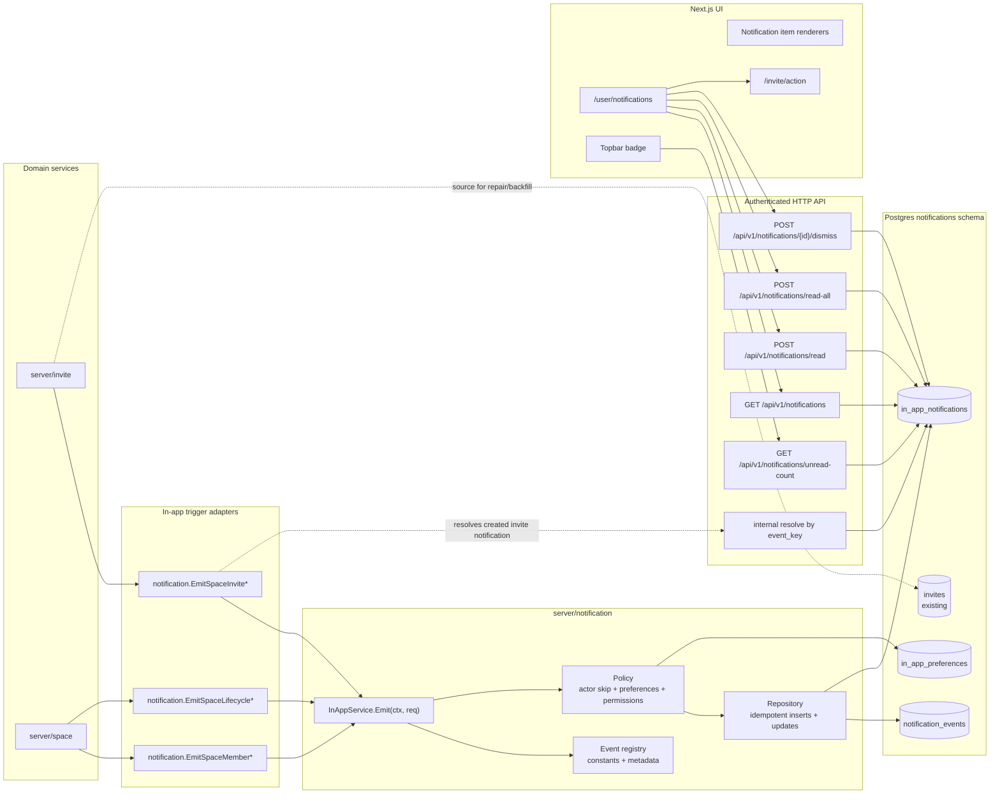
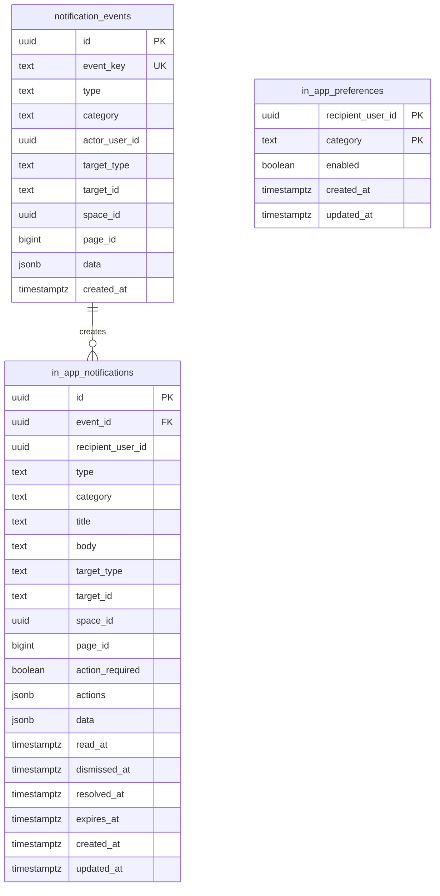
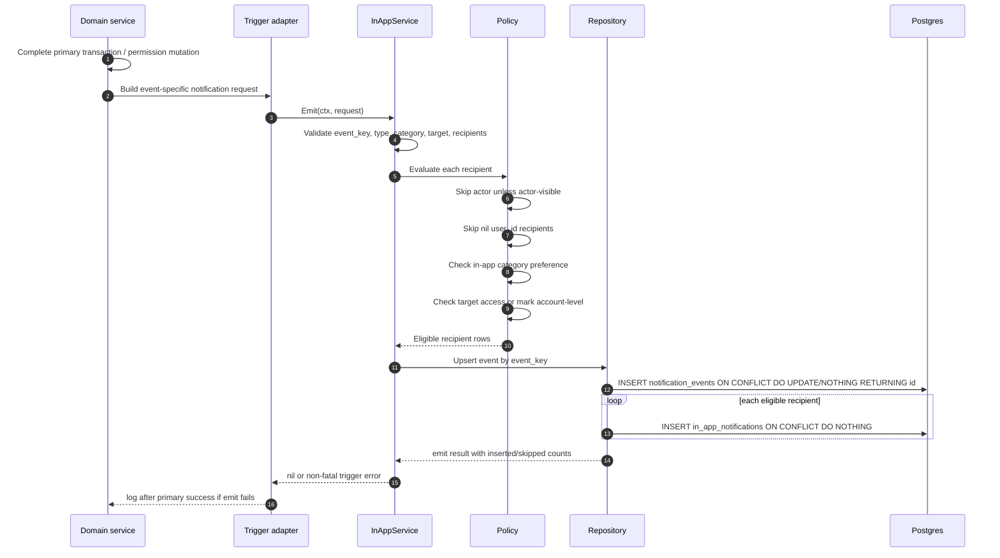
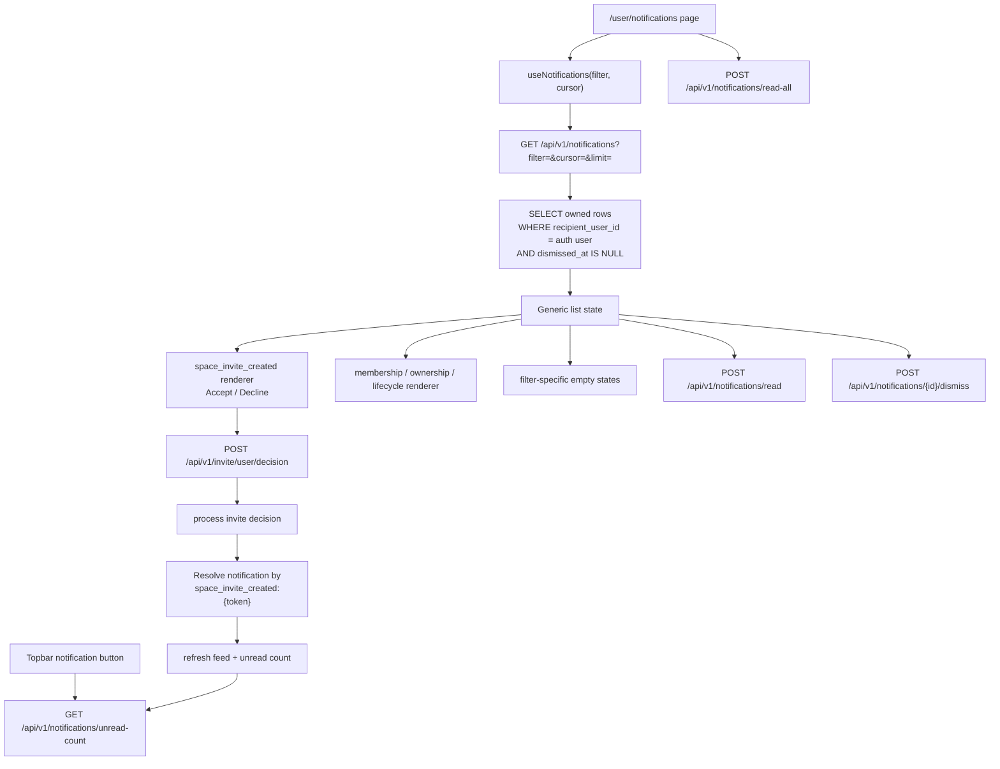
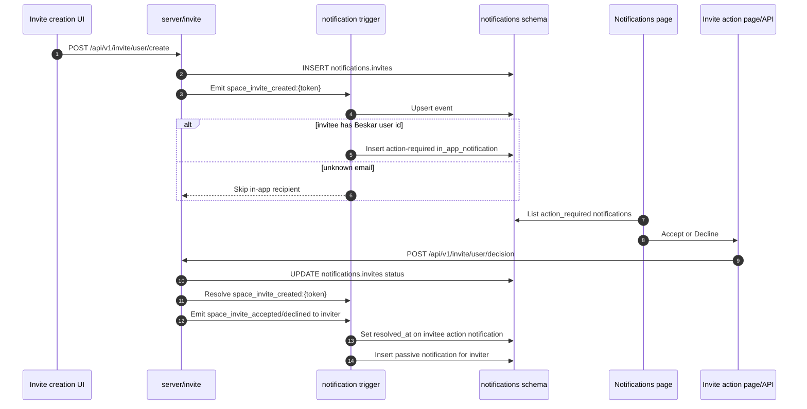
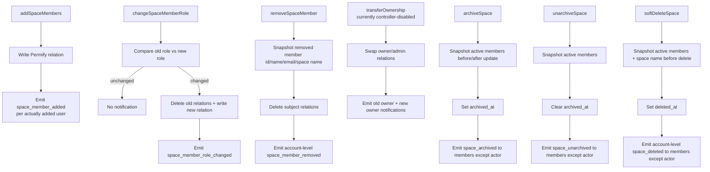
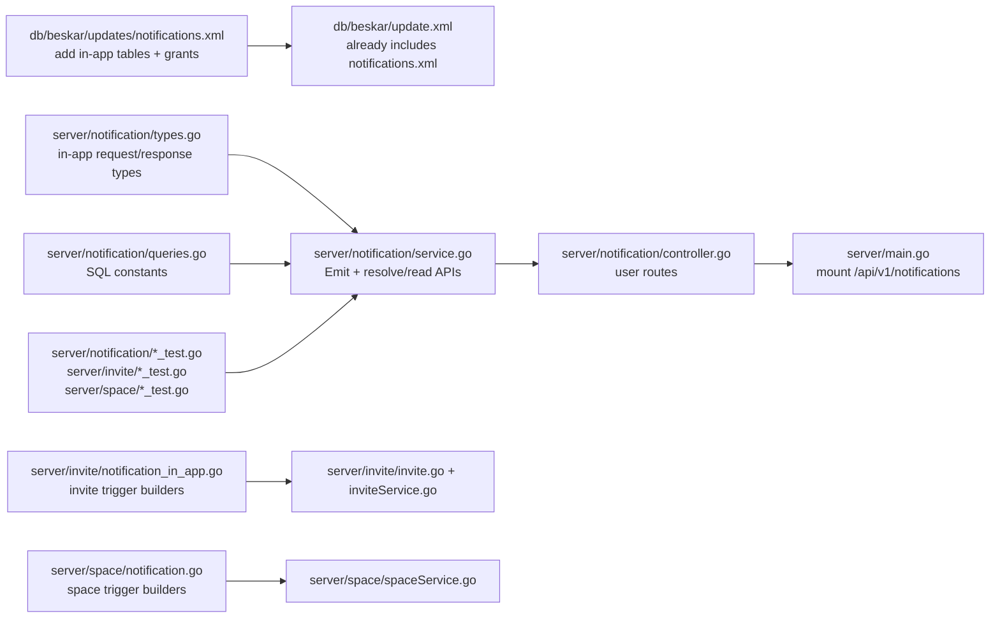
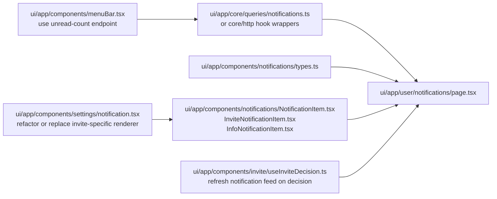

# In-App Notifications Implementation Diagram

This plan covers the in-app notification work from `req-notification-engine-and-flow-expansion.md`.
Email notification delivery is intentionally out of scope here. Existing email tables, workers, templates, preferences, suppressions, and invite email behavior must remain untouched.

## Scope

Implement durable in-app notifications for:

| Event type | Recipient | Action required | Target/link behavior |
|---|---|---:|---|
| `space_invite_created` | Known invitee user | Yes | `/invite/action?token={token}` |
| `space_invite_accepted` | Original inviter | No | Space members/invites settings when still allowed |
| `space_invite_declined` | Original inviter | No | Space invites settings when still allowed |
| `space_member_added` | Added member | No | Space home |
| `space_member_removed` | Removed member | No | Account-level notification, no space link |
| `space_member_role_changed` | Changed member | No | Space home or settings based on permission |
| `space_ownership_transferred` | Previous owner and new owner | No | Space settings/home when allowed |
| `space_archived` | Active members except actor | No | Space home/settings, read-only copy |
| `space_unarchived` | Active members except actor | No | Space home |
| `space_deleted` | Active members except actor, captured before delete | No | Account-level notification, no deleted space link |

Deferred from this phase:

- Comment notifications.
- Mention notifications.
- Page watcher notifications.
- Realtime SSE/websocket notification delivery.
- Email channel decisions, email preferences, digesting, new email templates, and any changes to currently enabled email flows.

## Hard Email Boundary

This implementation must not alter existing email notification behavior.

Rules:

- Do not change `notifications.email_messages`, `notifications.email_delivery_attempts`, `notifications.email_preferences`, or `notifications.email_suppressions`.
- Do not change `server/notification.EnqueueEmail`, the email worker, SMTP provider, template renderer, or existing email admin endpoints.
- Do not replace the current invite email call path. `server/invite` may continue calling `enqueueSpaceInviteCreatedEmail` exactly as it does today.
- Do not enqueue new emails from the in-app notification service in this phase.
- Do not migrate email preferences into a combined preference table in this phase.
- New in-app triggers run beside existing email-enabled flows. If an existing flow already sends email, it keeps sending email through the existing path; the in-app trigger only adds durable app feed rows.

## System Diagram



## Data Model Diagram



Recommended constraints and indexes:

```sql
UNIQUE notifications.notification_events(event_key);
UNIQUE notifications.in_app_notifications(event_id, recipient_user_id);
CREATE INDEX idx_in_app_user_created ON notifications.in_app_notifications(recipient_user_id, created_at DESC, id DESC);
CREATE INDEX idx_in_app_user_unread ON notifications.in_app_notifications(recipient_user_id, read_at, created_at DESC, id DESC);
CREATE INDEX idx_in_app_user_action_required ON notifications.in_app_notifications(recipient_user_id, action_required, resolved_at, created_at DESC, id DESC);
CREATE INDEX idx_in_app_space_created ON notifications.in_app_notifications(space_id, created_at DESC);
```

## Read And Action State Model

Read state and action-required state are separate dimensions.

| Field | Meaning | Set by | Cleared by |
|---|---|---|---|
| `read_at` | User has seen/acknowledged the notification in the feed. Controls unread styling and badge count. | `POST /notifications/read`, `POST /notifications/read-all`, or optional item open behavior | Not cleared in V1 |
| `action_required` | Notification represents an outstanding user decision or required workflow. | Event builder at creation time | Not cleared; it is historical classification |
| `resolved_at` | Required action is no longer pending. | Successful domain action, expiry, revoke, or repair reconciliation | Not cleared in V1 |
| `dismissed_at` | User hides a notification from normal feed views. | `POST /notifications/{id}/dismiss` | Not cleared in V1 |

Derived states:

| State | Query rule | Notes |
|---|---|---|
| Unread | `read_at IS NULL` | A notification can be unread and passive, or unread and action-required. |
| Read | `read_at IS NOT NULL` | Read does not imply resolved. |
| Action required | `action_required = true AND resolved_at IS NULL` | This is the Action Required filter. |
| Informational/passive | `action_required = false` | Membership, ownership, lifecycle, accepted/declined notices. |
| Resolved action | `action_required = true AND resolved_at IS NOT NULL` | Can still appear in All unless dismissed, with disabled/completed action UI. |
| Hidden | `dismissed_at IS NOT NULL` | Omitted from user feed filters. |

Important behavior:

- Marking read only sets `read_at`; it must not resolve an action.
- Accepting or declining an invite sets `resolved_at`; it may also set `read_at` for that notification.
- Action-required notifications should not be dismissible while `resolved_at IS NULL`.
- Topbar badge count should use unread count only: `read_at IS NULL AND dismissed_at IS NULL`.
- The API can also return `actionRequired` count from `action_required = true AND resolved_at IS NULL AND dismissed_at IS NULL`.
- UI should visually distinguish unread from action-required:
  - Unread: stronger background/text or unread dot.
  - Action required: persistent action chip and inline buttons.
  - Read but action-required: no unread styling, but action chip/buttons remain until resolved.
  - Resolved action: completed state; no action buttons.

## Emit Sequence



Domain operations should not fail user-facing success after the primary mutation has already committed. Trigger failures should be logged with type, category, target id, and user ids, excluding invite tokens in routine logs.

## API And UI Flow



## Invite Flow Diagram



## Space Membership And Lifecycle Flow



## Backend File Touch Points



Implementation notes:

- `server/notification.Service` can be extended with in-app methods only if `EnqueueEmail` behavior remains unchanged. Alternatively, add an `InAppService` type in the same package using the same database pool. Either way, keep email delivery paths isolated.
- Add code-defined event constants and categories in `server/notification`.
- Keep trigger builders close to domain packages so recipient rules remain near the mutations that know what actually changed.
- Use `context.Context` from the controller path where available; current space service helpers use `context.Background()` internally, so this can be improved opportunistically when adding trigger calls.

## Frontend File Touch Points



UI behavior:

- `All`: all non-dismissed notifications.
- `Unread`: `read_at IS NULL`.
- `Action Required`: `action_required = true AND resolved_at IS NULL`.
- Accept/decline uses the existing invite decision API, then refreshes the feed and topbar count.
- Passive notification clicks mark that item read and navigate only when the target is still safe.
- Removed/deleted space notifications render without a direct space link.

## Event Builders

| Builder | Event key | Required data | Dedupe behavior |
|---|---|---|---|
| `EmitSpaceInviteCreated` | `space_invite_created:{token}` | token, sender, invitee user id if known, space id/name, role | One event and one invitee row |
| `ResolveSpaceInviteCreated` | `space_invite_created:{token}` | token, recipient user id optional | Sets `resolved_at`; no new row |
| `EmitSpaceInviteAccepted` | `space_invite_accepted:{token}:{inviter_user_id}` | token, inviter, invitee, space id/name | One passive row for inviter |
| `EmitSpaceInviteDeclined` | `space_invite_declined:{token}:{inviter_user_id}` | token, inviter, invitee, space id/name | One passive row for inviter |
| `EmitSpaceMemberAdded` | `space_member_added:{space_id}:{recipient_user_id}` | actor, recipient, role, space id/name | Only users actually added |
| `EmitSpaceMemberRoleChanged` | `space_member_role_changed:{space_id}:{recipient_user_id}:{new_role}:{changed_at}` | old role, new role, changed_at | Requires role changed |
| `EmitSpaceMemberRemoved` | `space_member_removed:{space_id}:{recipient_user_id}:{removed_at}` | removed user, actor, space name | Account-level row, no space link |
| `EmitSpaceOwnershipTransferred` | two keys from requirements | old owner, new owner, space id/name | One row per owner |
| `EmitSpaceArchived` | `space_archived:{space_id}:{archived_at}` | active members snapshot, actor, space id/name | One event, many rows |
| `EmitSpaceUnarchived` | `space_unarchived:{space_id}:{unarchived_at}` | active members snapshot, actor, space id/name | One event, many rows |
| `EmitSpaceDeleted` | `space_deleted:{space_id}:{deleted_at}:{recipient_user_id}` | member snapshot before delete, actor, space name | Account-level row per member |

## Open Review Decisions

1. For `space_deleted`, this diagram includes account-level in-app notifications with no deleted-space link. The requirements say in-app should not point to deleted content and leave this as an open decision.
2. Ownership transfer notification wiring depends on enabling `transferOwnershipController`; it currently returns forbidden.
3. `space_member_role_changed` needs a stable timestamp or relation-version value. If no durable relation event version exists, use the successful mutation timestamp captured in the service.
4. `space_archived` and `space_unarchived` use one event row with many recipient rows. If we want per-recipient event keys for easier repair, adjust before implementation.

## Verification Plan

Backend:

- Emit creates a `notification_events` row and recipient `in_app_notifications` rows.
- Re-emitting the same event does not duplicate rows.
- Actor recipients are skipped.
- Unknown invite email recipients are skipped for in-app.
- Disabled in-app category preference skips rows.
- Feed/read/read-all/dismiss endpoints enforce authenticated ownership.
- Invite accept/decline resolves the invite notification and emits accepted/declined to inviter.
- Removed/deleted space notifications do not expose inaccessible links.

Frontend:

- `/user/notifications` renders loading, error, empty, all, unread, and action-required states.
- Invite actions work from the generic feed.
- Mark read and mark all read update the feed and topbar count.
- Membership, ownership, archive, unarchive, removed, and deleted notifications render with safe copy.
- Mobile notification actions do not overflow.
