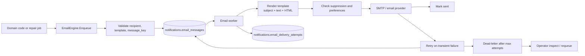

# Requirements: Email Notification Engine

## Overview

Build a reusable backend email notification engine for Beskar. The engine is responsible for accepting an email job, rendering the selected template, sending through SMTP or a transactional email provider, retrying transient failures, dead-lettering exhausted work, and exposing enough operational state to debug and requeue failures.

This requirement does not decide which product actions send email. Product/domain triggers are covered separately in `req-trigger-integration.md`.

## Goals

- Provide a backend API that can enqueue an email without sending it inline.
- Support recipients that are known users and recipients that are only raw email addresses.
- Render plain text and HTML templates with safe data substitution.
- Send email asynchronously through a configurable provider.
- Retry transient failures with exponential backoff and jitter.
- Dead-letter jobs that cannot be delivered after max attempts.
- Make email delivery idempotent by a caller-provided `message_key`.
- Keep the primary user action independent from email provider/network failures.

## Non-Goals

- Defining every product trigger.
- Building a full in-app notification feed.
- Mobile push notifications.
- Marketing campaign tooling.
- Admin UI for editing templates.
- Sending email synchronously inside HTTP request handlers.

## Architecture



## Public Backend Contract

The engine should expose an internal Go API, not a public unauthenticated endpoint.

```go
type EmailRecipient struct {
    UserID *uuid.UUID
    Email  string
    Name   string
}

type EnqueueEmailRequest struct {
    MessageKey   string
    Category     string
    TemplateKey  string
    Recipient    EmailRecipient
    TemplateData map[string]any
    Priority     string
    ScheduledAt  *time.Time
}

type EmailEngine interface {
    EnqueueEmail(ctx context.Context, req EnqueueEmailRequest) (uuid.UUID, error)
}
```

Contract rules:

- `message_key` is required and globally unique.
- `recipient.email` is required.
- `recipient.user_id` is optional.
- `template_key` must reference a registered template.
- `template_data` must contain all fields required by the template.
- `EnqueueEmail` only writes local database rows. It must not call SMTP, external identity APIs, or other network services.
- Duplicate `message_key` calls must be idempotent and return the existing message id.

## Unknown Recipient Support

The engine must support email-only recipients.

| Recipient Type | Required Data | Behavior |
|---|---|---|
| Known user | `recipient_user_id`, `recipient_email` | Store both. Use user id for preferences and audit. Send to email. |
| Unknown email | `recipient_email` only | Store email, leave `recipient_user_id` null, send email. |

Unknown-recipient rules:

- Do not require the email address to exist in Beskar or Zitadel.
- Do not create in-app notification rows for unknown recipients.
- Use `recipient_email` as the delivery address.
- If the same person later signs up, product logic can connect pending domain records by email. That mapping is outside the engine.

## Data Model

Recommended tables under the existing `notifications` schema:

```sql
CREATE TABLE notifications.email_messages (
  id UUID PRIMARY KEY DEFAULT gen_random_uuid(),
  message_key TEXT NOT NULL UNIQUE,
  category TEXT NOT NULL,
  template_key TEXT NOT NULL,
  template_version TEXT,
  recipient_user_id UUID,
  recipient_email TEXT NOT NULL,
  recipient_name TEXT,
  subject TEXT,
  text_body TEXT,
  html_body TEXT,
  template_data JSONB NOT NULL DEFAULT '{}'::jsonb,
  priority TEXT NOT NULL DEFAULT 'normal',
  status TEXT NOT NULL DEFAULT 'pending',
  attempt_count INT NOT NULL DEFAULT 0,
  scheduled_at TIMESTAMPTZ NOT NULL DEFAULT now(),
  next_attempt_at TIMESTAMPTZ NOT NULL DEFAULT now(),
  last_attempt_at TIMESTAMPTZ,
  sent_at TIMESTAMPTZ,
  failed_at TIMESTAMPTZ,
  dead_lettered_at TIMESTAMPTZ,
  provider TEXT,
  provider_message_id TEXT,
  last_error_code TEXT,
  last_error_message TEXT,
  created_at TIMESTAMPTZ NOT NULL DEFAULT now(),
  updated_at TIMESTAMPTZ NOT NULL DEFAULT now()
);

CREATE TABLE notifications.email_delivery_attempts (
  id UUID PRIMARY KEY DEFAULT gen_random_uuid(),
  email_message_id UUID NOT NULL REFERENCES notifications.email_messages(id) ON DELETE CASCADE,
  attempt_number INT NOT NULL,
  provider TEXT NOT NULL,
  status TEXT NOT NULL,
  started_at TIMESTAMPTZ NOT NULL DEFAULT now(),
  finished_at TIMESTAMPTZ,
  provider_message_id TEXT,
  error_code TEXT,
  error_message TEXT
);

CREATE TABLE notifications.email_preferences (
  recipient_user_id UUID NOT NULL,
  category TEXT NOT NULL,
  enabled BOOLEAN NOT NULL DEFAULT true,
  frequency TEXT NOT NULL DEFAULT 'instant',
  created_at TIMESTAMPTZ NOT NULL DEFAULT now(),
  updated_at TIMESTAMPTZ NOT NULL DEFAULT now(),
  PRIMARY KEY (recipient_user_id, category)
);

CREATE TABLE notifications.email_suppressions (
  email TEXT PRIMARY KEY,
  reason TEXT NOT NULL,
  source TEXT NOT NULL,
  created_at TIMESTAMPTZ NOT NULL DEFAULT now()
);
```

## Table Purpose

| Table | Purpose | Written By | Read By | Important Notes |
|---|---|---|---|---|
| `notifications.email_messages` | Durable email queue. Stores one logical email job and its current delivery state. | `EmailEngine.EnqueueEmail`, email worker. | Email worker, admin/debug tooling, metrics. | `message_key` makes enqueue idempotent. `recipient_user_id` may be null for unknown recipients. |
| `notifications.email_delivery_attempts` | Immutable-ish attempt history for each provider send attempt. | Email worker. | Admin/debug tooling, metrics. | Useful for debugging retries, provider failures, and final dead letters. |
| `notifications.email_preferences` | Known-user category-level email preferences. | Preferences API or default seeding. | Email worker before send. | Applies only when `recipient_user_id` is present. Unknown raw emails cannot use user preferences. |
| `notifications.email_suppressions` | Email-level block list for bounces, unsubscribes, manual blocks, or provider complaints. | Bounce/unsubscribe handlers, admin tooling. | Email worker before send. | Applies to known and unknown recipients by normalized email address. |

Indexes:

- `notifications.email_messages(status, next_attempt_at, priority)` for worker polling.
- `notifications.email_messages(message_key)` unique for idempotency.
- `notifications.email_messages(recipient_user_id, created_at DESC)` for user-level debugging.
- `notifications.email_messages(recipient_email, created_at DESC)` for invite/unknown-recipient debugging.
- `notifications.email_delivery_attempts(email_message_id, attempt_number DESC)`.

## Status Values

| Status | Meaning |
|---|---|
| `pending` | Email is queued and waiting for worker pickup. |
| `processing` | A worker has claimed the message. |
| `retrying` | Last attempt failed transiently; message will be retried at `next_attempt_at`. |
| `sent` | Provider accepted the email. |
| `failed` | Permanent failure; no retry planned. |
| `dead_lettered` | Max retries exhausted or worker marked unrecoverable after repeated failures. |
| `suppressed` | Recipient email is blocked by suppression/preference rules. |
| `skipped` | Engine intentionally skipped delivery, usually because email is disabled in config. |

## Worker Behavior

Worker requirements:

- Claim messages with `FOR UPDATE SKIP LOCKED` or equivalent so multiple backend instances can run safely.
- Only process rows where `status IN ('pending', 'retrying')` and `next_attempt_at <= now()`.
- Mark claimed rows `processing` before calling the provider.
- Render the template at send time so template fixes can apply to unsent jobs.
- Create one `email_delivery_attempts` row per provider send attempt.
- Mark success as `sent`, with `sent_at` and `provider_message_id`.
- Mark transient failures as `retrying` with exponential backoff and jitter.
- Mark permanent failures as `failed`.
- Mark exhausted retries as `dead_lettered`.

Recommended retry defaults:

- Max attempts: `10`.
- Initial delay: `30 seconds`.
- Maximum delay: `6 hours`.
- Backoff multiplier: `2`.
- Jitter: random `0-20%`.

## Dead-Letter Handling

V1 uses database status as the dead-letter queue.

Requirements:

- After max attempts, set `email_messages.status = 'dead_lettered'`.
- Preserve `template_data`, recipient, status, attempt count, timestamps, and final error.
- Operators must be able to list dead-lettered messages.
- Operators must be able to requeue a dead-lettered message.
- Requeue sets `status = 'pending'`, clears `dead_lettered_at`, sets `next_attempt_at = now()`, and keeps the same `message_key`.
- Requeue must not create duplicate rows.

Suggested operator endpoints, protected for operators only:

```http
GET  /api/v1/admin/email/messages?status=dead_lettered
GET  /api/v1/admin/email/messages/{messageId}
POST /api/v1/admin/email/messages/{messageId}/requeue
```

V1 operator endpoints require normal authentication and `X-Email-Admin-Token` matching `EMAIL_ADMIN_TOKEN`.

## Email Provider Configuration

Environment variables:

```env
EMAIL_NOTIFICATIONS_ENABLED=true
EMAIL_WORKER_ENABLED=true
EMAIL_ADMIN_ENABLED=false
EMAIL_ADMIN_TOKEN=
EMAIL_PROVIDER=smtp
EMAIL_FROM_ADDRESS=no-reply@example.com
EMAIL_FROM_NAME=Beskar
EMAIL_APP_BASE_URL=http://localhost:3000
SMTP_HOST=
SMTP_PORT=
SMTP_USERNAME=
SMTP_PASSWORD=
SMTP_USE_TLS=true
SMTP_TIMEOUT_SECONDS=10
```

Provider requirements:

- Start with SMTP for V1.
- Hide provider-specific code behind an interface.
- Implement the SMTP provider with `github.com/wneessen/go-mail`, pinned to `v0.6.2` while the backend uses Go 1.23.x. Avoid `net/smtp` because it is frozen and leaves MIME/multipart handling to application code.
- Store provider message id when available.
- Classify errors as transient or permanent.
- Never log SMTP credentials or full message bodies.

## Template Requirements

Templates can be code-defined in V1.

Each template must define:

- Template key.
- Required data fields.
- Subject.
- Plain text body.
- HTML body.
- Optional preview text.

Template rendering rules:

- Missing required fields fail before provider send.
- HTML output must escape user-provided values.
- Plain text body is required for every email.
- Links must be built from `EMAIL_APP_BASE_URL` or explicit caller data.
- Tokenized links must not be logged.

Initial template required for V1:

| Template Key | Purpose |
|---|---|
| `space_invite_created` | Sends a space invitation email to an existing or unknown recipient. |

Other templates are added only when their trigger integration is approved.

## Preferences And Suppression

Known-user preference rules:

- If `recipient_user_id` is set, check `email_preferences` by category.
- Missing preference rows fall back to enabled.
- Preference checks should happen at send time, not enqueue time.

Suppression rules:

- Always check `email_suppressions` by normalized lowercase email.
- If suppressed, mark the message `suppressed`; do not call the provider.
- Suppression applies to known and unknown recipients.

## Failure Handling

Primary action failure isolation:

- Calling code should enqueue after the primary domain transaction succeeds.
- Email enqueue failure must not roll back the primary user action unless that product trigger explicitly says email is mandatory.
- Provider/network failures must never affect the original HTTP request.

Failure categories:

| Failure | Handling |
|---|---|
| Duplicate `message_key` | Return existing message id. |
| Invalid recipient email | Reject enqueue request. |
| Missing template data | Reject enqueue request or mark `failed` before provider send. |
| SMTP timeout / DNS / connection failure | Mark `retrying`. |
| Provider `429` or `5xx` | Mark `retrying`. |
| Permanent recipient failure | Mark `failed` or add suppression if appropriate. |
| Max attempts exceeded | Mark `dead_lettered`. |

## Security

- Normalize and validate recipient emails.
- Do not log full email bodies, invite tokens, or SMTP credentials.
- Escape user-provided content in HTML templates.
- Keep admin/debug APIs authenticated and operator-only.
- Store only the template data needed to render the email.
- Treat unknown-recipient emails as external delivery. Do not include private document/comment content unless a trigger explicitly proves the recipient is allowed to see it.

## Observability

Metrics:

- Emails enqueued by category/template.
- Emails sent by provider.
- Retry count by error category.
- Dead-letter count.
- Suppressed/skipped count.
- Worker queue age.

Logs:

- `message_key`
- `message_id`
- `template_key`
- recipient user id when present
- redacted recipient email hash or domain
- provider
- status
- provider message id
- redacted error code/message

## Acceptance Criteria

- Enqueuing an email creates exactly one `email_messages` row for a unique `message_key`.
- Enqueuing the same `message_key` twice returns the existing message without duplicate delivery work.
- Known-user recipients and unknown-email recipients are both supported.
- Unknown-email recipients can receive email without a `recipient_user_id`.
- Worker sends pending email through SMTP when enabled.
- Disabled email configuration marks messages `skipped` or leaves them unsent according to configured behavior, without calling SMTP.
- Transient provider/network failures retry with backoff.
- Max retry exhaustion marks the message `dead_lettered`.
- Operator requeue moves a dead-lettered message back to `pending`.
- Suppressed email addresses are not sent.
- Email bodies and tokens are not written to logs.
