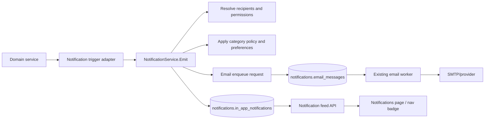

# Requirements: Notification Engine And Flow Expansion

## Overview

Beskar currently has a reusable email queue and worker under `server/notification`, but product integration is narrow: space invite creation enqueues an email, and the in-app Notifications page reads pending invites directly from `invite/user/invites`. This creates two gaps:

- Email is only available for invite flow even though other high-value workflows need mail when the recipient is offline or must act.
- In-app notifications are not a durable, general feed. They are invite-shaped UI records, so membership changes, ownership changes, lifecycle events, and later comment/mention events cannot be represented consistently.

This requirement expands notifications into a channel-based product notification system:

- Durable in-app notifications for eligible user-visible transactions.
- Email delivery for eligible transactions where email is necessary.
- A single trigger integration model so domain services emit one notification intent and the notification service decides recipients, channels, dedupe, preferences, and delivery.

The existing email engine remains the delivery mechanism for email. This document defines the product notification layer and the expanded flow requirements.

## Goals

- Add a durable in-app notification model that is not tied to invites.
- Keep the existing email queue, retry, dead-letter, provider, and template behavior.
- Add email templates and trigger adapters for all flows where email is required or strongly valuable.
- Move the Notifications page from invite-only data to a general notification feed.
- Support action-required notifications such as invite accept/decline.
- Support passive informational notifications such as membership updates, role changes, ownership changes, and lifecycle events.
- Avoid duplicate notifications across retries, repeated saves, or concurrent events.
- Respect user preferences for email and in-app categories.
- Prevent notification leakage when a user no longer has access to a space or page.
- Provide repair/backfill paths for missed notification side effects.

## Non-Goals

- Marketing or bulk campaign email.
- Mobile push notifications.
- Real-time websocket delivery for V1. The API should be compatible with polling first and realtime later.
- A fully editable admin template builder.
- Digest email in the first implementation, unless explicitly called out as follow-up.
- Notifying every low-value CRUD action. The flow matrix below defines eligible transactions.
- Comment notifications. Comment workflows need to evolve before notification rules are stable.
- Mention notifications. The mention feature does not exist yet.

## Current State

### Backend

- `server/notification` exposes `EmailEngine.EnqueueEmail(ctx, req)`.
- `notifications.email_messages` is the durable email queue.
- `notifications.email_delivery_attempts` stores provider attempts.
- `notifications.email_preferences` and `notifications.email_suppressions` exist for email preference/suppression use.
- `server/invite/notification.go` builds the `space_invite_created` email request.

### Frontend

- `ui/app/user/notifications/page.tsx` calls `invite/user/invites`.
- `ui/app/components/settings/notification.tsx` renders only invite notifications.
- Filters `All`, `Unread`, and `Action Required` currently show the same invite list.
- `Mark all as read` is disabled.

## Product Principles

- In-app notifications are the primary record for signed-in users.
- Email is reserved for events that require action, affect access/security, or are likely to be missed if the user is offline.
- A user must not receive a notification for their own action unless the event is explicitly a confirmation or security notice.
- Unknown raw email recipients only receive email. They cannot receive in-app notifications until they have a Beskar user id.
- Removed users may receive an email about losing access, but their in-app notification should only remain visible if it does not require access to removed content.
- Notifications must link to the most specific safe destination: invite action page, space settings, or space home.
- Links must gracefully fall back if the target was deleted, archived, or access was revoked.

## Notification Architecture



Domain services should not create in-app rows or email rows directly. They should call a notification trigger adapter after the primary transaction succeeds.

## Public Backend Contract

Add a product notification service in `server/notification` or a sibling package.

```go
type NotificationActor struct {
    UserID uuid.UUID
    Name   string
    Email  string
}

type NotificationTarget struct {
    Type    string
    ID      string
    SpaceID *uuid.UUID
    PageID  *int64
}

type NotificationRecipient struct {
    UserID *uuid.UUID
    Email  string
    Name   string
}

type NotificationAction struct {
    Key    string
    Label  string
    Method string
    URL    string
}

type EmitNotificationRequest struct {
    EventKey      string
    Type          string
    Category      string
    Actor         NotificationActor
    Recipients    []NotificationRecipient
    Target        NotificationTarget
    Title         string
    Body          string
    Data          map[string]any
    Actions       []NotificationAction
    Channels      []string
    EmailTemplate string
    EmailData     map[string]any
    CreatedAt     *time.Time
}

type NotificationService interface {
    Emit(ctx context.Context, req EmitNotificationRequest) error
}
```

Contract rules:

- `event_key` is required and deterministic.
- `type` is required and comes from the event type registry.
- `category` is required and maps to preference policy.
- `recipients` must be explicit. The service should not broadcast to a whole space without a resolver owned by that trigger.
- `channels` may contain `in_app`, `email`, or both.
- Email may only be enqueued when `recipient.email` is present.
- In-app rows may only be created when `recipient.user_id` is present.
- The service must skip the actor by default unless the trigger marks the event as actor-visible.
- Duplicate `(event_key, recipient_user_id, channel)` or `(event_key, recipient_email, channel)` must not create duplicate side effects.

## Data Model

Add durable in-app notification tables under the existing `notifications` schema.

```sql
CREATE TABLE notifications.notification_events (
  id UUID PRIMARY KEY DEFAULT gen_random_uuid(),
  event_key TEXT NOT NULL UNIQUE,
  type TEXT NOT NULL,
  category TEXT NOT NULL,
  actor_user_id UUID,
  target_type TEXT NOT NULL,
  target_id TEXT NOT NULL,
  space_id UUID,
  page_id BIGINT,
  data JSONB NOT NULL DEFAULT '{}'::jsonb,
  created_at TIMESTAMPTZ NOT NULL DEFAULT now()
);

CREATE TABLE notifications.in_app_notifications (
  id UUID PRIMARY KEY DEFAULT gen_random_uuid(),
  event_id UUID NOT NULL REFERENCES notifications.notification_events(id) ON DELETE CASCADE,
  recipient_user_id UUID NOT NULL,
  type TEXT NOT NULL,
  category TEXT NOT NULL,
  title TEXT NOT NULL,
  body TEXT,
  target_type TEXT NOT NULL,
  target_id TEXT NOT NULL,
  space_id UUID,
  page_id BIGINT,
  action_required BOOLEAN NOT NULL DEFAULT false,
  actions JSONB NOT NULL DEFAULT '[]'::jsonb,
  data JSONB NOT NULL DEFAULT '{}'::jsonb,
  read_at TIMESTAMPTZ,
  dismissed_at TIMESTAMPTZ,
  resolved_at TIMESTAMPTZ,
  expires_at TIMESTAMPTZ,
  created_at TIMESTAMPTZ NOT NULL DEFAULT now(),
  updated_at TIMESTAMPTZ NOT NULL DEFAULT now(),
  UNIQUE(event_id, recipient_user_id)
);

CREATE TABLE notifications.notification_preferences (
  recipient_user_id UUID NOT NULL,
  category TEXT NOT NULL,
  in_app_enabled BOOLEAN NOT NULL DEFAULT true,
  email_enabled BOOLEAN NOT NULL DEFAULT true,
  email_frequency TEXT NOT NULL DEFAULT 'instant',
  created_at TIMESTAMPTZ NOT NULL DEFAULT now(),
  updated_at TIMESTAMPTZ NOT NULL DEFAULT now(),
  PRIMARY KEY (recipient_user_id, category)
);
```

Indexes:

- `notification_events(event_key)` unique.
- `in_app_notifications(recipient_user_id, created_at DESC)`.
- `in_app_notifications(recipient_user_id, read_at, created_at DESC)`.
- `in_app_notifications(recipient_user_id, action_required, resolved_at, created_at DESC)`.
- `in_app_notifications(space_id, created_at DESC)` for debugging.
- `in_app_notifications(page_id, created_at DESC)` for debugging.

Relationship to existing email tables:

- Keep `notifications.email_messages`.
- Keep `notifications.email_delivery_attempts`.
- Either keep `notifications.email_preferences` and treat it as email-only, or migrate its rows into `notifications.notification_preferences`.
- Email message rows should store the originating `event_key` in `message_key`, e.g. `space_member_added:{space_id}:{recipient_user_id}`.

## Event Type Registry

Notification types must be code-defined constants. Free-form type strings are not allowed in domain code.

| Type | Category | Action Required | In-App | Email | Initial Status |
|---|---|---:|---:|---:|---|
| `space_invite_created` | `space_invite` | Yes | Yes for known user | Yes | Required |
| `space_invite_accepted` | `space_membership` | No | Yes to inviter | Optional | Required |
| `space_invite_declined` | `space_membership` | No | Yes to inviter | No | Required |
| `space_member_added` | `space_membership` | No | Yes to added user | Yes | Required |
| `space_member_removed` | `space_membership` | No | Yes if still valid | Yes | Required |
| `space_member_role_changed` | `space_membership` | No | Yes to changed user | Yes | Required |
| `space_ownership_transferred` | `space_security` | No | Yes to old and new owner | Yes | Required |
| `space_archived` | `space_lifecycle` | No | Yes to active members | Optional | Required |
| `space_unarchived` | `space_lifecycle` | No | Yes to active members | No | Required |
| `space_deleted` | `space_lifecycle` | No | No after access removal | Yes to active members before deletion | Required |
| `comment_thread_created` | `comments` | No | Later | Later | Deferred |
| `comment_reply_created` | `comments` | No | Later | Later | Deferred |
| `comment_thread_resolved` | `comments` | No | Later | Later | Deferred |
| `page_mention_created` | `mentions` | No | Later | Later | Deferred |
| `comment_mention_created` | `mentions` | No | Later | Later | Deferred |
| `page_published` | `pages` | No | Optional to watchers | No | Deferred |
| `page_deleted` | `pages` | No | Optional to watchers | No | Deferred |
| `attachment_uploaded` | `attachments` | No | No by default | No | Not eligible |

Required means the transaction is eligible for this requirement. Optional means the implementation should support the type, but product may turn the email channel off by default. Deferred means do not implement until the prerequisite product flow and recipient rules are stable.

## Flow Requirements

### 1. Space Invite Created

Current integration exists for email; expand it to in-app.

Recipients:

- Invitee if known user: in-app and email.
- Invitee if unknown email: email only.

In-app behavior:

- Create one action-required notification with `Accept` and `Decline` actions.
- Link opens `/invite/action?token={token}`.
- Accept/decline resolves the in-app notification.
- Existing invite feed should be replaced by this notification row.

Email behavior:

- Continue using `space_invite_created`.
- Email link opens the app action page, not a direct mutating endpoint.

Message/event key:

```text
space_invite_created:{invite_token}
```

Acceptance:

- Duplicate invite creation or retry does not create duplicate in-app rows or email rows.
- Invite accept/decline removes the notification from Action Required.
- Unknown email invite does not attempt an in-app row.

### 2. Space Invite Accepted / Declined

Recipients:

- Original inviter.

In-app behavior:

- Show an informational notification that the invitee accepted or declined.
- Link to the space settings members/invites page if the inviter still has permission.

Email behavior:

- Accepted: optional email for high-value async visibility.
- Declined: no email by default.

Event keys:

```text
space_invite_accepted:{invite_token}:{inviter_user_id}
space_invite_declined:{invite_token}:{inviter_user_id}
```

Acceptance:

- Inviter is notified once when the invite transitions from pending to accepted/declined.
- Re-opening an already accepted invite does not send another notification.

### 3. Member Added Directly

Recipients:

- Added member.

In-app behavior:

- Notify the member that they were added to the space and show their role.
- Link to the space home.

Email behavior:

- Send email because direct add grants access without an invite decision.

Event key:

```text
space_member_added:{space_id}:{recipient_user_id}
```

Acceptance:

- Bulk member add creates one notification per added member.
- Existing members skipped by the domain service do not receive notifications.
- Actor does not receive a notification when adding themselves is disallowed or skipped.

### 4. Member Role Changed

Recipients:

- Member whose role changed.

In-app behavior:

- Notify the user of the new role and space.
- Link to the space home or settings page depending on permission.

Email behavior:

- Send email because role changes affect access level.

Event key:

```text
space_member_role_changed:{space_id}:{recipient_user_id}:{new_role}:{change_timestamp_or_relation_version}
```

Acceptance:

- No notification if the role is unchanged.
- Owner role changes use ownership transfer event, not generic role changed.

### 5. Member Removed

Recipients:

- Removed member.

In-app behavior:

- If the user still has a valid account, create a notification that does not require opening the removed space.
- Target should be account-level, not space-level, to avoid broken access links.

Email behavior:

- Send email because access was revoked.

Event key:

```text
space_member_removed:{space_id}:{recipient_user_id}:{removed_at}
```

Acceptance:

- Removed user receives a clear notification without a link that leaks inaccessible space content.
- Owner cannot be removed through this flow and must not receive this event.

### 6. Ownership Transferred

Recipients:

- Previous owner.
- New owner.

In-app behavior:

- Previous owner sees confirmation that ownership was transferred.
- New owner sees that they are now owner and can manage the space.

Email behavior:

- Send email to both parties because ownership is security-sensitive.

Event keys:

```text
space_ownership_transferred:{space_id}:old_owner:{old_owner_user_id}:{new_owner_user_id}
space_ownership_transferred:{space_id}:new_owner:{new_owner_user_id}
```

Acceptance:

- Both users receive exactly one notification for a successful transfer.
- Failed transfers do not notify.

### 7. Space Archived / Unarchived

Recipients:

- Active members except actor.

In-app behavior:

- Archived: notify members that the space is read-only.
- Unarchived: notify members that editing is available again.

Email behavior:

- Archived email is optional and should default off unless product decides it is important enough.
- Unarchived email should default off.

Event key:

```text
space_archived:{space_id}:{archived_at}
space_unarchived:{space_id}:{unarchived_at}
```

Acceptance:

- Actor is skipped.
- Members added after the archive event do not receive historical notifications.

### 8. Space Deleted

Recipients:

- Active members at the time deletion is confirmed, except actor.

In-app behavior:

- Do not create an in-app notification that requires reading the deleted space.
- If an account-level notification is created, it must not link to deleted content.

Email behavior:

- Send email because the workspace object and access are removed.

Event key:

```text
space_deleted:{space_id}:{deleted_at}:{recipient_user_id}
```

Acceptance:

- Recipient list is captured before permissions/content are removed.
- Email contains space name and actor name, but no unavailable links except app home.

## Deferred Comment And Mention Notifications

Comment and mention notifications are intentionally out of scope for this implementation.

Reasons:

- Comment workflows and recipient rules still need to evolve.
- Watcher/subscriber behavior is not defined.
- The mention feature does not exist yet.
- Mention dedupe requires persisted mention instances or another stable source of truth.

Future comment notification work should define recipients for thread creation, replies, resolve/unresolve, deleted/orphaned threads, and page access changes before implementation starts.

Future mention notification work should depend on the mention feature and must prove unchanged saves do not re-notify existing mentions.

## API Requirements

### List Notifications

```http
GET /api/v1/notifications?filter=all|unread|action_required&cursor={cursor}&limit={limit}
```

Response:

```json
{
  "items": [
    {
      "id": "uuid",
      "type": "space_invite_created",
      "category": "space_invite",
      "title": "Sara invited you to Product Design",
      "body": "Review the invite before choosing.",
      "actor": { "id": "uuid", "name": "Sara Ahmed" },
      "target": { "type": "space", "id": "uuid", "spaceId": "uuid", "pageId": null },
      "actionRequired": true,
      "actions": [
        { "key": "accept", "label": "Accept", "method": "POST", "url": "/api/v1/invite/user/decision" },
        { "key": "decline", "label": "Decline", "method": "POST", "url": "/api/v1/invite/user/decision" }
      ],
      "readAt": null,
      "resolvedAt": null,
      "createdAt": "2026-05-01T10:00:00Z"
    }
  ],
  "nextCursor": "opaque"
}
```

Rules:

- Only return notifications for the authenticated user.
- `unread` filters `read_at IS NULL`.
- `action_required` filters `action_required = true AND resolved_at IS NULL`.
- Pagination is cursor-based by `created_at DESC, id DESC`.
- Deleted/dismissed notifications are omitted unless an admin/debug endpoint asks for them.

### Unread Count

```http
GET /api/v1/notifications/unread-count
```

Response:

```json
{
  "unread": 8,
  "actionRequired": 2
}
```

### Mark Read

```http
POST /api/v1/notifications/read
{
  "notificationIds": ["uuid"]
}
```

Rules:

- Only marks notifications owned by the authenticated user.
- Already read notifications remain read.

### Mark All Read

```http
POST /api/v1/notifications/read-all
{
  "category": null
}
```

### Dismiss

```http
POST /api/v1/notifications/{notificationId}/dismiss
```

Rules:

- Dismiss hides passive notifications.
- Action-required notifications cannot be dismissed unless the action is no longer valid or the product explicitly allows dismissal.

### Resolve Action Notification

Domain actions should resolve the related notification by `event_key` or target metadata after a successful transition.

Examples:

- Accept/decline invite sets `resolved_at`.
- Removed/expired invite sets `resolved_at`.
- Removed/expired membership-related actions set `resolved_at` when applicable.

## Frontend Requirements

### Notifications Page

Replace invite-only rendering with a generic notification feed.

Required UI states:

- Loading.
- Error.
- Empty all.
- Empty unread.
- Empty action-required.
- Paginated list.
- Read/unread styling.
- Action-required styling.
- Inline actions for supported action types.
- Passive item link navigation.
- Mark selected/all as read.

Filters:

- `All`.
- `Unread`.
- `Action Required`.

Item rendering:

- Invite items show accept/decline actions.
- Membership, ownership, and lifecycle items show the space name and access change.
- Membership/security items show the space name and access change.
- Deleted or inaccessible targets show safe fallback copy and disable direct content links.

### Navigation Badge

The global navigation notification badge should use `GET /notifications/unread-count`.

Rules:

- Badge count represents unread notifications.
- Action-required count may be visually highlighted later, but V1 can use one count.
- After in-page action/read changes, refresh the count.

### Backward Compatibility

- Existing `/user/notifications` route remains.
- Existing invite action page remains.
- Current invite UI component can be refactored into a specialized renderer for `space_invite_created`.
- The old direct `invite/user/invites` feed should be removed only after the generic API supports invite notifications.

## Preferences And Delivery Policy

Default category policy:

| Category | In-App Default | Email Default | Notes |
|---|---:|---:|---|
| `space_invite` | On | On | Required for unknown recipients by email. |
| `space_membership` | On | On | Access granted/revoked/changed. |
| `space_security` | On | On | Ownership transfer. |
| `space_lifecycle` | On | Off except delete | Archive/unarchive email can be noisy. |
| `comments` | Deferred | Deferred | Out of current scope. |
| `mentions` | Deferred | Deferred | Out of current scope until the mention feature exists. |
| `pages` | Off until watchers exist | Off | Deferred. |

Preference rules:

- In-app preferences apply only to known users.
- Critical security/access emails may bypass email opt-out only if product and legal policy allow it. Otherwise label them as required account/access notices.
- Unknown email recipients cannot have stored user preferences; suppressions still apply.
- Suppressed email addresses must not receive email, even for invite.

## Dedupe And Idempotency

Every trigger must define:

- Stable `event_key`.
- Recipient set.
- Channel policy.
- Email `message_key`.
- Repair source.

Rules:

- `notification_events.event_key` is globally unique.
- `in_app_notifications(event_id, recipient_user_id)` is unique.
- Email `message_key` remains globally unique.
- Retrying `Emit` is safe.
- Re-running repair jobs is safe.

## Security And Privacy Requirements

- Never create a notification for a recipient who lacks permission to view the target, except account-level access removal notices that intentionally avoid content links.
- Do not store sensitive document body excerpts in notification rows unless reviewed. Prefer page title, space name, actor name, and short generated copy.
- Do not log invite tokens, action URLs with tokens, or email addresses in high-volume logs.
- Action URLs must require authentication and server-side permission checks.
- Mark/read/dismiss endpoints must enforce ownership by authenticated user id.
- Admin/debug endpoints must be protected separately from user APIs.

## Observability Requirements

Metrics:

- Notifications emitted by type/category/channel.
- Notifications skipped by reason: actor, preference, no recipient, no permission, missing email, suppression.
- Email enqueue success/failure by type/category.
- In-app insert conflicts by type/category.
- API latency and error counts for feed endpoints.

Logs:

- Structured logs on trigger failures after primary transaction commit.
- No tokens, passwords, or provider credentials.
- Avoid full recipient email in routine logs; use user id where available.

Admin/debug:

- Inspect event by `event_key`.
- Inspect notifications for a user id.
- Inspect email messages by `message_key` or recipient.
- Requeue failed emails using existing email admin endpoints.

## Repair Jobs

Repair jobs should run manually first and can become scheduled jobs later.

| Job | Source | Missing Condition | Action |
|---|---|---|---|
| Invite notification repair | `notifications.invites` | Pending invite lacks `notification_events.space_invite_created:{token}` or email message | Emit invite notification. |
| Membership notification repair | Permission/member audit source | Recent member event missing notification | Emit missing member notification when source event log exists. |

If a domain does not have a durable source event log, add one before claiming repair coverage.

## Migration Plan

1. Add in-app notification schema and generic service contract.
2. Add generic notification API endpoints and tests.
3. Integrate `space_invite_created` into both in-app and email channels.
4. Move `/user/notifications` to the generic notification API.
5. Add membership and ownership triggers.
6. Add space lifecycle triggers.
7. Add preference UI for email and in-app categories.
8. Remove invite-only notification feed code once parity is verified.
9. Revisit comment notifications after comment recipient rules evolve.
10. Revisit mention notifications after the mention feature exists.

## Testing Requirements

Backend tests:

- Emit creates event and in-app row.
- Emit enqueues email using existing email engine.
- Duplicate emit does not duplicate event, in-app row, or email row.
- Actor is skipped.
- Unknown email recipient receives email only.
- Preference-disabled email is skipped.
- Preference-disabled in-app is skipped.
- Suppressed email is skipped.
- User cannot list, read, dismiss, or resolve another user's notification.
- Invite accept/decline resolves the invite notification.

Frontend tests:

- Notifications page renders all supported item types.
- Filters show correct subsets.
- Mark all as read updates UI and badge.
- Invite accept/decline works from the generic feed.
- Inaccessible/deleted target fallback does not crash.
- Mobile layout supports inline actions without overflow.

Manual verification:

- Create invite to known user: in-app + email.
- Create invite to unknown email: email only.
- Accept invite: invite notification resolves and inviter gets result.
- Add member directly: added user sees in-app and receives email.
- Change role: target sees access change.
- Remove member: target receives account-level notice.
- Transfer ownership: old and new owners receive notices.

## Acceptance Criteria

- There is a general in-app notification table and API independent of invite records.
- `/user/notifications` displays notifications from the generic feed.
- Invite notifications retain current accept/decline behavior and also create durable in-app rows.
- Email is available through the existing email engine for every required email flow in the registry.
- All required invite, membership, ownership, and lifecycle events have defined trigger adapters or explicit dependency blockers.
- Notification creation is idempotent.
- User preferences and suppressions are respected.
- No notification leaks inaccessible target data.
- Tests cover emit, dedupe, feed APIs, invite actions, and at least one non-invite flow.

## Open Decisions

- Whether archive notifications should email all members or only in-app notify.
- Whether space deletion should also create account-level in-app notifications before access is removed.
- Whether to implement notification digest as a later email frequency.
- Whether to add realtime SSE/websocket delivery after polling APIs are stable.
