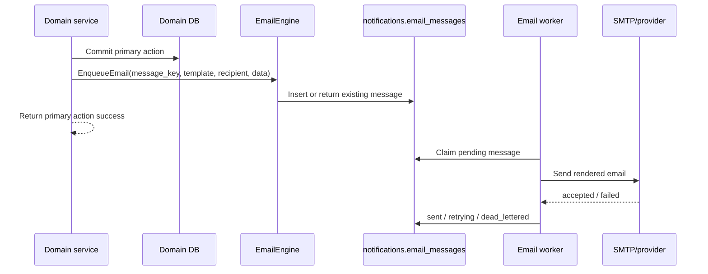

# Requirements: Notification Trigger Integration

## Overview

This document defines how product/domain code should integrate with the email notification engine. It intentionally does not belong inside the engine requirement because many possible notification triggers are not implemented yet, may not be needed in V1, or need separate product decisions.

The email engine requirement is `req-email-notification-engine.md`.

## Dependency

Trigger integration depends on the email engine:

- `EmailEngine.EnqueueEmail(ctx, req)`
- durable `notifications.email_messages`
- worker-based provider delivery
- retry and dead-letter behavior
- idempotent `message_key`

Triggers should not call SMTP or provider code directly.

## Integration Principles

- Add a trigger only when the product flow exists and the notification has clear user value.
- Emit email after the primary domain transaction succeeds.
- Do not block the primary user action on provider/network delivery.
- Use deterministic `message_key` values.
- Keep template data minimal.
- For unknown recipients, pass `recipient.email` and leave `recipient.user_id` null.
- Avoid broad notifications to entire spaces unless product explicitly requires them.
- Prefer V1 integration with one high-value trigger, then expand.

## Integration Flow



## V1 Trigger Recommendation

Start with one trigger:

| Trigger | Reason | Template | Recipient |
|---|---|---|---|
| Space invite created | Existing invite flow already stores `email_id` and token; email is required for inviting users who are not in the system. | `space_invite_created` | Invite email, with optional `user_id` when known. |

This keeps V1 focused and validates the engine with a real product need.

## Space Invite Created

Code area:

- `server/invite/createInvitation`
- `server/invite/Invite.invite`
- `notifications.invites`

Trigger timing:

- Enqueue after the invite row is committed.
- If enqueue fails, return success for invite creation and log/metric the failure.
- A repair job should find pending invite rows without a matching email message and enqueue them later.

Message key:

```text
space_invite_created:{invite_token}
```

Recipient behavior:

```text
Existing user invite
  recipient_user_id = notifications.invites.user_id
  recipient_email = notifications.invites.email_id or current identity email

Unknown email invite
  recipient_user_id = NULL
  recipient_email = notifications.invites.email_id
```

Template data:

| Field | Purpose |
|---|---|
| `space_name` | Display target space. |
| `sender_name` | Show who invited the recipient. |
| `role` | Explain access level. |
| `accept_url` | Authenticated accept link containing token. |
| `reject_url` | Authenticated reject link containing token. |
| `app_url` | Fallback app URL. |

Acceptance:

- Inviting an existing user enqueues one email.
- Inviting an unknown email enqueues one email with `recipient_user_id = NULL`.
- Duplicate invite/email enqueue attempts do not create duplicate messages.
- If SMTP fails, the engine retries; invite creation remains successful.
- Pending invite repair can enqueue a missing invite email later.

V1 implementation notes:

- `server/invite/createInvitation` calls the trigger after `Invite.invite()` commits the invite row.
- `server/invite/notification.go` owns the trigger adapter, message key, template data, and accept/reject URL construction.
- `EMAIL_NOTIFICATIONS_ENABLED=false` skips enqueue entirely for local/dev safety.
- Enqueue failures are logged and do not fail the invite creation response.
- Pending invite repair is still a follow-up job; the V1 path covers newly created invites.

## Trigger Backlog

These are candidates only. They should not be treated as V1 requirements until product confirms the workflow.

| Candidate Trigger | Status | Notes |
|---|---|---|
| Invite accepted/rejected | Defer | Could notify sender, but not required for invite email V1. |
| Member added directly | Defer | Useful if direct-add flow is used heavily. |
| Role changed | Defer | Useful for permission clarity. |
| Removed from space | Defer | Needs careful copy because removed user may no longer have access. |
| Ownership transferred | Defer | High value, but separate from initial email engine. |
| Space archived/deleted | Defer | Needs product decision on recipient scope. |
| Page published | Defer | Needs watchers/subscriptions first. |
| Comment reply | Defer | Needs participant rules and digest decisions. |
| Mention created | Defer | Needs mention implementation and dedupe model. |
| Attachment added | Defer | Needs watcher/subscription model. |

## Trigger Decision Checklist

Before adding any new trigger:

- Is the domain action implemented and stable?
- Who exactly receives the email?
- Can recipients be resolved without leaking private data?
- Should unknown raw emails be allowed, or only known users?
- Is the notification instant or digest?
- What is the deterministic `message_key`?
- What template key and required data fields are needed?
- What happens if enqueue fails?
- Is there a repair job source for missed emails?
- What acceptance tests prove no duplicate emails are sent?

## Repair Jobs

V1 repair job:

| Repair Job | Source | Missing Condition | Action |
|---|---|---|---|
| Invite email repair | `notifications.invites` | Pending invite has no `email_messages.message_key = 'space_invite_created:{token}'` | Enqueue invite email. |

Future triggers should define their own repair source before they are implemented.

## Out Of Scope

- Building the email worker itself.
- Provider configuration.
- Template rendering engine internals.
- In-app notification feed.
- Every possible product trigger.

Those belong to the engine requirement or future product requirements.
