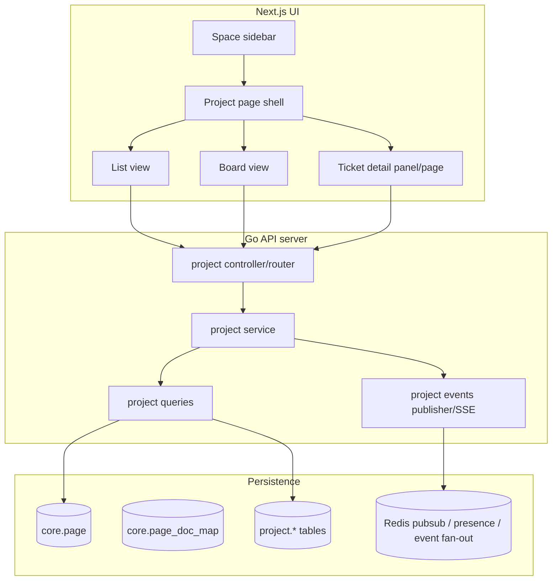
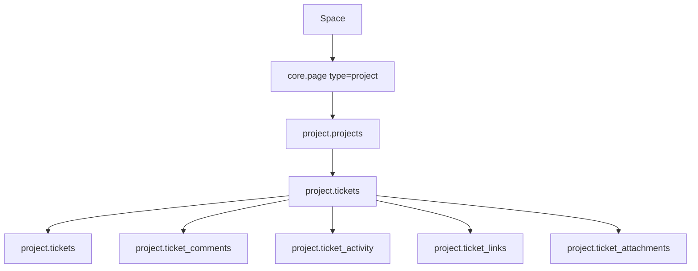
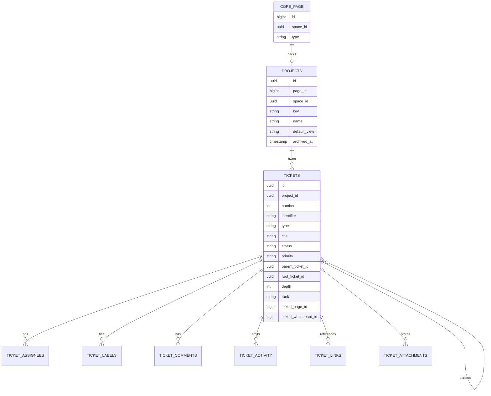
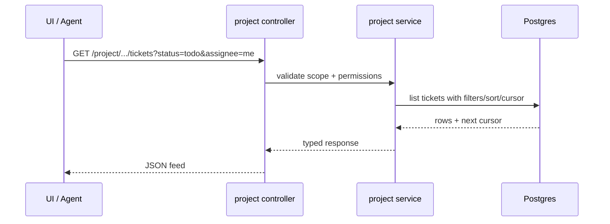
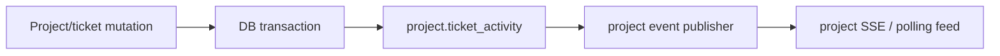

# Project Management Architecture

This document defines the implementation architecture for the Beskar project-management feature described in [requirements.md](/Users/kiran/projects/beskar/new-features/project-management/requirements.md). The goal is to add project and ticket management as a Beskar-native capability that reuses existing page, permission, and event patterns while staying lightweight and highly compatible with AI agents, while remaining compatible with later notification-platform expansion.

## 1. Executive summary

The project-management system should be implemented as a new Beskar page type, `project`, backed by a dedicated server domain package and project-specific database tables. A project remains a `core.page` so it inherits:

- space membership and navigation
- page-level permissions through existing Permify checks
- the existing page tree mental model
- common resource linking patterns used by documents and whiteboards

Tickets are not pages. They are structured records owned by a project, and they may form a lightweight parent/child hierarchy inside that project. This is the main architectural boundary that keeps the feature lightweight.

The feature has four main planes:

1. **Resource plane**: project page metadata inside `core.page`
2. **Domain plane**: ticket/project records and activity in a new `project` schema/package
3. **UI event plane**: project activity and page-local event feeds for open views and agent consumers
4. **Future notification plane**: a follow-up integration boundary for generic Beskar notifications after the notification platform expands beyond its current invite-focused scope

## 2. Goals

| Goal | Architectural consequence |
|---|---|
| Beskar-native project pages | Reuse `core.page` with `type = 'project'` rather than creating a separate top-level resource tree |
| Lightweight ticket management | Keep tickets as structured rows, not full document pages |
| Lightweight hierarchy | Model parent/child relationships directly on tickets with fixed types and validation rules, not a configurable issue-type/workflow system |
| AI-agent compatibility | Use stable IDs, explicit enums, deterministic APIs, idempotent writes, bulk endpoints, and machine-readable activity |
| Future notification compatibility | Emit canonical project activity/event data so later notification work can attach without rewriting ticket logic |
| Operational simplicity | Extend existing Go server conventions, Redis/event patterns, notification package, and UI routing patterns |

## 3. Existing Beskar touchpoints

The architecture should extend these existing areas rather than inventing parallel infrastructure.

| Concern | Current touchpoint | Reuse in project management |
|---|---|---|
| Page identity | `core.page`, `server/editor/queries.go`, `server/space/{spaceId}/page/list` | Add new page type `project` and include it in page listing/navigation |
| Permissions | `core.ValidateUserPagePermission`, `server/core/permify.go` | Project read/edit/archive rights inherit from page permissions |
| Notifications | `server/notification/` and `ui/app/user/notifications/page.tsx` | Do not depend on project-specific notification types in V1; keep project activity compatible with later reuse |
| Server push/event fan-out | `server/editor/pageevents/` | Reuse the same architectural pattern for project event streams |
| Attachments | `server/attachment/`, attachment requirement doc | Ticket attachments use the same storage/auth model |
| Linked Beskar resources | document + whiteboard page ids | Tickets link to pages without duplicating editor storage |

## 4. Proposed top-level architecture

## 5. Resource model

### 5.1 Project as a page

A project should be created as:

- one `core.page` row with `type = 'project'`
- one `project.projects` row with domain metadata

This mirrors how Beskar already distinguishes generic page identity from resource-specific storage such as document or whiteboard state.

### 5.2 Ticket as a structured domain record

A ticket is not a page and should not create `core.page` rows. It belongs to a single project and stores:

- type and hierarchy metadata
- status, priority, title, description
- reporter and assignees
- rank for list/board ordering
- due/completion timestamps
- labels
- linked Beskar resources
- attachments
- comments and activity

This keeps ticket operations cheap, filterable, and easy for agents to read and mutate.

### 5.3 Resource hierarchy

## 6. Proposed server package layout

Follow the existing Beskar pattern used by `server/comment` and `server/editor`, while keeping the domain compatible with later `server/notification` integration.

Suggested package:

- `server/project/`

Suggested files:

- `project.go`: router
- `controller.go`: HTTP handlers
- `service.go`: transactions and business logic
- `queries.go`: SQL
- `types.go`: request/response/domain structs
- `validations.go`: input validation and transition rules
- `events.go`: project activity and page-event helpers

Suggested subpackages if the domain grows:

- `server/project/eventstream/`
- `server/project/search/`

## 7. Database architecture

### 7.1 Core tables

The feature should introduce a dedicated schema, preferably `project`.

Suggested primary tables:

- `project.projects`
- `project.tickets`
- `project.ticket_assignees`
- `project.ticket_labels`
- `project.ticket_comments`
- `project.ticket_activity`
- `project.ticket_links`
- `project.ticket_attachments`

### 7.2 Relational model

### 7.3 Key design decisions

- `project.projects.page_id` should be unique.
- `project.tickets(project_id, number)` should be unique.
- `project.tickets.identifier` should be unique globally if stored; otherwise derive from `(project.key, number)`.
- `rank` should be designed for stable concurrent ordering within a sibling set and remain usable in board/list projections.
- hierarchy must stay project-local: `parent_ticket_id` may only reference a ticket in the same project.
- `root_ticket_id` and `depth` should be maintained transactionally so list/tree queries do not require recursive computation on every read.
- validation rules should reject cycles, invalid type nesting, and attempts to assign children to `subtask` tickets.
- `ticket_activity` should store normalized event types and structured payloads, not only human text.
- project activity should be rich enough to support later notification triggers without reshaping ticket writes.

## 8. API architecture

### 8.1 Routing model

Project APIs should remain explicitly space-scoped and page-scoped to match Beskar conventions and permission checks.

Suggested API routes:

- `GET /api/v1/project/space/{spaceId}/page/{pageId}`
- `PATCH /api/v1/project/space/{spaceId}/page/{pageId}`
- `GET /api/v1/project/space/{spaceId}/page/{pageId}/tickets`
- `POST /api/v1/project/space/{spaceId}/page/{pageId}/tickets`
- `GET /api/v1/project/space/{spaceId}/page/{pageId}/tickets/{ticketId}`
- `PATCH /api/v1/project/space/{spaceId}/page/{pageId}/tickets/{ticketId}`
- `POST /api/v1/project/space/{spaceId}/page/{pageId}/tickets/bulk`
- `GET /api/v1/project/space/{spaceId}/page/{pageId}/activity`
- `GET /api/v1/project/space/{spaceId}/page/{pageId}/events`

### 8.2 API contract principles

- Return canonical IDs and human-friendly identifiers together.
- Accept and return explicit enum strings.
- Return ticket hierarchy fields directly in ticket payloads, including `type`, `parentTicketId`, `rootTicketId`, `depth`, and child summary counts where useful.
- Use structured validation errors.
- Support idempotency keys on create/update/bulk endpoints.
- Support optimistic concurrency via `version` or `updatedAt`.
- Support cursor pagination for tickets and activity.
- Support URL-stable filters so agents and humans can share the same views.

### 8.3 Ticket query path

## 9. UI architecture

### 9.1 Route shape

Suggested Next.js routes:

- `ui/app/space/[spaceId]/project/[pageId]/page.tsx`
- `ui/app/space/[spaceId]/project/[pageId]/ticket/[ticketIdentifier]/page.tsx`

Suggested components:

- `ProjectShell`
- `ProjectToolbar`
- `ProjectListView`
- `ProjectBoardView`
- `ProjectFilters`
- `TicketDetailPanel`
- `TicketHierarchyField`
- `TicketChildrenList`
- `TicketComposer`

### 9.2 Sidebar integration

The current sidebar and space layout logic filters page types explicitly. That logic should be expanded to understand `project` alongside `document` and `whiteboard`.

Expected UI changes:

- page-list response includes `type = 'project'`
- sidebar uses a project-specific icon and route
- space overview can optionally count projects separately

### 9.3 UI state strategy

Project UI state should split into:

- **server state**: tickets, activity, counts, filters
- **view state**: selected ticket, open drawer, board/list mode, active tab
- **optimistic state**: inline edits and drag moves

Do not make the board the source of truth. Ticket state changes must always round-trip through canonical API mutations.

## 10. Permission architecture

Project permissions should inherit from the backing page.

Rules:

- project view requires page `view`
- project/ticket create/edit requires page `edit`
- archive/delete requires page `delete` or an explicit stronger rule if needed later
- ticket comments/attachments reuse the same project edit/view rules unless later refined

This keeps the authorization surface consistent with:

- `core.ValidateUserPagePermission(...)`
- current document and whiteboard access checks

Per-ticket ACLs are explicitly deferred.

## 11. Activity and page event architecture

### 11.1 Canonical project activity

All important project mutations should emit canonical project activity events, for example:

- `project.created`
- `project.updated`
- `ticket.created`
- `ticket.updated`
- `ticket.status_changed`
- `ticket.parent_changed`
- `ticket.assigned`
- `ticket.comment_added`

Each event should contain:

- schema version
- event id
- event type
- occurred at
- actor
- space id
- project id
- project key
- ticket id and identifier when present
- before/after field changes
- canonical Beskar deep link
- compact summary text

### 11.2 Activity pipeline

The project domain should persist one canonical activity record per meaningful mutation and optionally fan that out to page-local listeners after commit.

### 11.3 Relation to existing Beskar systems

- **Activity storage** is part of the project domain and is the source of truth for project history.
- **Event streaming** should follow the architectural pattern already used in `server/editor/pageevents`.
- **Notifications** should remain a future integration point; V1 should not depend on new `/api/v1/notifications` project event types.

### 11.4 Why page events are separate from request handlers

Page-local event publication should remain an after-commit concern so:

- ticket writes stay deterministic
- transient publish failures do not break core edits
- open clients can recover through polling or explicit refetch

## 12. Future notification integration boundary

Project management should leave a clean seam for later notification work, but that is not part of the initial rollout.

Design rules for follow-up work:

- project-specific notification triggers should consume canonical project activity rather than duplicating ticket-domain logic
- any later email or in-app notification types should be implemented only after the generic notification platform supports them
- any later Slack, Google Chat, Gmail, or GitHub adapters should stay asynchronous and must never become the source of truth for ticket state

## 13. Real-time and incremental update architecture

Project pages need lightweight real-time behavior, but not collaborative CRDT editing.

Recommended model:

- UI uses standard fetch/polling for main ticket lists
- project events are exposed through SSE or long-poll using the same shape across transports
- list and board UIs reconcile incremental ticket updates by ticket id/version

Suggested event stream use cases:

- another user moves a ticket to a different column
- a comment count changes
- assignment changes while the page is open

This should follow the transport abstraction style already established in the document-collaboration work rather than introducing a bespoke socket protocol.

## 14. Search and filtering architecture

Filtering is a primary part of the product, not a UI afterthought.

The server query layer should support:

- status
- priority
- assignee
- reporter
- labels
- due date window
- updated-after
- free-text search
- sorting by updated, created, due, priority, rank

The UI should reflect filter state in URL query params so:

- agents can reconstruct the exact query
- humans can share views
- browser navigation stays predictable

## 15. AI-agent architecture considerations

The architecture should assume that Beskar itself, or external agents, will manipulate tickets programmatically.

Required features:

- bulk mutation endpoints
- idempotency keys
- structured transition rules
- stable machine-readable activity
- canonical deep links
- JSON export
- explicit status/priority enums

Recommended agent-safe patterns:

- never require DOM scraping to determine ticket state
- never hide important semantics in board position alone
- always return full canonical ticket data after mutations
- expose exact field changes in activity rows

## 16. Operational and scaling considerations

### 16.1 Data scale

Expected growth characteristics:

- many tickets per project
- frequent reads of filtered lists
- moderate write frequency on status/assignee/comments
- bursty page-local event fan-out after bulk updates

### 16.2 Indexing

Likely required indexes:

- `tickets(project_id, status, rank)`
- `tickets(project_id, updated_at desc)`
- `tickets(project_id, due_at)`
- `ticket_assignees(user_id, ticket_id)`
- `ticket_activity(ticket_id, created_at desc)`

### 16.3 Background work

Recommended workers/jobs:

- optional backfill/rebuild worker for derived counters

## 17. Failure modes and safeguards

| Failure mode | Safeguard |
|---|---|
| duplicate agent retries create duplicate tickets | idempotency keys + unique message/event keys |
| board reorder races | stable rank token strategy and optimistic concurrency |
| transient page-event publish failure | ticket write commits first; clients recover via polling/refetch |
| deleted linked document/whiteboard | keep link row, render as unavailable |
| large bulk update floods open clients with page events | event coalescing, cursor-based activity fetches, and polling fallback |

## 18. Recommended implementation phases

### Phase A: Core model

- add `project` page type
- add `project` schema tables
- build CRUD, filters, ticket activity, and rank handling

### Phase B: UI and routing

- add sidebar and page routing support
- implement project shell, list view, and ticket detail

### Phase C: Activity and live updates

- emit canonical project events
- expose project event stream

### Phase D: Follow-up notification integration

- only after the generic notification platform expands, map project activity into that system
- keep any later provider adapters outside the core ticket write path

### Phase E: Agent acceleration

- bulk APIs
- idempotency everywhere needed
- JSON export and richer event queries

## 19. Non-goals

This architecture intentionally does not require:

- tickets as full collaborative documents
- custom workflow builders in V1
- project-specific in-app notification types in V1
- project-specific email triggers in V1
- outbound Slack, Google Chat, Gmail, or GitHub project notifications in V1
- bidirectional GitHub/Jira/Slack task sync in V1
- a separate authorization model beyond page inheritance
- a heavy sprint/planning subsystem before core ticket flows exist

## 20. Success criteria

The architecture is successful if it enables:

- project pages to behave like native Beskar resources
- tickets to be fast, structured, and easy to query
- project activity to be durable, queryable, and reusable for later notification work
- AI agents to read and mutate state reliably through stable APIs
- future channels and richer automation without rewriting the domain core
