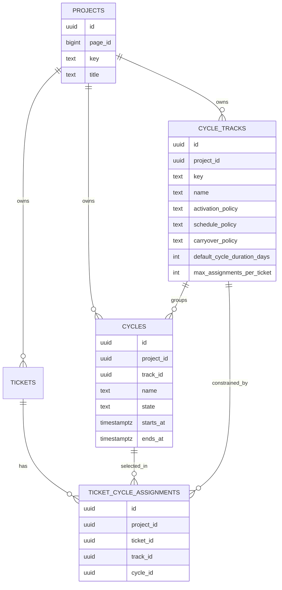

# Project Management Cycles Design

This document defines the detailed solution design for introducing cycles into Beskar project management.

It intentionally extends the original project-management scope. The earlier project-management requirements deferred sprint-style planning in the initial delivery; this document defines the next planning slice now that the base project and ticket system exists.

It builds on the existing project-management documents:

- [requirements.md](/Users/kiran/projects/beskar/new-features/project-management/requirements.md)
- [architecture.md](/Users/kiran/projects/beskar/new-features/project-management/architecture.md)
- [ux.md](/Users/kiran/projects/beskar/new-features/project-management/ux.md)

It also aligns with the current implementation in:

- [db/beskar/updates/project_management.xml](/Users/kiran/projects/beskar/db/beskar/updates/project_management.xml)
- [server/project/types.go](/Users/kiran/projects/beskar/server/project/types.go)
- [server/project/queries.go](/Users/kiran/projects/beskar/server/project/queries.go)
- [server/project/service.go](/Users/kiran/projects/beskar/server/project/service.go)
- [ui/app/components/project-management/ProjectPageView.tsx](/Users/kiran/projects/beskar/ui/app/components/project-management/ProjectPageView.tsx)

## 1. Summary

Beskar project management currently supports:

- projects as `core.page` records with project metadata
- tickets with status, priority, hierarchy, assignee, labels, due date, comments, attachments, and activity
- three primary project views: `list`, `board`, and `my_work`

The missing layer is planning. Users can track tickets, but they cannot group work into overlapping planning dimensions such as:

- short execution windows like sprints
- release checkpoints like milestones
- broader horizons like quarters

The earlier draft assumed a ticket would belong to one sprint and one milestone. That is not sufficient. A ticket may need to belong to:

- `Sprint 14`
- `Launch Readiness`
- `Q3 FY26`

at the same time.

The correct model is therefore:

- **cycle tracks** define planning lanes such as `Sprint`, `Milestone`, and `Quarter`
- **cycles** are the actual time-bound or target-bound objects inside those tracks, such as `Sprint 14` or `Q3 FY26`
- **ticket cycle assignments** link tickets to cycles

The key UI idea is that cycles are visualized as **overlapping planning tracks on a time axis**, not as one flat list.

## 2. Design Goals

- Let a ticket belong to multiple cycles at the same time.
- Keep cycle membership explicit and machine-readable for agents.
- Preserve the current lightweight project-management model rather than turning Beskar into a full portfolio planning tool.
- Make the first implementation useful inside the current project page before requiring a full planning dashboard.
- Reuse the existing `server/project` domain, current page permissions, and current ticket detail flows.
- Keep future options open for additional track types without forcing a schema rewrite.

## 3. Non-Goals

- Story points
- Capacity planning
- Velocity charts
- Burn-down charts
- A full Jira Advanced Roadmaps equivalent
- Cross-project portfolio planning
- Multiple assignments to different cycles within the same track in v1
- A generic configurable workflow rule engine per cycle track
- Auto-closing tickets when a cycle completes

## 4. Core Product Model

### 4.1 Track

A **track** is a planning dimension inside a project.

Examples:

- `Sprint`
- `Milestone`
- `Quarter`

A track defines:

- how cycles are grouped
- how they are ordered visually
- whether an active cycle concept exists for that track
- whether cycles render as ranges, markers, or both
- the default duration and date relationship policy for cycles in that track
- whether a ticket can have one or many assignments in that track

For the first version, the recommended rule is:

- **at most one assignment per ticket per track**

That means a ticket can belong to:

- one sprint
- one milestone
- one quarter

at the same time, without belonging to two sprints or two quarters simultaneously.

### 4.2 Cycle

A **cycle** is an item inside a track.

Examples:

- Track `Sprint` -> cycles `Sprint 14`, `Sprint 15`, `Sprint 16`
- Track `Milestone` -> cycles `Launch Readiness`, `Pricing Freeze`
- Track `Quarter` -> cycles `Q3 FY26`, `Q4 FY26`

A cycle has:

- a name
- a lifecycle state
- optional goal or description
- start and end dates, or at least a target date

Different tracks can have very different cycle lengths:

- Sprint: days or weeks
- Milestone: days or months
- Quarter: months

### 4.3 Ticket cycle assignment

Tickets are assigned to cycles through an explicit join model.

This lets one ticket participate in multiple planning lenses simultaneously without duplicating the ticket or overloading labels.

Example:

- `WEB-31` belongs to sprint `Sprint 15`
- `WEB-31` belongs to milestone `Content Lock`
- `WEB-31` belongs to quarter `Q3 FY26`

### 4.4 Why the track model matters

Without tracks, cycles become a flat bag of tags with dates.

That fails because:

- the UI cannot clearly distinguish tactical cycles from strategic ones
- the API cannot enforce useful constraints
- a timeline view becomes visually chaotic
- filters become ambiguous

Tracks give the system structure:

- sprints occupy one row
- milestones occupy another row
- quarters occupy another row

## 5. Visualization Model

This is the most important product change from the previous design.

Cycles should be visualized as **planning tracks laid out against time**.

### 5.1 Dedicated cycles view

The dedicated `Cycles` view should render something conceptually like this:

```text
Time --------------------------------------------------------------->

Quarter      [ Q3 FY26 ------------------------------------------ ]

Milestone            [ Launch Readiness --------------- ]
Milestone                                  [ Pricing Freeze ---- ]

Sprint       [ S14 ] [ S15 ] [ S16 ] [ S17 ]
```

Behavior:

- each track is its own row
- each cycle is shown as a bar if it has a range
- a milestone with only a target date can render as a marker or very short bar
- overlapping cycles across tracks are expected, not treated as collision bugs

This view should answer:

- what planning tracks exist
- which cycle is current for each track
- what overlaps with what
- what tickets are assigned to the selected cycle
- where tickets are missing assignments

### 5.2 Cycles view layout

Recommended desktop layout:

1. Project header
2. Settings-style project tabs including `Cycles`
3. Cycles toolbar
4. Main planning canvas with tracks and time axis
5. Inspector panel or lower detail panel for selected cycle

Recommended contents:

- track legend and filters
- time scale controls such as `4 weeks`, `3 months`, `6 months`
- one row per track
- cycle bars in each row
- unassigned counts per track
- selected cycle ticket list
- quick actions like `Create cycle`, `Edit`, `Assign tickets`, `Complete`

### 5.3 Ticket-level visualization in normal views

The `Cycles` tab is where overlap becomes visible. The normal operational views should stay compact.

#### List view

Show a compact `Planning` cell or inline planning chips under the title.

Example:

- `Sprint 15`
- `Launch Readiness`
- `Q3 FY26`

To avoid noise:

- show up to 2 chips inline
- collapse the rest into `+1` or `+2 more`

#### Board view

Keep cards lighter.

Recommended behavior:

- show the most tactical assignment first, usually sprint
- if additional cycle assignments exist, show `+2 cycles` or a hover/detail affordance

#### My work view

Show planning context, but keep it secondary to ownership and status.

### 5.4 Ticket detail and create flows

Do not force users to reason about planning through a generic multi-select of raw cycles.

Instead, render a `Planning` section that is grouped by track.

Example:

- Sprint: `Sprint 15`
- Milestone: `Launch Readiness`
- Quarter: `Q3 FY26`

This keeps the editing mental model simple:

- users pick one cycle per track
- the API still stores assignments through a join model

### 5.5 Mobile and tablet

The timeline-heavy cycles view is primarily a desktop surface.

On smaller screens:

- cycle tracks should be collapsible sections or a stacked list
- each selected cycle should still show dates, status, and assigned tickets
- ticket detail should remain the main place to edit planning assignments

## 6. Chosen Data Model

### 6.1 Why direct fields on `project.tickets` are not enough

The earlier proposal used:

- `sprint_cycle_id`
- `milestone_cycle_id`

That only works when the set of planning dimensions is fixed and very small.

It breaks as soon as the product needs:

- quarter planning
- release train planning
- any other project-specific track

The requirement is no longer "one sprint plus one milestone." It is "many cycles across different tracks." That requires a proper assignment model.

### 6.2 Why not a flat many-to-many `ticket -> cycle` only

A plain many-to-many table without a track concept is also not enough.

The system still needs to know:

- which cycles are tactical versus strategic
- whether a ticket may belong to two cycles of the same kind
- how to render cycles on the planning view
- how to filter by a planning dimension

The correct model is therefore:

- `project.cycle_tracks`
- `project.cycles`
- `project.ticket_cycle_assignments`

### 6.3 Proposed tables

### `project.cycle_tracks`

Tracks are project-scoped planning lanes.

Suggested fields:


| Field                         | Type                 | Notes                                               |
| ----------------------------- | -------------------- | --------------------------------------------------- |
| `id`                          | UUID                 | Primary key                                         |
| `project_id`                  | UUID                 | FK to `project.projects.id`                         |
| `key`                         | TEXT                 | Stable key such as `sprint`, `milestone`, `quarter` |
| `name`                        | TEXT                 | Human name shown in UI                              |
| `position`                    | INTEGER              | Row ordering in the cycles view                     |
| `display_style`               | TEXT                 | `range`, `marker`, `auto`                           |
| `activation_policy`           | TEXT                 | `none`, `single_active`, `multi_active`             |
| `schedule_policy`             | TEXT                 | `flexible`, `non_overlapping`, `contiguous`         |
| `carryover_policy`            | TEXT                 | `keep_assignments`, `optional_open_ticket_carryover`, `required_open_ticket_decision` |
| `default_cycle_duration_days` | SMALLINT nullable    | Optional default duration for new cycles            |
| `max_assignments_per_ticket`  | SMALLINT             | `1` in v1                                           |
| `color_token`                 | TEXT nullable        | Optional UI token                                   |
| `created_by`                  | UUID                 | Actor                                               |
| `updated_by`                  | UUID nullable        | Last actor                                          |
| `created_at`                  | timestamptz          | Audit                                               |
| `updated_at`                  | timestamptz          | Audit                                               |
| `archived_at`                 | timestamptz nullable | Soft archive                                        |


Recommended constraints:

- unique `(project_id, key)` for non-archived tracks
- `display_style IN ('range', 'marker', 'auto')`
- `activation_policy IN ('none', 'single_active', 'multi_active')`
- `schedule_policy IN ('flexible', 'non_overlapping', 'contiguous')`
- `carryover_policy IN ('keep_assignments', 'optional_open_ticket_carryover', 'required_open_ticket_decision')`
- `default_cycle_duration_days IS NULL OR default_cycle_duration_days > 0`
- `max_assignments_per_ticket >= 1`

Recommended initial seed tracks per project:

- `Sprint`: `display_style=range`, `activation_policy=single_active`, `schedule_policy=contiguous`, `carryover_policy=required_open_ticket_decision`, `default_cycle_duration_days=14`
- `Milestone`: `display_style=auto`, `activation_policy=multi_active`, `schedule_policy=flexible`, `carryover_policy=keep_assignments`, `default_cycle_duration_days=NULL`
- `Quarter`: `display_style=range`, `activation_policy=single_active`, `schedule_policy=contiguous`, `carryover_policy=optional_open_ticket_carryover`, `default_cycle_duration_days=NULL`

These can be stored as rows even if the product does not yet expose full custom track creation.
The seed track keys are defaults for new projects, not service branching rules. Completion, scheduling, activation, and assignment behavior must be driven by the policy columns on the track row.

### `project.cycles`

Cycles belong to a track.

Suggested fields:


| Field          | Type                 | Notes                                        |
| -------------- | -------------------- | -------------------------------------------- |
| `id`           | UUID                 | Primary key                                  |
| `project_id`   | UUID                 | FK to `project.projects.id`                  |
| `track_id`     | UUID                 | FK to `project.cycle_tracks.id`              |
| `name`         | TEXT                 | `Sprint 14`, `Launch Readiness`, `Q3 FY26`   |
| `goal`         | TEXT                 | Short planning goal                          |
| `description`  | TEXT                 | Optional notes                               |
| `state`        | TEXT                 | `planned`, `active`, `completed`, `canceled` |
| `starts_at`    | timestamptz nullable | Optional, but recommended for ranges         |
| `ends_at`      | timestamptz nullable | Required for target or range display         |
| `position`     | INTEGER              | Ordering within the track                    |
| `completed_at` | timestamptz nullable | Set when completed                           |
| `created_by`   | UUID                 | Actor                                        |
| `updated_by`   | UUID nullable        | Last actor                                   |
| `created_at`   | timestamptz          | Audit                                        |
| `updated_at`   | timestamptz          | Audit                                        |
| `archived_at`  | timestamptz nullable | Soft archive                                 |


Recommended constraints:

- `state IN ('planned', 'active', 'completed', 'canceled')`
- `ends_at IS NOT NULL` for the first implementation
- if `starts_at IS NOT NULL`, then `starts_at <= ends_at`
- unique `(project_id, track_id, name)` for non-archived cycles is recommended

Important behavior:

- a sprint cycle normally has both `starts_at` and `ends_at`
- a milestone may have only `ends_at` or may have a full range
- a quarter normally has both `starts_at` and `ends_at`

### `project.ticket_cycle_assignments`

Assignments link tickets to cycles.

Suggested fields:


| Field         | Type                 | Notes                              |
| ------------- | -------------------- | ---------------------------------- |
| `id`          | UUID                 | Primary key                        |
| `project_id`  | UUID                 | FK to project for query efficiency |
| `ticket_id`   | UUID                 | FK to `project.tickets.id`         |
| `track_id`    | UUID                 | FK to `project.cycle_tracks.id`    |
| `cycle_id`    | UUID                 | FK to `project.cycles.id`          |
| `created_by`  | UUID                 | Actor                              |
| `updated_by`  | UUID nullable        | Last actor                         |
| `removed_by`  | UUID nullable        | Actor who removed or replaced this assignment |
| `created_at`  | timestamptz          | Audit                              |
| `updated_at`  | timestamptz          | Audit                              |
| `removed_at`  | timestamptz nullable | Set when the assignment is no longer current |
| `removal_reason` | TEXT nullable     | `manual`, `cycle_completed`, `cycle_canceled`, etc. |


Recommended constraints:

- unique current `(ticket_id, track_id)` where `removed_at IS NULL` so a ticket has at most one current cycle per track
- unique current `(ticket_id, cycle_id)` where `removed_at IS NULL`
- assignment must stay inside the same project
- assigned cycle must belong to the referenced track

Historical assignment rows should be retained after carryover or manual reassignment by setting `removed_at` instead of deleting the row. Current ticket planning views should read only rows where `removed_at IS NULL`; completed cycle reporting may include historical rows for that cycle.

Those last two rules can be enforced in service logic first; trigger-based DB enforcement can be added later if needed.

### 6.4 Example relational model




## 7. Lifecycle Rules

### 7.1 Track lifecycle

Tracks are relatively stable compared to cycles.

Recommended first-version behavior:

- tracks can be created from system templates
- tracks can be reordered
- tracks can be archived if no longer needed

Full arbitrary custom track creation can come later if the product needs it.

### 7.2 Cycle state rules

Cycles use:

- `planned`
- `active`
- `completed`
- `canceled`

State semantics are constrained by the track's `activation_policy`.

Examples:

- Sprint track -> `single_active`
- Milestone track -> `multi_active` or `none`
- Quarter track -> `single_active`

Recommended track defaults:

- Sprint: `single_active`
- Milestone: `multi_active`
- Quarter: `single_active`

This means:

- one active sprint at a time
- one active quarter at a time
- multiple milestones may be ongoing if the team wants that

### 7.3 Schedule rules

Cycle date relationships are constrained by the track's `schedule_policy`.

Recommended values:

- `flexible`: cycles may overlap or have gaps
- `non_overlapping`: cycles may have gaps, but cannot overlap
- `contiguous`: cycles must be back-to-back, with no gaps and no overlap

Recommended first-version behavior:

- `flexible` only requires valid dates on each individual cycle.
- `non_overlapping` and `contiguous` require both `starts_at` and `ends_at`.
- schedule checks compare cycles inside the same track only; overlaps across different tracks are expected.
- archived and canceled cycles are ignored by schedule checks.
- planned, active, and completed cycles participate in schedule checks so historical planning remains coherent.

For timestamp math, cycle ranges should be treated as half-open intervals: `[starts_at, ends_at)`. Under `contiguous`, the next cycle's `starts_at` should equal the previous cycle's `ends_at`.

`default_cycle_duration_days` is a creation default, not inherited mutable state. If a new cycle supplies `starts_at` but omits `ends_at`, the service can set `ends_at = starts_at + default_cycle_duration_days`. For a `contiguous` track, the create flow may also prefill `starts_at` from the latest non-archived, non-canceled cycle's `ends_at` when the caller does not provide a start date.

Changing `default_cycle_duration_days` must not rewrite existing cycles.

### 7.4 Assignment rules

For v1:

- a ticket can belong to many cycles
- but no more than one cycle in the same track

Examples:

- valid: `Sprint 15` + `Launch Readiness` + `Q3 FY26`
- invalid: `Sprint 15` + `Sprint 16`

### 7.5 Completion and carryover

When a cycle is completed:

- historical assignments should remain visible for audit and reporting
- incomplete tickets may need reassignment depending on the track

Completion behavior is constrained by the track's `carryover_policy`, not by hardcoded track keys.

Recommended values:

- `keep_assignments`: completing a cycle does not modify ticket assignments
- `optional_open_ticket_carryover`: completing a cycle may move or clear open-ticket assignments, but it is not required
- `required_open_ticket_decision`: if open tickets are assigned to the cycle, the completion request must either move them to another cycle in the same track or clear that track assignment

Generic first-version behavior:

- closed tickets can remain assigned to the completed cycle for reporting
- `keep_assignments` ignores carryover and only changes the cycle state
- `optional_open_ticket_carryover` defaults to keeping open-ticket assignments if no carryover action is supplied
- `required_open_ticket_decision` rejects completion when open tickets exist and no carryover action is supplied
- moving open tickets requires the target cycle to belong to the same project and same track, and to be assignable
- moving or clearing open tickets marks the old assignment rows as removed with `removal_reason=cycle_completed`; moving then inserts new current assignment rows for the target cycle

This keeps sprint-like, milestone-like, quarter-like, and custom track behavior data-driven. The seed templates choose sensible defaults, but the completion service should only evaluate `carryover_policy`.

## 8. API Design

All cycle APIs should live under the existing project route family:

- `/api/v1/project/space/{spaceId}/page/{pageId}`

### 8.1 Track endpoints

### List tracks

- `GET /cycle-tracks`

Response should return tracks in display order, plus current cycle summaries where useful.

### Create track

- `POST /cycle-tracks`

Recommended first version:

- support only known templates or constrained inputs
- avoid full arbitrary track configuration until the product proves the need
- allow typed policy fields only through supported enum values

### Update track

- `PUT /cycle-tracks/{trackId}`

Editable fields:

- `name`
- `position`
- `displayStyle`
- `activationPolicy`
- `schedulePolicy`
- `carryoverPolicy`
- `defaultCycleDurationDays`
- `colorToken`

If `schedulePolicy` is changed on a track with existing cycles, the service must validate all non-archived, non-canceled cycles in that track under the new policy and reject the update if they do not satisfy it. Changing `defaultCycleDurationDays` affects future cycle creation only.

### Archive track

- `DELETE /cycle-tracks/{trackId}`

Behavior:

- reject if active cycles still exist
- reject if open assignments still exist unless migration or reassignment flow is implemented

### 8.2 Cycle endpoints

### List cycles

- `GET /cycles`

Query parameters:

- `trackId`
- `state`
- `from`
- `to`
- `includeCounts=true|false`

### Create cycle

- `POST /cycles`

Request:

```json
{
  "trackId": "uuid",
  "name": "Sprint 15",
  "goal": "Merchandising QA",
  "description": "",
  "startsAt": "2026-06-10T00:00:00Z"
}
```

If `endsAt` is omitted and the track has `defaultCycleDurationDays`, the service should calculate `endsAt` from `startsAt`. If the track uses `non_overlapping` or `contiguous`, the resulting dates must pass the track's schedule policy before the cycle is created.

### Get cycle detail

- `GET /cycles/{cycleId}`

Should return:

- cycle metadata
- track metadata
- assignment counts
- optionally a ticket preview list

### Update cycle

- `PUT /cycles/{cycleId}`

Editable fields:

- `name`
- `goal`
- `description`
- `startsAt`
- `endsAt`
- `position`

Any update to `startsAt` or `endsAt` must re-run the track's schedule policy validation.

### Activate cycle

- `POST /cycles/{cycleId}/activate`

Rules come from the track:

- `single_active` -> no other active cycle in that track
- `multi_active` -> allow multiple
- `none` -> reject activation

### Complete cycle

- `POST /cycles/{cycleId}/complete`

Request:

```json
{
  "openTicketDisposition": "keep",
  "targetCycleId": null
}
```

Interpretation:

- `openTicketDisposition=keep` leaves ticket assignments unchanged
- `openTicketDisposition=move` moves open-ticket assignments to `targetCycleId`
- `openTicketDisposition=clear` clears open-ticket assignments for this track
- `targetCycleId` is required only when `openTicketDisposition=move`
- allowed and required dispositions are determined by the track's `carryoverPolicy`

### Cancel cycle

- `POST /cycles/{cycleId}/cancel`

### Archive cycle

- `DELETE /cycles/{cycleId}`

Recommended first-version rule:

- reject archive if active assignments still exist

### 8.3 Ticket API extensions

The current ticket APIs in [server/project/types.go](/Users/kiran/projects/beskar/server/project/types.go) should be extended to work with assignment arrays, not direct cycle ID fields.

### Create ticket

Add:

```json
{
  "cycleAssignments": [
    { "trackId": "track-sprint", "cycleId": "cycle-sprint-15" },
    { "trackId": "track-milestone", "cycleId": "cycle-launch-readiness" },
    { "trackId": "track-quarter", "cycleId": "cycle-q3-fy26" }
  ]
}
```

### Update ticket

Recommended shape:

```json
{
  "cycleAssignments": [
    { "trackId": "track-sprint", "cycleId": "cycle-sprint-16" },
    { "trackId": "track-quarter", "cycleId": "cycle-q3-fy26" }
  ],
  "cycleAssignmentsSet": true
}
```

Meaning:

- `cycleAssignmentsSet=true` means replace the ticket's current assignment set with the provided set
- if omitted, ticket planning assignments are left unchanged

This is more predictable than trying to overload field-by-field patch semantics for a variable set of tracks.

### Bulk update tickets

Recommended bulk shape:

```json
{
  "ticketIds": ["..."],
  "setCycleAssignments": [
    { "trackId": "track-sprint", "cycleId": "cycle-sprint-16" }
  ],
  "clearTrackIds": ["track-milestone"]
}
```

This allows common planning operations:

- assign selected tickets to next sprint
- clear milestone assignment
- add quarter context

### 8.4 Ticket response shape

Ticket responses should include assignment summaries sorted by track position.

Suggested response shape:

```json
{
  "id": "ticket-uuid",
  "identifier": "WEB-29",
  "title": "Finalize homepage QA checklist",
  "status": "in_review",
  "cycleAssignments": [
    {
      "track": {
        "id": "track-sprint",
        "key": "sprint",
        "name": "Sprint"
      },
      "cycle": {
        "id": "cycle-sprint-15",
        "name": "Sprint 15",
        "state": "active",
        "startsAt": "2026-06-10T00:00:00Z",
        "endsAt": "2026-06-21T00:00:00Z"
      }
    },
    {
      "track": {
        "id": "track-milestone",
        "key": "milestone",
        "name": "Milestone"
      },
      "cycle": {
        "id": "cycle-launch-readiness",
        "name": "Launch Readiness",
        "state": "planned",
        "endsAt": "2026-06-12T00:00:00Z"
      }
    }
  ]
}
```

### 8.5 Ticket filtering model

The filter model needs to support overlapping cycles.

Recommended query parameters:

- `cycle=<cycleId>` repeated
- `track=<trackId>` repeated
- `unplanned=true`
- `unplannedTrack=<trackId>` repeated

Recommended semantics:

- repeated `cycle` filters use **AND**
- repeated `track` filters mean the ticket must have an assignment in each requested track
- `unplanned=true` means no cycle assignments at all
- `unplannedTrack=<trackId>` means no assignment in that specific track

This makes cross-track filtering possible.

Example:

- `cycle=cycle-sprint-15&cycle=cycle-q3-fy26`

means:

- show tickets that are in both `Sprint 15` and `Q3 FY26`

### 8.6 Project summary extensions

Extend `ProjectPageView` with compact planning summaries:

- tracks
- active or current cycle per track
- unplanned ticket counts per track

Suggested shape:

```json
{
  "cycleTracks": [
    {
      "id": "track-sprint",
      "key": "sprint",
      "name": "Sprint",
      "currentCycle": {
        "id": "cycle-sprint-15",
        "name": "Sprint 15",
        "endsAt": "2026-06-21T00:00:00Z"
      },
      "unplannedTicketCount": 4
    },
    {
      "id": "track-quarter",
      "key": "quarter",
      "name": "Quarter",
      "currentCycle": {
        "id": "cycle-q3",
        "name": "Q3 FY26",
        "endsAt": "2026-09-30T00:00:00Z"
      },
      "unplannedTicketCount": 0
    }
  ]
}
```

## 9. Validation Rules

Validation should live alongside the current project validation layer in [server/project/validations.go](/Users/kiran/projects/beskar/server/project/validations.go).

Required checks:

- track keys are unique within a project
- `displayStyle`, `activationPolicy`, `schedulePolicy`, and `carryoverPolicy` are supported
- `defaultCycleDurationDays` is null or positive
- changing a track's schedule policy cannot make existing non-archived, non-canceled cycles invalid
- cycle belongs to the same project as its track
- cycle date order is valid
- cycle dates follow the track's schedule policy
- cycle completion follows the track's carryover policy
- assignments stay inside one project
- assigned cycle belongs to the referenced track
- no more than one cycle assignment per ticket per track
- cycle activation follows track policy
- archived or canceled cycles reject new assignment unless explicitly reopened

## 10. Activity and Audit

Cycles and assignments must integrate with the existing project activity stream.

Recommended new activity types:

- `cycle_track_created`
- `cycle_track_updated`
- `cycle_created`
- `cycle_updated`
- `cycle_activated`
- `cycle_completed`
- `cycle_canceled`
- `ticket_cycle_assignment_added`
- `ticket_cycle_assignment_removed`
- `ticket_cycle_assignment_changed`

For assignment events, `field_name` can be:

- `cycle_assignment`

and the structured event payload or old/new values should include:

- `trackId`
- `trackKey`
- `oldCycleId`
- `newCycleId`

This is more expressive than stuffing planning changes into fixed `sprint_cycle_id` style fields.

## 11. UI Design

The first implementation should improve the current project surface before shipping the full planning view.

### 11.1 Phase 1 UI

Touch existing surfaces in:

- [ProjectPageView.tsx](/Users/kiran/projects/beskar/ui/app/components/project-management/ProjectPageView.tsx)
- [ProjectTicketCreatePage.tsx](/Users/kiran/projects/beskar/ui/app/components/project-management/ProjectTicketCreatePage.tsx)

#### Header

Add:

- a compact summary of current cycles by track
- unplanned counts by track
- `Create cycle`
- `Manage cycles`

#### List view

Add:

- cycle filters
- track filters
- unplanned-by-track filters
- compact planning chips in the ticket cell

Recommended display:

- show at most 2 chips inline
- preserve current list density

#### Board view

Add:

- cycle and track filters
- a compact planning indicator on cards

Recommended display:

- one primary chip, typically sprint
- `+N cycles` overflow if more assignments exist

#### My work view

Add:

- visible planning context, but keep it secondary to owner and status

#### Ticket detail drawer and full page

Add a `Planning` section grouped by track:

- Sprint picker
- Milestone picker
- Quarter picker

If tracks are configurable later, the section should render from track metadata rather than hardcoded field names.

#### Create ticket route

Use the same track-grouped planning section.

Prefill behavior:

- from selected cycle context
- from parent ticket when creating a child

#### Bulk update

Support:

- set cycle in track
- clear cycle in track

This is the operational planning workflow teams will use most often.

### 11.2 Phase 2 UI

Add a fourth project tab:

- `Cycles`

This should extend the current `PROJECT_VIEW_TABS` in [ProjectPageView.tsx](/Users/kiran/projects/beskar/ui/app/components/project-management/ProjectPageView.tsx), which currently contains only `list`, `board`, and `my_work`.

The `Cycles` tab should follow the same settings-style tab treatment now used for the project view switcher.

#### Cycles tab structure

Recommended structure:

1. planning toolbar
2. time axis
3. one row per track
4. cycle bars or markers inside each row
5. selected-cycle inspector or details panel

#### Interaction model

- click a cycle bar to inspect it
- multi-select or filter across tracks later if needed
- create a cycle directly inside a track row
- drag is optional later, not required for the first version

#### Selected cycle details

Show:

- cycle metadata
- ticket counts by status
- assigned ticket list
- unassigned count in the same track
- actions such as `Assign selected tickets`, `Complete`, `Archive`

### 11.3 Mobile and tablet

- keep the rich timeline view desktop-first
- use stacked track sections on smaller devices
- keep planning editing in ticket detail
- allow cycle browsing and assignment without requiring the full timeline

## 12. Read Model and Query Changes

`ticketSummarySelect` in [server/project/queries.go](/Users/kiran/projects/beskar/server/project/queries.go) should be extended to aggregate cycle assignments.

Recommended read model changes:

- join `project.ticket_cycle_assignments`
- join `project.cycles`
- join `project.cycle_tracks`
- aggregate planning assignments into ordered response arrays

`getProjectView` should be extended with:

- track summaries
- current cycle per track
- unplanned counts per track

The timeline view itself can be powered by:

- list tracks
- list cycles in a date window
- optionally fetch tickets for the selected cycle

No materialized planning table is required initially.

## 13. Migration Plan

Add new Liquibase change sets to [db/beskar/updates/project_management.xml](/Users/kiran/projects/beskar/db/beskar/updates/project_management.xml):

1. create `project.cycle_tracks`
2. create `project.cycles`
3. create `project.ticket_cycle_assignments`
4. create partial unique indexes for current ticket-cycle assignments
5. seed or template default track policies
6. optionally extend `chk_project_default_view` to allow `cycles`

Notably, this design does **not** require adding direct cycle fields to `project.tickets`.

No backfill is required. Existing projects can begin with:

- no tracks

or

- seeded default tracks with no cycles

depending on the chosen product rollout.

## 14. Expected Code Impact

### Database

- [db/beskar/updates/project_management.xml](/Users/kiran/projects/beskar/db/beskar/updates/project_management.xml)

### Server

- [server/project/types.go](/Users/kiran/projects/beskar/server/project/types.go)
- [server/project/queries.go](/Users/kiran/projects/beskar/server/project/queries.go)
- [server/project/service.go](/Users/kiran/projects/beskar/server/project/service.go)
- [server/project/validations.go](/Users/kiran/projects/beskar/server/project/validations.go)
- [server/project/project.go](/Users/kiran/projects/beskar/server/project/project.go)
- [server/project/project_test.go](/Users/kiran/projects/beskar/server/project/project_test.go)
- [server/project/integration_test.go](/Users/kiran/projects/beskar/server/project/integration_test.go)

### UI

- [ui/app/components/project-management/ProjectPageView.tsx](/Users/kiran/projects/beskar/ui/app/components/project-management/ProjectPageView.tsx)
- [ui/app/components/project-management/ProjectTicketCreatePage.tsx](/Users/kiran/projects/beskar/ui/app/components/project-management/ProjectTicketCreatePage.tsx)
- [ui/app/components/**tests**/ProjectPageView.test.tsx](/Users/kiran/projects/beskar/ui/app/components/__tests__/ProjectPageView.test.tsx)
- [ui/app/components/**tests**/ProjectTicketCreatePage.test.tsx](/Users/kiran/projects/beskar/ui/app/components/__tests__/ProjectTicketCreatePage.test.tsx)

## 15. Rollout Plan

### Step 1

Ship planning primitives:

- cycle tracks
- cycles
- ticket cycle assignments
- activity support

### Step 2

Ship current-view integration:

- header summaries
- filters
- ticket detail planning section
- create-ticket planning section
- bulk planning updates

### Step 3

Ship the dedicated `Cycles` tab and track-based timeline view.

This keeps the feature useful even if the larger planning UI takes longer.

## 16. Testing Plan

### Unit and service tests

- create track
- create cycle in track
- create cycle with default duration from track
- reject overlapping cycle under `non_overlapping`
- reject gapped or overlapping cycle under `contiguous`
- reject invalid activation under `single_active`
- allow multiple active cycles under `multi_active`
- complete cycle with `keep_assignments`
- reject completion under `required_open_ticket_decision` when open tickets exist and no disposition is supplied
- move open tickets to a same-track target cycle during completion
- clear open-ticket assignments during completion while retaining historical assignment rows
- reject assignment to cycle in another project
- reject second assignment to another cycle in the same track
- replace cycle assignment for a track
- complete sprint and carry over sprint assignments
- complete quarter and carry over quarter assignments

### Integration tests

- create sprint, milestone, and quarter tracks
- create cycles in each track
- assign one ticket to multiple tracks
- filter by two cycles with AND behavior
- filter for tickets unplanned in a specific track
- verify project summary exposes current cycle per track

### UI tests

- render planning chips in list view
- edit planning assignments in ticket detail
- bulk assign tickets to next sprint
- render cycles tab with track rows
- select a cycle and inspect assigned tickets

## 17. Alternatives Considered

### Alternative A: direct fields on tickets

Examples:

- `sprint_cycle_id`
- `milestone_cycle_id`

Rejected because it does not scale to additional tracks such as quarter without repeatedly changing the schema and API.

### Alternative B: flat `ticket_cycle_assignments` without tracks

Rejected because it loses the structure needed for:

- clear visualization
- per-track constraints
- per-track filtering
- compact ticket editing

### Alternative C: cycles as page children in the space tree

Rejected because cycles are planning metadata inside a project, not top-level navigable resources like documents or whiteboards.

## 18. Open Questions

- Should projects start with seeded default tracks automatically, or should users enable them manually?
- Should the first release allow custom tracks, or only the system templates `Sprint`, `Milestone`, and `Quarter`?
- Should milestone tracks use `multi_active` or `none` as the default activation policy?
- Should repeated `cycle` filters use strict AND semantics from day one, or should the UI expose OR grouping later?
- Should the `Cycles` tab be allowed as `default_view` in the first UI release, or only after the timeline surface stabilizes?

## 19. Recommendation

Proceed with:

- `project.cycle_tracks`
- `project.cycles`
- `project.ticket_cycle_assignments`
- ticket APIs that read and write cycle assignment arrays
- phase 1 planning support in existing views
- phase 2 dedicated `Cycles` tab with track-based timeline visualization

This is the correct design for the clarified requirement that a ticket can belong to multiple cycles at the same time across different planning tracks.
