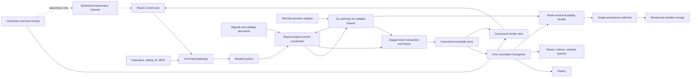

# Glideboard Correctness and Data-Safety Implementation Plan

- **Status:** Proposed engineering plan
- **Audit date:** 2026-07-14
- **Code baseline:** `e03d247` plus the current working tree
- **Primary scope:** `packages/glideline`, `packages/glideboard`, the Beskar whiteboard host, and whiteboard persistence endpoints
- **Parent roadmap:** [Current-State Gap Analysis and Implementation Roadmap](./current-gap-analysis-and-implementation-roadmap.md)
- **Audience:** Glideline, Glideboard, host-application, collaboration, and backend maintainers

## 1. Purpose

This document turns the correctness findings in the broader whiteboard roadmap into an implementation-ready safety program. It defines:

- the invariants the editor, store, history, collaboration, and persistence layers must preserve;
- the concrete failure modes in the current code;
- the target APIs and ownership boundaries;
- migration and backward-compatibility rules;
- a dependency-aware sequence of pull requests;
- unit, integration, browser, failure-injection, property, and concurrency tests;
- rollout gates that must pass before hierarchy, asset libraries, or richer editing expand the state model.

This plan distinguishes three concepts that the current implementation sometimes conflates:

1. **Visible state:** what the user sees during a gesture or text edit.
2. **Canonical editing state:** the committed in-memory store used by rendering, commands, history, and serialization; for every editable Beskar whiteboard it is a validated projection of Yjs at a tracked transaction checkpoint.
3. **Locally recoverable state:** a canonical revision whose IndexedDB/Yjs journal transaction has completed.
4. **Server-durable state:** a canonical revision or Yjs update/checkpoint digest that the server persistence authority has acknowledged.

A shape moving on screen does not necessarily mean the document has changed. A queued browser-storage write is not yet locally recoverable. A callback receiving a document or a provider reporting connected does not mean that document is server-durable. A read-only toolbar does not mean mutation is impossible. The implementation must encode those distinctions rather than relying on timing or UI convention.

## 2. Executive Summary

The current system has several P0 correctness risks:

- Glideboard state and save scheduling are module-global, so boards can share editor state and a pending timer can save the wrong or already-cleared document.
- Store writes are published before all fallible work completes. A validation, geometry, lifecycle-hook, or index failure can leave partial records or derived indices.
- Failed batches can notify observers of temporary state and still increment the store version after rollback.
- The store retains caller-owned object references. Mutating an input or serialized output can silently mutate the board without signals, history, spatial reindexing, or persistence.
- History and collaboration both monkey-patch store methods. They do not observe one authoritative atomic commit.
- Move, resize, and rotate previews mutate canonical records. Pointer-up then records history from the already-previewed state, so undo can be a no-op. Preview frames can also be autosaved and broadcast.
- `deserialize` merges records rather than replacing a document, while unknown or malformed records can partially install before geometry throws.
- Binding, page, and spatial indices can retain stale memberships after updates.
- Read-only is enforced mainly by UI hiding; keyboard, debug, imperative, tool, and direct-store paths can still mutate.
- Client autosave marks content clean before the request succeeds, does not flush on close, and retries neither ordinary failures nor conflicts.
- The server replaces complete Yjs snapshots without a revision precondition. A delayed client can overwrite newer merged state, and autosave can race publish.
- Rendering, point hits, export, and stored `index` do not use one total order.
- Rotation is applied by rendering and export elements but not consistently by RBush, hit testing, selection, anchors, routing, or export bounds.
- Text editing commits a stale full `props` object, so a concurrent unrelated update can be overwritten.

The central design decision is:

> Every durable mutation must pass through one instance-owned commit coordinator that validates a complete candidate state and prepares every required participant. It publishes one runtime-immutable store change set with its undo state; for every editable Beskar whiteboard that publication is a tracked projection of the corresponding Yjs transaction. Persistence advances only through an exact Glideline-revision/Yjs durability checkpoint.

Transient interaction and text drafts stay outside that durable path until commit.

## 3. Severity and Terminology

| Level | Meaning                                                                                                                   |
| ----- | ------------------------------------------------------------------------------------------------------------------------- |
| P0    | Can corrupt, lose, leak across sessions, incorrectly publish, or silently overwrite user data. Blocks broad rollout.      |
| P1    | Can produce inconsistent editing, collaboration, hit testing, export, or recovery. Blocks hierarchy and large-board work. |
| P2    | Primarily hardening, observability, or performance, but should be designed with the P0 foundation.                        |

| Term                  | Definition                                                                                                                                                |
| --------------------- | --------------------------------------------------------------------------------------------------------------------------------------------------------- |
| Record                | A persisted shape, binding, page, asset, or opaque future record.                                                                                         |
| Canonical store       | The committed in-memory editing database. For every editable Beskar whiteboard it is a validated projection of Yjs at a tracked transaction checkpoint.   |
| Transient overlay     | Gesture, eraser, binding, or edit preview state that affects display but is not serializable or durable.                                                  |
| Transaction           | A staged candidate-state computation that publishes all changes or none.                                                                                  |
| Change set            | The immutable description of one successful non-empty canonical commit.                                                                                   |
| Origin                | Why a transaction exists: user, undo, redo, remote, load, system, or repair.                                                                              |
| Replacement           | Making the store exactly match an incoming document.                                                                                                      |
| Merge/import          | Intentionally adding or remapping incoming records while retaining existing records.                                                                      |
| Persistence authority | The one component responsible for durable storage for a board mode.                                                                                       |
| Revision              | A monotonic canonical commit number in memory, or an opaque durable version token from the server.                                                        |
| Durability checkpoint | The exact store revision and Yjs transaction sequence plus canonical-state/update digest acknowledged by local recovery and server persistence.           |
| Read-only             | A mutation policy that rejects local durable changes at the command boundary; it is not merely hidden UI.                                                 |

## 4. Required Invariants

These invariants are the acceptance contract for the redesign.

### INV-01. Session isolation

Every mounted board owns its editor, store, history, clipboard, tools, transient overlays, collaboration adapter, awareness, save coordinator, settings, and debug handle. Disposing board A cannot read, clear, save, or publish board B.

### INV-02. Atomic visibility

A logical transaction exposes either the complete previous state or the complete next state. A failed or no-op transaction changes no record signal, index, revision, history stack, persistence state, or collaboration state.

### INV-03. Store ownership

The store owns deeply immutable, JSON-safe records in production as well as development. Inputs are cloned or normalized at the boundary. Public reads, subscriptions, change sets, transaction updater inputs, and serialized snapshots expose no writable canonical reference or writable signal.

### INV-04. One commit event

Every successful non-empty canonical transaction increments the in-memory revision exactly once and emits exactly one immutable change set after canonical publication succeeds.

### INV-05. Transient means non-durable

Pointer moves, resize frames, rotation frames, route-handle previews, eraser previews, creation previews, and uncommitted text drafts are absent from canonical serialization, history, durable Yjs records, and autosave.

### INV-06. Exact undo

One undo reverses one user command to its exact applicable pre-command fields. A user command is not reported complete unless its precomputed history entry is installed with the commit. Undo/redo applies atomically, and a failed or conflicting application does not move the history stack.

### INV-07. Explicit load semantics

`replaceDocument` removes records absent from the incoming document; `mergeDocument` or `importRecords` retains existing state according to an explicit conflict/remap policy. No API named `deserialize` ambiguously chooses between them.

### INV-08. Complete validation

Base envelopes, record kinds, registered props, binding props, finite values, IDs, sizes, JSON safety, schema versions, relationships, and graph invariants validate before publication.

### INV-09. Exact derived state

RBush and all binding, page, parent, asset, and order indices equal a fresh derivation from the committed records after every commit. Unknown opaque records are never sent through geometry or rendering utilities.

### INV-10. Deterministic order

Within one parent, the canonical sibling comparator `(orderKey, id)` drives rendering, hit testing, arrow targets, export, layers, clipboard, and collaboration tie-breaking. `parentId` scopes the sibling query; deterministic hierarchy traversal defines global paint order instead of lexically comparing unrelated parent IDs.

### INV-11. Geometry agreement

Rendering, point hits, marquee hits, selection handles, spatial bounds, connector anchors, routing obstacles, viewport visibility, minimap, and export share one transform and geometry service.

### INV-12. Permission enforcement

Every public local mutation path passes through a policy check. Viewer mode rejects commands, tools, keyboard shortcuts, history, paste, debug, AI/MCP, and imperative writes while still allowing navigation, selection policy, presence, load, and trusted remote transactions.

### INV-13. Save acknowledgement

Dirty state becomes clean only after the persistence authority acknowledges the exact saved generation. Failure, timeout, abort, stale completion, or conflict never silently clears dirty state.

### INV-14. One durability owner

A board has one durable authority in a given mode. Snapshot autosave and Yjs-state autosave cannot independently race to persist different representations of the same board.

### INV-15. Published immutability

After publish commits, later draft autosave cannot mutate that published row. Publish drains or fences older saves and the server enforces the same rule transactionally.

### INV-16. Forward-compatible quarantine

Unknown and forward-versioned records survive load-save-load semantically unchanged, including their version metadata. They remain opaque and non-indexable until a compatible plugin is installed.

### INV-17. Failure transparency

Validation, migration, collaboration, save, conflict, offline, and recovery failures have typed results and observable status. The system does not use logging alone as its user-data recovery strategy.

### INV-18. Collaboration projection coherence

For every editable Beskar whiteboard, each Glideline store revision maps to a known Yjs transaction checkpoint. The checkpoint includes a sequence and canonical-state/update digest; a state vector may be retained only to calculate diffs because deletion-only changes need not advance it. Local commands prepare and validate their store projection before changing Yjs, then publish the prepared projection as a required part of that Yjs transaction. Missed events, adapter failure, or invalid shared state freezes local editing and triggers deterministic reprojection or quarantine; the two models cannot drift silently.

## 5. Current Gap Register

| ID     | Priority          | Gap                                | Typical failure                                                                                                      |
| ------ | ----------------- | ---------------------------------- | -------------------------------------------------------------------------------------------------------------------- |
| CDS-01 | P0                | Global board lifecycle             | Board A unmount clears or saves board B; undo and clipboard cross sessions.                                          |
| CDS-02 | P0                | Unsafe debounce cleanup            | A pending callback runs after teardown and persists an empty document.                                               |
| CDS-03 | P0                | Non-atomic store publication       | A later geometry or hook failure leaves some records or indices installed.                                           |
| CDS-04 | P0                | Observable rollback                | Subscribers see temporary writes and the version advances even after rollback.                                       |
| CDS-05 | P0                | Mutable record aliasing            | Mutating a caller object changes canonical state without a revision.                                                 |
| CDS-06 | P0                | History method interception        | Exceptions leave partial writes; nested batches and undo failures corrupt stacks.                                    |
| CDS-07 | P0                | Canonical live previews            | In-progress gestures save/sync; move/resize/rotate undo restores the wrong state.                                    |
| CDS-08 | P0                | Ambiguous/additive load            | Loading B after A can retain A; malformed input can partially install.                                               |
| CDS-09 | P0                | Schema and kind ambiguity          | Bindings skip migrations/validation; unknown records can crash geometry.                                             |
| CDS-10 | P0                | Stale secondary indices            | Old binding endpoints, page membership, or RBush entries remain queryable.                                           |
| CDS-11 | P0                | Presentation-only read-only        | Keyboard, debug, tool, or direct-store mutation succeeds in viewer mode.                                             |
| CDS-12 | P0                | Fire-and-forget host save          | Close loses recent edits; a failed request is treated as clean.                                                      |
| CDS-13 | P0                | Unconditional snapshot replacement | A delayed client overwrites a newer merged Yjs state.                                                                |
| CDS-14 | P0                | Publish/autosave race              | A late draft save modifies the just-published record.                                                                |
| CDS-15 | P1                | Whole-record collaboration         | Concurrent move and style edits to one shape lose one valid change.                                                  |
| CDS-16 | P1                | Competing z-orders                 | Paint, click, connector target, and export disagree about topmost shape.                                             |
| CDS-17 | P1                | Competing transforms               | Rotated visible areas miss hits or export; anchors and routes detach.                                                |
| CDS-18 | P1                | Stale text commit                  | Text commit overwrites concurrent style/props; local draft can disappear.                                            |
| CDS-19 | P1                | Broken version hydration           | Historical endpoint/payload mismatches prevent safe read-only rendering.                                             |
| CDS-20 | P2                | CSS-only culling                   | Every shape remains mounted and subscribed; large-board work is O(N).                                                |
| CDS-21 | P0 before uploads | Active untrusted content           | Raw internet SVG/HTML or remote fetch can introduce script, network, resource-exhaustion, or tenant-isolation risks. |

### 5.1 Reproduced store and history failures

Read-only audit scripts against the current code confirmed:

- a failed `store.batch` subscriber observed the temporary values `[1, 0]`; the record rolled back, but revision advanced from 1 to 2;
- `put([good, bad])` with a throwing later geometry calculation left record signals installed while only part of the shape-ID/index state existed;
- changing a binding from `a → t1` to `c → t2` left the binding discoverable through all four old and new endpoint index entries;
- mutating an object after `put`, or mutating a record returned by `serialize`, changed store content with no signal, revision, or reindex;
- an ignored preview move from `x=0` to `x=100`, followed by the current pointer-up history path, produced a history entry whose before and after were both 100; undo did nothing;
- loading an unknown shape through a real editor threw during util lookup after partially installing the record;
- loading document A and then deserializing B retained records from both documents.

These observations are characterization targets for Phase 0. The scripts did not modify repository files.

## 6. Target Architecture



The command gateway, commit coordinator, and store transaction are separate boundaries:

- The **command gateway** answers whether a local actor may perform an operation and supplies user-facing labels.
- The **commit coordinator** prepares required participants. For every editable Beskar whiteboard it stages the store/history projection, changes Yjs, and then publishes that prepared projection at a tracked transaction checkpoint.
- The **transaction** guarantees data validity and atomicity regardless of origin. Remote and load paths do not bypass validation; they use internal capabilities with different policy and history metadata.

## 7. Workstream A — Board-Scoped Lifecycle

### 7.1 Current failure

`packages/glideboard/src/editor.ts` exports the mutable `wbEditor`, tool server, read-only signal, awareness, interaction refs, settings, collaboration cleanup, and persistence timer. `Glideboard.tsx` initializes and tears down that shared state from one effect whose dependencies include object and callback identities.

Consequences include:

- two mounted boards sharing records, camera, selection, history, clipboard, settings, and presence;
- callback identity or read-only changes destructively rehydrating a session;
- a new route briefly rendering the previous board;
- custom shape registration recreating the global editor during render;
- session cleanup leaving history and clipboard from the previous board;
- a pending board-A timer serializing board B or an already-cleared editor.

### 7.2 Decision

Introduce one `GlideboardController` per mounted board and expose it through React context.

```ts
interface GlideboardControllerOptions {
  sessionKey: string;
  customShapes?: readonly ShapePlugin[];
  mutationPolicy: MutationPolicy;
  durability?: DurabilityHandle;
}

class GlideboardController {
  readonly sessionKey: string;
  readonly editor: GlideEditor;
  readonly commands: CommandRegistry;
  readonly interactions: InteractionManager;
  readonly durability: DurabilityHandle;
  readonly presence: PresenceController;

  replaceDocument(document: GlideDocument): LoadResult;
  attachCollaboration(adapter: CollaborationAdapter): () => void;
  setMutationPolicy(policy: MutationPolicy): void;
  flush(): Promise<DurabilityCheckpoint>;
  dispose(options: { pendingSave: "flush" | "cancel" }): Promise<void>;
}
```

Controller ownership includes:

- editor/store/schema/history;
- clipboard and active styles;
- active tool, tool server, gesture, and pointer capture;
- transient overlays and text edit session;
- collaboration adapter, provider status, and awareness;
- save scheduler, generation, abort controller, and status;
- arrow defaults and other board-local settings;
- debug or imperative handle registration.

### 7.3 React lifecycle

Split the current broad effect into narrow responsibilities:

1. Create the controller from `sessionKey` and startup plugin configuration.
2. Consume the initial source exactly once for that controller.
3. Store live callbacks in refs; callback identity changes do not recreate state.
4. Update mutation policy when read-only/role changes.
5. Attach/detach collaboration independently and idempotently.
6. On unmount, disarm scheduling first, handle the pending-save policy, detach listeners/provider/debug handles, cancel interactions, and only then release the store.

`initialDocument` is not a live synchronization prop. To replace a mounted document, the host calls an explicit controller method or changes `sessionKey`.

### 7.4 Public integration

Deprecate the exported mutable editor. Add an imperative handle with scoped, policy-safe operations:

```ts
interface GlideboardHandle {
  getReadOnlyEditor(): ReadonlyGlideEditor;
  exportSvg(options?: ExportOptions): Promise<string>;
  serialize(): GlideDocument;
  flush(): Promise<DurabilityCheckpoint>;
  getDurabilityStatus(): DurabilityStatus;
}
```

The host publishing flow must use the handle for the rendered board, never a module-global import. `flush(target)` delegates to the board's Yjs durability handle and awaits local and server acknowledgement of that exact transaction/digest checkpoint.

### 7.5 Acceptance tests

- Mount two boards; verify records, selection, camera, history, clipboard, tools, settings, timers, and presence are isolated.
- Mount/unmount in React StrictMode; no unexpected clear, save, or collaboration detach occurs.
- Change callback identities and read-only state; records and history are not reloaded.
- Switch sessions with a pending timer; neither callback receives another session's document.
- Undo in a new session cannot restore an old session record, including a colliding ID.
- Detaching collaboration clears local awareness and cannot affect another controller.

## 8. Workstream B — Atomic Store Transactions and Immutable Records

### 8.1 Current failure

The existing `GlideStore.put` validates registered shape props, then publishes each record. Geometry and index calculation still happen during publication and can throw. The existing `batch` rolls back already-visible writes, can notify between write and rollback, does not restore the version, and can repeat index bugs during rollback.

Deletion removes a signal object rather than publishing a tombstone, so old subscribers are orphaned. Public reads, writes, history snapshots, and serialization share object references.

### 8.2 Change-set contract

```ts
type ChangeOrigin =
  | 'user'
  | 'undo'
  | 'redo'
  | 'remote'
  | 'load'
  | 'system'
  | 'repair';

interface RecordDelta {
  id: string;
  before: DeepReadonly<AnyRecord> | null;
  after: DeepReadonly<AnyRecord> | null;
  changedPaths: readonly JsonPointer[];
}

interface StoreChangeSet {
  id: string;
  revision: number;
  origin: ChangeOrigin;
  label?: string;
  actorId?: string;
  deltas: readonly RecordDelta[];
  changedIds: readonly string[];
  timestamp: number;
}

interface TransactionOptions {
  origin: ChangeOrigin;
  label?: string;
  history?: 'record' | 'ignore';
}

interface StoreTransaction {
  insert(record: AnyRecord): void;
  update(
    id: string,
    updater: (record: DeepReadonly<AnyRecord>) => AnyRecord,
  ): void;
  remove(id: string): void;
  get(id: string): DeepReadonly<AnyRecord> | undefined;
}

store.transact<T>(
  options: TransactionOptions,
  fn: (tx: StoreTransaction) => T,
): { value: T; changes: StoreChangeSet | null };
```

The write vocabulary is intentional:

- `insert` fails if the ID exists.
- `update` fails if the ID does not exist and requires stable `id`, `kind`, and util `type`.
- `remove` follows relationship policy and fails if a protected invariant would be broken.
- trusted load/sync code may use explicit `upsert`, but only inside a full-document or remote transaction with graph validation.
- shape creation uses a centralized collision-checked ID generator; `create` is never silent upsert.

### 8.3 Staged algorithm

The outer transaction owns a copy-on-write overlay:

1. Normalize and deep-clone each ingress record into engine-owned JSON data.
2. Record the first committed before-image for each touched ID.
3. Serve reads from `overlay → committed store` so the transaction has read-your-writes behavior.
4. Coalesce repeated writes and remove deep-equal no-ops.
5. Build a candidate final-state accessor without touching live signals.
6. Validate every changed record and affected graph invariant.
7. Precompute fallible geometry, order, binding, page, parent, asset, and RBush deltas.
8. If any step throws, discard the overlay. Nothing observable changes.
9. In one Preact batch, publish stable record signals/tombstones, all derived indices, ordered-ID signals, and the revision.
10. After publication, emit one frozen `StoreChangeSet`.

Observational listeners such as analytics, router invalidation, and UI status are isolated and reported; they cannot roll back an already-committed store. History is not merely an observational listener: its entry is prepared from the staged change set and installed as a required command participant. For every editable Beskar whiteboard, Yjs projection is also a required coordinator participant as defined in Workstream I. Network/server persistence remains asynchronous, but the durability handle retains dirty/outbox state and never claims acknowledgement after failure.

Validators, migrators, geometry functions, and derived-index hooks used during staging must be synchronous, deterministic, and side-effect free. They cannot perform I/O, mutate the store, dispatch commands, or depend on camera/UI state. Development builds should detect transaction re-entry from these hooks, and plugin documentation/tests must make purity part of the compatibility contract.

### 8.4 Nested and asynchronous semantics

- Nested transactions join the outer root transaction.
- The outer command owns `origin`, history policy, and label.
- Any uncaught nested exception aborts the root.
- If a caller catches a nested exception, the root remains poisoned and cannot commit. This avoids accidental partial recovery without true savepoints.
- Transaction callbacks must be synchronous. Returning a promise throws a typed `AsyncTransactionError`.
- Savepoints are deferred until a demonstrated use case; they should not be simulated with nested history batches.

### 8.5 Record ownership

- Accept JSON-compatible values only. Reject cycles, functions, symbols, BigInt, non-finite numbers, prototype-bearing objects, and unsupported class instances.
- Clone/normalize at external boundaries.
- Deep-freeze committed records and change sets in every build. If benchmarks show that recursive freezing is too expensive for a validated payload class, keep the canonical object private and expose a detached frozen projection; never solve performance by returning the writable canonical reference.
- Expose deeply read-only TypeScript types and readonly transaction updater inputs.
- Keep writable Preact signals private. Public selectors expose only `get`/`subscribe` through a `ReadonlySignal` façade with no `.value` setter.
- Use frozen arrays or purpose-built immutable collections in public change sets. TypeScript `ReadonlySet` alone is still a mutable JavaScript `Set` at runtime.
- `serialize()` returns a detached deterministic snapshot.
- Migration input is deep-cloned; a migrator cannot mutate the source document.
- Keep one signal per record ID for the store lifetime. Deletion sets it to `null`; reinsertion revives the same signal.

### 8.6 No-op and revision rules

- A successful non-empty commit increments revision once.
- Multiple writes to one ID in a transaction produce one before/after delta.
- Updates record normalized changed paths so history and field-addressable collaboration can apply only command-owned fields; insert/remove use the record root path.
- Empty `put`, empty `remove`, same-value update, failed transaction, and overlay preview do not increment revision.
- A full replacement that is deep-equal to the current canonical document is a no-op, though session-level cleanup may still be explicitly requested.

### 8.7 Acceptance tests

- Throw while processing the second record's geometry; no record, signal value, ID list, index, or revision changes.
- Subscribe to records and revision, then throw; subscribers observe no temporary state.
- Throw from validation, migration, lifecycle hook, relationship check, or derived-index calculation; outcome is identical.
- Mutate input, `get()` output, change-set snapshots, history snapshots, and serialized output; canonical state is unchanged.
- Repeat reference and writable-signal attacks against a production build, not only development deep-freeze assertions.
- Delete and reinsert one ID; the original signal publishes `record → null → record`.
- Fuzz randomized transactions and compare every index with a brute-force rebuild.
- Assert one commit event and one revision for multi-record commands.

## 9. Workstream C — Schema, Record Kinds, Migrations, and Document Loading

### 9.1 Current failure

The schema primarily registers shape utilities. Bindings are inferred from the presence of `fromId` and `toId`, binding props do not participate fully in validation or version metadata, and shape and binding records can share util type names such as `arrow`. Store version is saved but not used as a migration pipeline.

Unknown records are intended to round-trip, but the editor geometry hook treats non-bindings as known shapes and calls `getShapeUtil`, which throws. `deserialize` loads additively and clear-plus-load is not atomic.

### 9.2 Record envelope

Store v2 introduces an explicit `kind` independent of util `type`:

```ts
type KnownRecordKind = "shape" | "binding" | "page" | "asset";

interface BaseRecord {
  id: string;
  kind: string;
  type: string;
  schemaVersion: number;
  meta: JsonObject;
}
```

Shape structural fields remain explicit and validated: `parentId`, `x`, `y`, `rotation`, `index`, visibility/lock fields when introduced, and `props`.

Binding structural fields include `fromId`, `toId`, and validated binding props. A malformed record cannot change kind merely because a property appears or disappears.

`shape`, `binding`, `page`, and `asset` are the currently understood persisted kinds. Runtime capability resolution is separate from the persisted `kind`: a record with an unknown future kind, or a known kind whose util/version is unavailable, is classified as opaque without rewriting its original `kind` or `type`. The `opaque` persisted kind is reserved for an explicitly wrapped ambiguous legacy payload; it is not stamped onto an otherwise valid future record.

### 9.3 Validation pipeline

For load and transaction commit:

1. Validate the document envelope and configured byte/record/depth limits.
2. Run sequential store/document migrations.
3. Infer legacy record kind only in the legacy migration.
4. Run kind-specific shape, binding, page, and asset migrations.
5. Validate base fields and JSON safety.
6. Validate registered util props.
7. Validate the candidate relationship graph.
8. Precompute derived data.
9. Atomically publish or replace.

Base checks include:

- non-empty valid ID and type, unique IDs, stable kind/type on update;
- integer non-negative schema versions;
- finite coordinates, rotations, dimensions, points, and route values;
- valid order keys with bounded length;
- plain JSON props/meta with configurable size and nesting limits;
- existing page/parent/asset/binding targets;
- no parent cycles;
- per-binding-util constraints, including terminal uniqueness;
- no dangling canonical references unless an explicit repair/quarantine mode applies.

Engine defaults should prevent accidental resource exhaustion but remain configurable by the host. Initial proposed ceilings are 100,000 records, 64 MiB decoded document JSON, 1 MiB per props payload, 64 KiB per metadata payload, and nesting depth 64. Benchmark before freezing these as a public compatibility contract.

### 9.4 Unknown and future records

- Preserve the parsed JSON payload and its source schema metadata semantically unchanged.
- Classify it at runtime as opaque/non-renderable/non-indexable/non-editable without rewriting a future `kind`, `type`, or schema version.
- Do not call shape, binding, geometry, router, export, or clipboard util hooks.
- Include it in detached serialization.
- If a compatible plugin becomes available, require an explicit rehydrate/replacement operation rather than mutating record meaning during render.
- If exact source bytes, rather than semantic JSON equivalence, become a product requirement, retain an explicit raw payload alongside the parsed envelope.

### 9.5 Replace versus import

```ts
store.replaceDocument(document, {
  origin: 'load',
}): LoadReport;

controller.replaceDocument(document, {
  resetSessionState: true,
}): LoadReport;

editor.importRecords(payload, {
  idPolicy: 'remap',
  relationshipPolicy: 'detach-external',
}): ImportReport;
```

The store replacement builds and validates a complete temporary candidate before publishing; it does not own history or UI state. A failure leaves the old document and session state untouched. The controller-level replacement coordinates the successful store commit with clearing history, redo, clipboard, selection, editing, interactions, and session-local settings according to an explicit policy.

Import is graph-aware and atomic. It remaps IDs, parent IDs, binding endpoints, and util-declared references before commit.

### 9.6 Store-v2 migration

1. Parse the legacy envelope without installing records.
2. Infer a legacy binding only when its complete binding signature and registered binding type validate; known drawable types become shapes; ambiguous unknowns become opaque.
3. Create a default page and parent root shapes to it.
4. Normalize each parent's legacy visual order using `(existing index, original record-array ordinal, id)` and assign unique fractional keys.
5. Add explicit record-level and binding schema versions.
6. Reconcile duplicated arrow terminal relationships. Binding records are authoritative when valid; strict mode rejects conflict, while a separately invoked repair mode logs every repair.
7. Preserve unknown payloads and header versions.
8. Validate the entire candidate graph and publish once.

Never silently drop a record during migration. `LoadReport` lists migrations, quarantined opaque records, repairs, and warnings.

### 9.7 Historical-version hydration

Historical whiteboard data is base64 Yjs state, not a `GlideDocument` object. The version viewer must:

1. call the server's plural versions route consistently;
2. decode base64 into bytes;
3. create a fresh version-scoped `Y.Doc`;
4. apply the stored update;
5. mount read-only Glideboard in collaborative-document mode without a live provider;
6. destroy that `Y.Doc` on cleanup;
7. show a typed corrupt-version state if decoding or validation fails.

### 9.8 Hydration baseline classification

“Loaded” does not necessarily mean “already durable.” Every initialization source declares one disposition:

```ts
type InitialDocumentDisposition =
  | { kind: "acknowledged-baseline"; durableRevision: string }
  | { kind: "local-recovery"; recoveryCheckpoint: string }
  | { kind: "new-unsaved-seed" };
```

- `acknowledged-baseline` establishes a clean scheduler baseline and emits no save.
- `local-recovery` validates/merges the recovered content, marks it dirty, immediately journals the resulting generation, and schedules server durability.
- `new-unsaved-seed` covers templates, newly created imported content, and caller-provided initial records that have never been acknowledged; it also starts dirty and journals/schedules a save.

The controller refuses an initial document whose disposition is omitted. Collaboration bootstrap separately records whether the Yjs state came from an acknowledged server revision, local recovery, or a new seed. Tests prove that hydration does not create an accidental save for a clean server snapshot and does not lose an unsaved template/recovery payload by treating all load-origin transactions as clean.

## 10. Workstream D — Derived Indices, Bindings, and Graph Integrity

### 10.1 Current failure

Updating a binding adds its new `fromId` and `toId` memberships without removing old memberships. Page moves similarly add without removing. If geometry becomes unavailable, an old RBush entry can remain. Replacing one inferred record kind with another can retain indices from both meanings.

Direct record deletion can bypass editor-level binding cleanup. Arrow terminal data and binding records duplicate relationship authority and can diverge.

### 10.2 Decision

All derived changes come from `before → after` deltas computed during transaction staging:

```ts
interface DerivedDelta {
  removeTreeEntries: readonly RBushEntry[];
  addTreeEntries: readonly RBushEntry[];
  removeBindingFrom: readonly [ShapeId, BindingId][];
  addBindingFrom: readonly [ShapeId, BindingId][];
  removeBindingTo: readonly [ShapeId, BindingId][];
  addBindingTo: readonly [ShapeId, BindingId][];
  removeParentMemberships: readonly [ParentId, ShapeId][];
  addParentMemberships: readonly [ParentId, ShapeId][];
}
```

Always remove memberships implied by `before`, then add those implied by `after`. Remove empty sets. Reject kind changes in ordinary updates.

Graph validation runs against the final candidate state, not write order. This allows a transaction to create a shape and its binding together while still rejecting a dangling endpoint after the complete batch.

### 10.3 Relationship authority

Choose one durable authority for each relationship:

- binding records are authoritative for connector-to-target relationships;
- arrow terminal convenience fields are derived/cache data or are validated to equal the binding;
- parent ownership lives on the child; `childrenByParent` is derived;
- asset references live in shape props through util-declared reference descriptors; reverse asset usage is derived.

Deletion, detach, cascade, and util lifecycle hooks execute inside the same staged command. A hook failure aborts everything.

### 10.4 Integrity tools

Add:

```ts
store.rebuildIndices(): void;
store.assertIntegrity(): IntegrityReport;
```

`rebuildIndices` is a load/recovery tool, not a substitute for correct deltas. `assertIntegrity` runs in tests and optionally development:

- one RBush entry per indexable shape with current world bounds;
- no opaque/binding/page/asset record in shape geometry indices;
- endpoint/page/parent/asset maps exactly match a brute-force scan;
- ordered-child queries contain each child exactly once;
- no dangling or cyclic relationships;
- every live signal value equals the canonical record map.

### 10.5 Graph-aware clipboard and duplication

The current process-local clipboard copies shapes but not a validated graph closure. Connector bindings, descendants, assets, terminal references, and order can be omitted or still point to the source records. Shallow-cloned props/meta can also retain aliases.

Use a versioned payload:

```ts
interface ClipboardPayload {
  schema: ClipboardSchemaHeader;
  rootIds: readonly ShapeId[];
  records: readonly AnyRecord[];
  assetRefs: readonly AssetId[];
  sourceBounds: Box2d;
}
```

Copy computes a graph closure:

- selected roots and all selected-root descendants;
- bindings whose required endpoints are both in the closure;
- immutable assets and util-declared references used by copied records;
- canonical relative order.

For a connector whose other endpoint is outside the selection, the default boundary policy is to detach that terminal while preserving its page-space point. A future explicit option may preserve an external reference, but silent cross-document links are forbidden.

Paste/import:

1. validate the payload schema and required plugins/assets;
2. allocate every new record ID before rewriting any reference;
3. rewrite parent IDs, binding endpoints, terminal caches, and util-declared internal references;
4. deep-clone owned props/meta;
5. allocate fresh top-level sibling keys while preserving internal relative order;
6. validate the complete candidate graph;
7. commit the entire paste as one command/history entry.

Duplicate delegates to the same pipeline. It is not a separate shallow-copy implementation. Tests cover target-plus-arrow, arrow-only boundary behavior, descendants, assets, missing plugins, ID collision, one-step undo/redo, and source/destination aliasing.

### 10.6 Identifier generation

Replace `Date.now()`/`Math.random()` combinations with one injectable, collision-checked ID service. Prefer cryptographically strong UUIDs with readable kind prefixes; tests inject deterministic IDs. Creation retries or reports collision and never overwrites. Import always uses a complete old-to-new ID map rather than relying on prefix replacement.

### 10.7 Implementation checkpoint — completed July 15, 2026

Workstream D is implemented in `packages/glideline`:

- Transaction commits derive RBush, binding endpoint, page, parent, and reverse asset-usage changes from each record's `before → after` delta. Old memberships are removed before new memberships are added, and empty sets are deleted.
- Changes to util-declared reference paths trigger validation of the complete candidate graph. Direct writes cannot publish dangling bindings, pages, parents, assets, cyclic parents, conflicting concrete arrow-terminal caches, or record-kind changes.
- Binding records are authoritative. Editor binding creation and deletion derive an arrow terminal's `boundShapeId` in the same staged command; deletion hooks, terminal detachment, binding removal, descendant removal, and canonical record removal abort together on failure.
- `store.getShapeIdsOnPage()`, `store.getChildren()`, and `store.getAssetUserIds()` expose derived queries. `store.rebuildIndices()` atomically rebuilds derived state without changing records, revision, persistence, or history. `store.assertIntegrity()` compares all indices and signal views with a brute-force canonical scan and reports typed issues.
- Copy now produces a versioned graph payload containing selected roots, descendants, bindings whose endpoints are both included, referenced assets, canonical source bounds, and root order. Boundary connector terminals detach while retaining their points. Paste allocates all IDs before rewriting references, preserves an existing destination page, deep-clones owned data, assigns fresh root order keys, validates once, and publishes one history entry.
- Duplicate delegates to the clipboard graph pipeline. It has no independent shallow-copy path.
- `RecordIdService` uses secure UUID tokens, readable kind/type prefixes, collision retry, and an injectable deterministic token source. Store import, editor creation, built-in tools, custom SVG tools, arrows/bindings, and AI/MCP commands now use the same service. The legacy standalone `createCanvasShapeId()` helper remains only as a compatibility API and is no longer used by production creation paths.

Regression coverage lives in `packages/glideline/src/workstream-d.test.ts` and covers index repair, missing geometry, invalid references, direct unsafe deletion, terminal conflicts, descendant cascades, full connector duplication, boundary detachment, assets, ownership rewriting, alias isolation, one-step undo/redo, and deterministic collision retry.

## 11. Workstream E — History, Commands, and Interaction Previews

### 11.1 History redesign

History no longer replaces `store.put` and `store.remove`, but it is also not a best-effort post-commit subscriber. For an undoable command, the command coordinator derives and allocates the history entry from the staged change set before publication.

```ts
interface HistoryEntry {
  id: string;
  label: string;
  forward: readonly RecordDelta[];
  inverse: readonly RecordDelta[];
  preconditions: readonly FieldPrecondition[];
  byteSize: number;
}
```

Rules:

- Record only `origin: 'user'` and `history: 'record'`.
- Load, remote, system, repair, and transient state never enter local history.
- Outer commands own the label and produce at most one entry.
- Precompute the next frozen undo/redo stacks, including memory-cap eviction, before any canonical signal changes.
- Publish store state and history-stack state in the same non-throwing controller batch. No command-complete callback or record observer runs between them.
- If history preparation fails, the user command does not publish. If the supposedly non-throwing publication phase fails, restore the precomputed stack pointer and enter a fatal integrity state rather than continuing silently.
- Undo peeks at the entry, atomically applies its inverse with origin `undo`, and moves the entry only after success.
- Redo mirrors undo with origin `redo`.
- A new user commit clears redo.
- Replacement/session disposal clears history explicitly.
- Bound history by both entry count and total byte size.
- Async command callbacks are rejected.

Whole-record inverse data can erase a later remote change to an unrelated field. History therefore uses `changedPaths` and preconditions to invert only fields owned by the original command. If an owned field or record generation changed incompatibly, undo returns a typed conflict and preserves both stack and canonical state. Collaborative undo remains disabled until this path-aware behavior and delete/restore generation policy pass the concurrency matrix; it must not ship temporarily with whole-record restoration.

### 11.2 Command gateway

Every durable user operation uses:

```ts
editor.executeCommand("shape.move", {
  label: "Move",
  affectedIds,
  run(tx) {
    // insert/update/remove through tx
  },
});
```

This includes create, delete, duplicate, paste, style, text commit, reorder, route change, align, distribute, group, ungroup, lock, and future rich-text mutations. Public editor helpers must not create nested private history batches.

### 11.3 Transient interaction overlay

The target design keeps previews outside canonical records:

```ts
interface InteractionSession {
  readonly id: string;
  readonly kind: "create" | "move" | "resize" | "rotate" | "route" | "erase";
  preview(patches: readonly RecordPatch[]): void;
  commit(): StoreChangeSet | null;
  cancel(reason: InteractionCancelReason): void;
}
```

The editor owns a composed record view:

```text
rendered record = transient overlay patch over committed record
serialized record = committed record only
```

The overlay has its own signals and temporary spatial data for accurate previews. Pointer-up captures the final overlay values, clears the overlay, and commits one `baseline → final` canonical transaction inside one render batch so there is no flicker. It does not derive `before` from the last preview.

Cancel discards the overlay. It does not rewrite a stale full snapshot over remote changes. If a remote commit touches the same fields during a local interaction, the interaction manager rebases non-conflicting fields and enters an explicit conflict/cancel policy for overlapping fields.

Required cancellation sources:

- Escape;
- `pointercancel`;
- `lostpointercapture`;
- window blur;
- tool change;
- read-only downgrade;
- record deletion;
- session replacement;
- unmount.

Optional collaborator drag ghosts are throttled awareness payloads. They are never written into the durable Yjs record map.

### 11.4 Interim safety bridge

If the overlay cannot land in the first repair:

1. capture immutable pointer-down baselines;
2. tag preview changes as `origin: 'preview', durability: 'ephemeral'`;
3. filter them from history, persistence, and durable collaboration;
4. synthesize the final change set from pointer-down to final state;
5. ensure crash/session cleanup removes fixed preview records;
6. restore only interaction-owned fields on cancellation.

This bridge fixes data leakage but still lets preview state occupy the canonical read model. It must not be treated as the finished architecture.

### 11.5 Interaction acceptance tests

- Hundreds of pointer moves plus pointer-up produce one commit and one history entry.
- Undo restores the exact pointer-down state; redo restores the exact final state.
- Pointer-up equal to the last preview remains undoable.
- Pausing mid-gesture produces no serialized, saved, or durable collaborative change.
- Multi-shape move/resize/rotate is visible as one observer frame.
- Cancellation through every listed path leaves canonical state unchanged.
- Concurrent unrelated style changes survive movement and cancellation.
- A thrown commit leaves the overlay recoverable and canonical state unchanged.

### 11.6 Implementation status — complete

Workstream E is implemented in `packages/glideline` and integrated into `packages/glideboard`:

- `GlideStore` now supports pre-publication commit participants. History derives its frozen entry and next bounded stacks before record publication, then publishes them in the same signal batch. A preparation failure aborts the entire command. A violation of the non-throwing publication contract rolls back participant state when possible and permanently places the store in a typed fatal-integrity state.
- Record deltas carry monotonic generations. History records only local user/document changes, retains stable command metadata, enforces both a 100-entry limit and a 16 MiB byte limit, and rejects async transactions.
- Undo and redo apply only the original command's `changedPaths`. They check field values and whole-record generations before writing, preserve unrelated remote fields, and return a typed conflict without moving either stack or changing canonical records when an owned field changed.
- `editor.executeCommand()` is the durable mutation gateway. Shape, binding, clipboard, duplication, reorder, generic batch, AI/MCP `run`, and nested lifecycle mutations join one root store transaction with a stable `commandId`, label, and declared affected IDs.
- `InteractionManager` owns a reactive record overlay. Select-tool move, resize, rotate, and arrow-handle previews are redirected through the overlay by the existing preview lifecycle. Shape, ellipse, draw, arrow, geo-shape, and custom SVG creation previews are likewise redirected from their ephemeral batches. They are visible through the editor's composed queries/signals but absent from the canonical store, schema graph, serialization, persistence listeners, collaboration, and history.
- Interaction commit derives owned paths from pointer-down baselines, rebases them onto the latest committed records, rejects overlapping remote edits with `InteractionConflictError`, and publishes one canonical command/history entry. Cancellation discards overlay state rather than restoring stale snapshots.
- Glideboard renders and draws selection/binding overlays from composed editor signals. Pointer cancel, lost pointer capture, window blur, unmount, tool changes, read-only changes, session reset/replacement, controller disposal, and deletion of an interaction-owned record cancel the overlay.

Regression coverage lives in `packages/glideline/src/workstream-e.test.ts`, the existing tool/history suites, and the Glideboard controller/lifecycle suites. It covers selective undo, unrelated and overlapping remote edits, local-only history, prepare/publication failures, fatal integrity state, command metadata, preview isolation, one-commit gestures, recoverable interaction conflicts, creation previews, and undo/redo behavior.

## 12. Workstream F — Mutation Policy and Read-Only Safety

### 12.1 Decision

Enforce policy at the command/transaction boundary:

```ts
type MutationOrigin = "local-user" | "local-api" | "remote" | "load" | "system";

interface MutationRequest {
  origin: MutationOrigin;
  command: string;
  affectedIds: readonly string[];
}

interface MutationPolicy {
  authorize(request: MutationRequest): "allow" | "deny";
}
```

Trusted remote and load transactions use internal capabilities unavailable to ordinary public callers. They still undergo schema and graph validation.

### 12.2 Public surface

- Expose a read-only store/editor view by default.
- Make raw mutable store methods package-private or require an unforgeable transaction capability.
- Route imperative, debug, AI/MCP, keyboard, context-menu, and tool commands through `executeCommand`.
- Undo and redo are mutations and are rejected for viewers.
- Selection, camera, local presence, export, and copy can be independently allowed.
- Server authorization remains mandatory; client policy is defense in depth, not an access-control boundary.

### 12.3 Permission downgrade

When editor becomes viewer:

1. reject new local commands immediately;
2. cancel active gestures without canonical writes;
3. resolve active text edit using the documented policy, recommended default: retain a recoverable local draft and do not commit;
4. release pointer capture;
5. switch to the hand/navigation tool;
6. keep remote updates, awareness, and camera navigation active.

### 12.4 Test matrix

In viewer mode attempt create, update, delete, style, paste, duplicate, reorder, undo, redo, text commit, mutating keyboard shortcut, tool dispatch, debug reset, MCP mutation, exported-editor write, and direct store write. Every local durable path must fail with a typed permission result and emit no change set. Repeat while a remote transaction succeeds.

### 12.5 Implementation status — complete

Workstream F is implemented across `packages/glideline` and `packages/glideboard`:

- `MutationPolicy` is enforced before editor commands and again at the root store transaction boundary. Undo, redo, compatibility history batches, interaction commits, imports, AI/MCP operations, debug commands, and direct API attempts return a typed `MutationPermissionError` without publishing a change set.
- Public editor store and history references are runtime and TypeScript read-only facades. Internal tests use source-only accessors that are not exported from the package root.
- Remote collaboration uses an identity-checked `MutationCapability` registered when the editor is created. Merely claiming `origin: 'remote'` or presenting an unregistered capability is rejected; trusted remote transactions remain active for viewers and stay out of local history.
- Trusted document replacement retains load capability in viewer mode. Selection, camera, copy, serialization/export, presence, and remote awareness remain available.
- Permission downgrade closes the policy gate before cleanup, cancels interaction overlays, retains a recoverable text draft, releases pointer capture, clears editing/binding state, and switches to the hand tool. Returning to edit mode switches safely to select.
- Viewer-mode regression coverage exercises create, update, delete, style, paste, duplicate, reorder, undo, redo, text commit, generic/AI execution, import, debug reset, MCP mutation, tool selection, exported-editor writes, direct store/history writes, forged remote origin, unregistered capability, active-gesture downgrade, and trusted remote/load success.

## 13. Workstream G — Persistence Coordinator and Host Integration

### 13.1 Current client failure

The original global Glideboard debounce timer has been replaced by controller-scoped tracking with detached serialization, one in-flight callback, retry, cancellation, and `flush()`. Those callbacks still acknowledge only callback completion, not durability of an exact Glideline revision or Yjs state, and `onDocumentChange` must remain observational.

The host now retains dirty state while a full-Yjs-state request is in flight and explicitly flushes on Close and Publish. It still has no server revision precondition, request identity, exact server-computed digest acknowledgement, local recovery journal, or mapping from a Glideline revision to the saved Yjs checkpoint. A successful request can therefore not prove that the preview, editor projection, Yjs document, local recovery record, and server draft cover the same state.

An empty board is valid, so a check such as “do not save zero records” is not a safe solution. The correct guard is session identity, canonical generation, and scheduler state.

### 13.2 Glideboard projection and host durability contracts

```ts
interface YjsProjectionCheckpoint {
  transactionSequence: number;
  stateDigest: string;
  // Optimization for computing diffs only; not an identity for document state.
  stateVector?: Uint8Array;
  serverUpdateSequence?: number;
}

interface DurabilityCheckpoint {
  sessionKey: string;
  draftId: string;
  storeRevision: number;
  durableRevision: string;
  yjs: YjsProjectionCheckpoint;
}

interface ProjectionTarget {
  storeRevision: number;
  yjs: Pick<YjsProjectionCheckpoint, "transactionSequence" | "stateDigest">;
}

interface ProjectedYjsState {
  target: ProjectionTarget;
  // Detached bytes whose digest is target.yjs.stateDigest.
  encodedState: Uint8Array;
}

interface CollaborationCheckpointSource {
  readonly status: ReadonlySignal<"healthy" | "catching-up" | "quarantined">;
  subscribe(listener: (state: ProjectedYjsState) => void): () => void;
  captureTarget(): Promise<ProjectionTarget>;
  waitForStoreRevision(storeRevision: number): Promise<ProjectionTarget>;
}

interface MutationFence {
  release(): void;
}

interface GlideboardHandle {
  readonly checkpoints: CollaborationCheckpointSource;
  settleActiveEdit(policy: "commit" | "cancel"): Promise<void>;
  captureProjectionTarget(): Promise<ProjectionTarget>;
  acquireMutationFence(reason: "close" | "publish"): MutationFence;
  exportSvg(options: { target: ProjectionTarget }): Promise<string>;
}

interface DurabilityHandle {
  readonly status: ReadonlySignal<DurabilityStatus>;
  flush(target: ProjectionTarget): Promise<DurabilityCheckpoint>;
  getAcknowledgedState(checkpoint: DurabilityCheckpoint): Uint8Array;
  advanceDraft(
    next: { sessionKey: string; draftId: string; durableRevision: string },
    publishedBaseline: DurabilityCheckpoint,
  ): Promise<void>;
  dispose(policy: "flush" | "cancel"): Promise<void>;
}

interface YjsSaveRequest {
  sessionKey: string;
  draftId: string;
  clientId: string;
  expectedDurableRevision: string;
  transactionSequence: number;
  stateDigest: string;
  encodedState: Uint8Array;
  generation: number;
  requestId: string;
  signal: AbortSignal;
}

interface YjsSaveResult {
  draftId: string;
  durableRevision: string;
  acknowledgedCheckpoint: YjsProjectionCheckpoint;
}

interface DurabilityStatus {
  phase:
    | "clean"
    | "dirty"
    | "saving"
    | "offline"
    | "error"
    | "conflict"
    | "quarantined";
  latestGeneration: number;
  localRecovery: "pending" | "acknowledged" | "error";
  localCheckpointGeneration?: number;
  durableRevision?: string;
  acknowledgedYjsCheckpoint?: YjsProjectionCheckpoint;
  projection: "healthy" | "catching-up" | "quarantined";
  error?: Error;
  remoteRevision?: string;
}
```

The contracts have a strict ownership boundary:

- Glideboard owns editing, the validated Glideline projection, transaction/digest accounting, projection health, active-edit settlement, and mutation fences. Its checkpoint source emits detached encoded state with the matching target so the host never has to serialize a different live Y.Doc. Glideboard can prove that a store revision corresponds to that Yjs checkpoint, but it does not know whether the checkpoint is locally or remotely durable.
- Beskar UI owns `DurabilityHandle`, local recovery adapters, HTTP/API details, authentication, request IDs, retries, online/offline state, revision conflicts, saved-status UI, draft identity changes, and Close/Publish orchestration.
- `ProjectionTarget` is the handoff between those layers. Neither layer re-encodes or substitutes a different live state after the target is captured.

Every editable Beskar whiteboard uses this host Yjs durability contract, whether one user or many users are present. `flush(target)` waits until the target supplied by Glideboard has been acknowledged by local recovery and the server persistence authority. A provider's “connected” event or matching Yjs state vector alone is not a durability acknowledgement. Historical read-only whiteboards have neither a mutation fence nor a durability handle.

`onDocumentChange` remains an observational callback and must not imply durability.

The existing `GlideboardHandle.flush()` is a compatibility API for pending observational callbacks only. It is deprecated for persistence and must be replaced in Beskar UI by `captureProjectionTarget()` plus the host-owned `durability.flush(target)`.

### 13.3 Beskar UI Yjs durability coordinator algorithm

1. Create one Y.Doc-backed session for every editable whiteboard, including solo editing, and identify it by account/workspace/page/draft rather than participant count.
2. Hydrate local recovery and the server baseline into that Y.Doc before bootstrap decides whether an empty shared document is authoritative. Later explicit imports are user commands, not silently ignored load origins.
3. Glideboard advances a controller-owned transaction sequence for each accepted Yjs transaction and maps the resulting exact state/update digest to the Glideline store revision published by the validated projection. Transient editor state never enters Yjs or schedules durability.
4. The Beskar UI coordinator subscribes to Glideboard's checkpoint source before editing becomes available. For each `ProjectedYjsState`, it increments a local durability generation, copies/owns the supplied detached encoded bytes, verifies their digest, and marks dirty. The same detached bytes are used for local recovery, the server request, acknowledgement comparison, and later Publish; do not re-encode a newer live Y.Doc for an older target.
5. Commit the generation to the configured local recovery adapter and distinguish a queued write from an acknowledged local checkpoint.
6. Debounce server persistence per controller and allow at most one in-flight request.
7. Before a request, capture the session key, draft ID, client ID, transaction sequence, state digest, generation, expected durable revision, request ID, and abort signal.
8. If new transactions arrive, retain only the newest pending generation and run it after the in-flight request settles.
9. Mark clean only if both the locally acknowledged and server-acknowledged generations cover the newest dirty generation and the projection remains healthy.
10. On failure, remain dirty and retry with bounded exponential backoff plus jitter. Offline status may report “saved locally” only after local acknowledgement.
11. On `409`, enter conflict state; fetch the current server Yjs state, merge it with the captured local update in a Y.Doc, capture a new checkpoint, and retry with a fresh revision and request ID. Never resend the stale complete state unchanged.
12. Ignore or abort completions after controller disposal, session generation change, or draft identity change.

The Beskar UI coordinator's `flush(target)` disarms debounce and awaits the local and server acknowledgements that cover that exact Glideboard projection target. It must reject if the target digest cannot be mapped to a captured durability generation; saving whichever Y.Doc state happens to be current is not a substitute. `cancel()` aborts pending work without claiming durability. React cleanup cannot reliably wait for asynchronous flush, so Close, Publish, and intentional navigation must capture a Glideboard projection target and await the host coordinator's `flush(target)` before navigation. `beforeunload` is best-effort only; platform local recovery protects the remaining crash window.

The first server transition may persist revisioned complete Yjs states rather than an append-only update log, but it must still return a server-computed digest of the exact stored decoded bytes and bind that acknowledgement to the request ID and draft revision.

### 13.4 Authority by lifecycle

| Lifecycle                                         | Canonical source                                                                                             | Durable authority            |
| ------------------------------------------------- | ------------------------------------------------------------------------------------------------------------ | ---------------------------- |
| Editable whiteboard, one or many active users     | Yjs shared document; Glideline store is its validated projection at a tracked transaction/digest checkpoint | Host Yjs persistence service |
| Historical or published read-only whiteboard      | Version-scoped Y.Doc                                                                                         | None                         |

Participant count and provider connectivity do not change the persistence model. Glideboard snapshot callbacks may drive previews or analytics but must not race the Yjs persistence path. Beskar UI derives and displays save/sync/recovery/error state from its durability coordinator; Glideboard may render host-supplied presentation state but does not calculate whether a checkpoint is saved.

### 13.5 Local recovery

Every editable whiteboard needs a Yjs local recovery journal. Recovery is platform-adapted rather than hard-wired into the core Glideboard package:

```ts
interface RecoveryCheckpoint {
  sessionKey: string;
  generation: number;
  transactionSequence: number;
  stateDigest: string;
}

interface YjsRecoveryAdapter {
  hydrate(doc: Y.Doc, sessionKey: string): Promise<RecoveryCheckpoint | null>;
  acknowledge(checkpoint: YjsProjectionCheckpoint): Promise<RecoveryCheckpoint>;
  clearThrough(checkpoint: YjsProjectionCheckpoint): Promise<void>;
  dispose(): Promise<void>;
}
```

- Browser and WebView hosts use `y-indexeddb` or an equivalent IndexedDB journal.
- Native hosts may use SQLite or a filesystem-backed journal implementing the same contract.
- An in-memory adapter is test-only and must never be reported as durable recovery.
- Missing or failed platform storage does not crash the editor, but status reports `localRecovery: "error"` and the UI cannot offer “leave with local recovery.”

Recovery data is keyed by account/workspace/page/draft/session/generation and cleared only after an acknowledged server revision that covers the corresponding local checkpoint. The durability status distinguishes `visible`, `locally journaled`, and `server acknowledged`; a queued adapter write is not yet local durability. Quota, transaction, filesystem, and privacy-cleanup failures surface to the user.

Local storage is asynchronous, so an OS/process failure in the small interval before the local transaction commits cannot be claimed recoverable. The implementation minimizes and measures that interval, and Close/Publish await the local checkpoint as well as the required server checkpoint.

On restart:

- compare local and server state;
- apply local and server Yjs updates into the session document and compare the resulting checkpoint with the acknowledged server revision;
- show a recovery notice if unsaved local state existed;
- never upload one stale complete snapshot as an unconditional overwrite.

Tests terminate and recreate the page after local-journal acknowledgement but before debounce/network acknowledgement, inject browser adapter quota/failure before acknowledgement, exercise an unavailable adapter without crashing, and run the same recovery contract against a native/mock adapter.

### 13.6 Close and publish

Close:

1. Beskar UI acquires a Glideboard `close` mutation fence so new durable commands are rejected while camera, selection, and awareness may continue according to policy;
2. Beskar UI asks Glideboard to commit/cancel the active edit according to policy;
3. Beskar UI calls `board.captureProjectionTarget()` and passes the returned target to its own `durability.flush(target)`;
4. if host durability fails, Beskar UI offers retry or explicit “leave with local recovery” only when the recovery adapter has acknowledged that target;
5. Beskar UI navigates only after success or the explicit choice, then releases/disposes the appropriate session resources.

Publish:

1. Beskar UI acquires a Glideboard `publish` mutation fence;
2. Beskar UI asks Glideboard to cancel previews and apply the active text policy;
3. Beskar UI captures the exact projection target from Glideboard, which waits for the projection barrier mapping the latest Glideline revision to a Yjs transaction sequence and digest;
4. Beskar UI passes that target to its durability coordinator and retains the returned local- and server-acknowledged checkpoint;
5. Glideboard exports the preview for that same target, while the host calls `durability.getAcknowledgedState(checkpoint)` for the detached encoded Yjs state bound to the acknowledgement;
6. Beskar UI calls Publish with `expectedDraftRevision`, draft ID, and checkpoint metadata;
7. on success, Beskar UI advances the durability coordinator to the returned draft identity before releasing the Glideboard fence and accepting later durable edits;
8. Beskar UI releases the fence in all success/failure paths.

The intended host flow is therefore:

```ts
const fence = board.acquireMutationFence("publish");
try {
  await board.settleActiveEdit("commit");
  const target = await board.captureProjectionTarget();
  const checkpoint = await durability.flush(target);
  const preview = await board.exportSvg({ target });
  const data = durability.getAcknowledgedState(checkpoint);
  const result = await publish({ checkpoint, data, preview });
  await durability.advanceDraft(result.nextDraft, checkpoint);
} finally {
  fence.release();
}
```

### 13.7 Implementation status — complete

The collaboration-based persistence path is now implemented across Glideboard, Beskar UI, and the editor server:

- Glideboard emits detached, SHA-256-verified Yjs projection checkpoints, exposes target capture, settles active edits, fences local mutations for Close/Publish, and verifies target-bound SVG export.
- Beskar UI owns a per-draft `YjsDurabilityCoordinator`, an IndexedDB recovery journal with acknowledged transactions, stable client identity, one in-flight revisioned save, stable idempotency keys across ambiguous retries, bounded retry, automatic Yjs conflict merge/reprojection, quarantine states, and saved-status presentation.
- Board bootstrap hydrates local recovery and the server state before joining the WebRTC room. Participant count never selects a different persistence path.
- Close captures and flushes an exact projection target before navigation. Publish flushes the target, exports that target, submits the acknowledged bytes with the draft revision, then advances to the server-created draft identity. Projections arriving during Publish are rebased onto that next draft rather than discarded.
- The server checkpoint route verifies decoded bytes against the digest, locks the active draft, performs a revision compare-and-swap, persists scoped idempotency responses, and returns the stored revision/checkpoint acknowledgement.
- Publish locks the same draft/revision authority, verifies the exact checkpoint bytes and server sequence, makes the published mapping immutable, creates and seeds the next draft in the same transaction, and persists an idempotent publish result. The legacy unconditional whiteboard update route is no longer registered.
- The publishing peer announces the next draft through collaboration metadata. Every peer verifies that hint against the server before rekeying its recovery/outbox state; a periodic authoritative-draft check covers a publisher that exits before announcing. The merged live Y.Doc is then saved against the new draft rather than the immutable published one.
- Browser and WebView hosts use the IndexedDB adapter. A native host can provide a different `YjsRecoveryAdapter` without changing Glideboard.

The durability contract ends at an acknowledged exact checkpoint. Glideboard never labels content saved and does not know whether persistence is IndexedDB, SQLite, a filesystem, or a server; Beskar UI owns those adapters, retry/conflict policy, Close/Publish orchestration, and saved-status UX.

## 14. Workstream H — Server Revisions, Yjs Durability, and Published Immutability

### 14.1 Current failure

The server writes a complete Yjs state into the current draft using unconditional last-write-wins. The update and publish flows do not share a revision precondition that prevents a late update selected before publish from writing to the now-published document.

### 14.2 Required API semantics

Save request:

```json
{
  "draftId": "draft-id",
  "data": "base64-yjs-update",
  "transactionSequence": 42,
  "stateDigest": "sha256-of-canonical-encoded-state",
  "stateVector": "base64-yjs-state-vector",
  "expectedRevision": "opaque-revision",
  "clientId": "stable-client-id",
  "requestId": "idempotency-key"
}
```

Response:

```json
{
  "revision": "new-opaque-revision",
  "draftId": "draft-id",
  "acknowledgedCheckpoint": {
    "serverUpdateSequence": 812,
    "stateDigest": "server-verified-state-or-payload-hash"
  }
}
```

A Yjs-aware persistence service returns its update-log sequence and digest of the accepted/merged canonical state. During the revisioned-full-state transition, the server at minimum binds the draft ID, new revision, client/request ID, and a server-computed hash of the exact stored decoded bytes; the client maps that acknowledged request to its local transaction checkpoint. Neither path treats a blindly echoed client field as proof. A Yjs state vector is carried only to optimize diff generation and cannot identify exact state because deletion-only transactions may leave it unchanged.

Return:

- `200` for success or idempotent replay;
- `409` with current revision/state metadata for a stale precondition;
- `413` before unbounded body allocation;
- typed validation errors for corrupt base64 or digest-mismatched transport data; in the revisioned full-state transition, semantic Yjs validation remains at the client projection boundary.

### 14.3 Transactional server rules

- Use request context rather than `context.Background()` for request-bound work.
- Enforce compressed/decoded request size limits before allocation and database write.
- Lock the page's active draft mapping, or use a compare-and-swap update on draft ID plus revision.
- Update only a row that is still `draft = 1` and has the expected revision.
- Scope idempotency keys by tenant, page, draft, and authenticated client. Persist each key with a server-computed hash of canonical request fields plus decoded payload bytes and the original response; JSON formatting/base64 spelling differences must not create accidental identities.
- Check idempotency before expected-revision conflict handling: same key plus same payload hash returns the original success after a lost response; same key plus different hash is rejected as misuse and never performs a write.
- Retain idempotency records for at least the maximum offline/retry window and define cleanup independently from document-version retention.
- Publish locks the same authority, checks `expectedDraftRevision`, writes data/preview, flips the row immutable, and commits in one transaction.
- Publish creates and returns the next draft identity before any client may resume durable editing; remaining collaborative clients switch through the authoritative draft-generation event.
- A late autosave targeting the old draft ID/revision receives conflict; it cannot update a published row.
- Published data is append-only/immutable. Corrections create a new version.

### 14.4 Yjs storage decision

Preferred: store append-only incremental Yjs updates with sequence numbers, compact periodically into a snapshot, and serve snapshot plus later updates. This preserves merge semantics across offline clients and creates an audit/recovery trail.

Acceptable transition: retain snapshots but use revision conflicts. On conflict, the client downloads current state, applies both Yjs updates to a fresh `Y.Doc`, encodes the merged state, and retries against the new revision. Never resolve a conflict by blindly sending the stale snapshot again.

### 14.5 Server acceptance tests

- Two clients save from the same revision; one succeeds and one receives `409`.
- The losing client merges current plus local Yjs updates and retries without losing either edit.
- An old delayed request after publish cannot change the published record.
- Publish racing autosave yields one immutable published snapshot and a separately identified draft.
- Duplicate request ID is idempotent.
- Duplicate scoped key with the same hash returns the original response even though its expected revision is now old; the same key with a different hash is rejected.
- Oversized/corrupt input is rejected before storage.
- Cancellation propagates through database work.
- Reload and version history reproduce the acknowledged state.

### 14.6 Implementation status — complete for revisioned full-state storage

- `PUT …/checkpoint` is the only editable save route. It bounds the body, decodes base64, verifies SHA-256 over the exact decoded bytes, carries request cancellation into database work, locks the active draft, and performs a revision compare-and-swap.
- Save idempotency is scoped by draft, authenticated owner, client, and request ID. The persisted request hash binds canonical fields and decoded bytes; same-content replay returns the original acknowledgement even after the revision advances, while key reuse with different content is rejected.
- Publish uses the same draft/revision authority, verifies the acknowledged digest and server update sequence, makes the published mapping immutable, seeds a separately identified next draft, and records an idempotent result in the same transaction.
- A late save can update only an active draft with its expected revision, so it cannot mutate a published version. Fetch and version-history reads expose the stored durability metadata.
- The Liquibase migration adds revision/digest/server-sequence columns and indexed save/publish idempotency records. Idempotency records are retained independently of version data; `created_at` indexes support the deployment cleanup policy, whose retention must be at least the supported offline retry window.
- This implementation deliberately uses the acceptable revisioned full-state transition from 14.4. The Go service verifies byte integrity but does not claim to semantically parse Yjs. Client conflict handling loads both valid Yjs states into a fresh `Y.Doc`, merges, reprojects, and retries against the returned revision. A future Yjs-aware update-log service may replace this storage representation without changing the acknowledgement contract.

## 15. Workstream I — Collaboration Convergence

### 15.1 Current failure

The collaboration adapter and history independently monkey-patch store writes. Initial and remote batches are not applied through one atomic invariant boundary. A whole record is stored as one `Y.Map` value, so concurrent updates to different fields still compete as whole-record last-writer-wins. An empty shared map can be mistaken for synchronized emptiness and seeded too early.

### 15.2 Adapter contract

For every editable whiteboard, whether one user or many users are active, Yjs is the replicated authority and the Glideline store is a validated editing projection, not an independently writable model followed by a best-effort Yjs subscriber. Provider connectivity may change without changing that authority; historical read-only documents use a version-scoped Y.Doc and attach no durability coordinator.

Local command flow:

1. stage the Glideline candidate, schema/graph/geometry deltas, path-aware history entry, and Yjs operations without publishing;
2. apply the prevalidated operations in one Yjs transaction with a local command origin;
3. synchronously publish the already-prepared Glideline projection and history state for that Yjs transaction;
4. record `store revision → Yjs transaction sequence/update digest → local journal checkpoint`;
5. let local recovery and provider/server acknowledgement advance the Yjs durability checkpoint.

`Y.Doc.transact()` is not a rollback boundary: an observer can throw after Yjs has already mutated. Yjs mutation operations contain no plugin/user callbacks, but after any transaction exception the coordinator must inspect an exact encoded-state/update digest, not assume “throw means unchanged.” If Yjs exactly reflects the prepared command, publish the prepared projection and mark provider/journal delivery dirty for replay. If it differs or cannot be proven, stop editing and rebuild the complete projection from the Y.Doc. A failed provider or local-journal observer triggers replay/full-state persistence and cannot drop the durability generation.

Remote transaction flow:

1. the provider applies an update to Yjs;
2. materialize the affected records and complete candidate graph;
3. validate and atomically replace/apply the Glideline projection with origin `remote`;
4. update the projected transaction sequence/digest; retain a state vector only for future diff calculation.

Because ordinary Yjs providers mutate their attached Y.Doc before application code validates semantic records, “reject invalid remote data” cannot mean that the bytes never reached Yjs. If projection validation fails, leave the last valid Glideline store untouched, mark the YDoc checkpoint quarantined, disable editing and publish/clean acknowledgements, and require a compatible client or explicit repair workflow. Never delete or rewrite the offending shared data silently.

The adapter also:

- performs a full atomic projection when attaching, so missed pre-attach events cannot create a gap;
- tracks controller-owned transaction/update sequence plus exact encoded-state digest and detects gaps, including deletion-only transactions;
- uses Yjs state vectors only to calculate missing updates, never as exact checkpoint identity;
- retries a deterministic full reprojection after observer failure;
- uses origins to prevent echo;
- attaches/detaches idempotently;
- waits for provider synchronization/readiness before deciding whether seeding is allowed;
- exposes healthy, catching-up, quarantined, incompatible, and failed projection states.

The normal fast path computes a checkpoint hash chain from the previous digest, controller transaction sequence, and exact Yjs update bytes, including delete-set changes. Attach, recovery, publish, suspected gaps, and compaction verify against a digest of the full encoded state. The controller owns the critical Y.Doc observers and wraps non-critical consumers so one throwing UI/provider listener cannot prevent checkpoint accounting.

### 15.3 Shared data model

For known records, use field-addressable CRDT state:

- one Y.Map per record;
- structural fields as independently addressable entries;
- props represented recursively where field-level convergence matters;
- text/rich text uses a dedicated Y.Text or Y.XmlFragment;
- opaque unknown payloads remain one protected blob because their structure is not understood.

The conversion layer validates JSON types and does not silently coerce unsupported values.

Deletion versus concurrent update needs a documented policy. Recommended: each shared record carries a generation ID and tombstone flag. Field edits target one generation; a tombstoned generation is absent from the canonical record view even if concurrent field updates also converge into its CRDT map. Explicit restore creates a new generation rather than clearing an old deletion accidentally. Garbage-collect tombstoned generations only after the server's compaction/retention policy proves they are no longer needed by offline clients or version history. Test this policy across reconnect, undo, restore, and compaction.

### 15.4 Schema negotiation

The shared document includes:

- store/document schema version;
- required plugin/util IDs and versions;
- client capability range;
- board identity and bootstrap revision.

An incompatible client enters read-only compatibility mode or refuses to edit. It must not downgrade, drop, or reinterpret records it does not understand.

### 15.5 Bootstrap

Every editable whiteboard has an explicit bootstrap state machine:

```text
created → loading-local-recovery → connecting → synchronized
        → validating-shared-state → ready
```

Seed a shared document only after local recovery hydration, server-baseline application, and provider synchronization confirm it has no authoritative content and the bootstrap revision still matches. These sources merge into one Y.Doc under a declared precedence/bootstrap policy; none may independently seed a competing complete state.

### 15.6 Presence and awareness safety

Awareness is untrusted, ephemeral peer input:

- validate a small versioned schema and strict byte/string/collection limits;
- derive identity and role from the authenticated host session, never a peer-asserted awareness field;
- render names/status as text, not HTML;
- rate-limit cursor/selection updates and cap retained peers;
- never persist awareness in document/version data;
- clear all local fields and listeners on detach;
- ignore malformed/oversized peers without failing canonical collaboration.

Tests cover spoofed role/identity, HTML-like names, oversized payloads, cursor floods, peer churn, detach, and reconnect.

### 15.7 Collaboration tests

- Local commit emits one Yjs transaction; its reflected remote observation does not echo or enter local history.
- Invalid remote multi-record update applies nothing to the Glideline projection, marks the Yjs state quarantined, and cannot be acknowledged as a clean publish state.
- Inject an adapter/projection observer failure; editing freezes, the transaction-sequence/digest mismatch is detected, and full reprojection either recovers exactly or enters quarantine.
- Make a Yjs `update` observer throw after mutation; verify the coordinator does not treat the transaction as rolled back, projects/rebuilds the actual Y.Doc, and replays full-state durability if provider/journal delivery was missed.
- Apply a deletion-only Yjs transaction; its unchanged state vector must not satisfy the transaction/digest checkpoint or Publish barrier.
- Attach after Yjs already contains updates; the full projection has no event gap.
- Concurrent move and color change converge with both changes.
- Concurrent same-field edits follow the documented CRDT result.
- Delete/update, binding endpoint changes, schema mismatch, and unknown plugin records converge safely.
- An offline stale peer cannot overwrite merged durable state on reconnect.
- Repeated attach/detach leaves no wrapper, listener, provider, or awareness leak.
- Empty-map seeding waits for provider readiness.

### 15.8 Implementation status — complete

- Glideline exposes a capability-protected required commit participant. Glideboard uses it to apply every durable local command to Yjs in one transaction before publishing the prepared store/history commit; origin suppression prevents reflected local changes from entering remote history.
- Remote Yjs changes materialize a complete candidate and enter Glideline through one trusted atomic transaction. Invalid state leaves the previous store projection intact, retries one deterministic full reprojection, and then quarantines editing and durability acknowledgement if it still fails.
- Shared schema v2 stores one nested `Y.Map` per known record, recursively addressable object fields, `Y.Text` for text fields, protected opaque blobs for unknown records, and generation-scoped tombstones. Tombstones win over concurrent edits to a deleted generation; explicit restore creates a new generation.
- Metadata carries the shared schema/record model, document shape and binding versions, client capability range, logical board identity, and bootstrap revision. Unsupported schema/capability or a mismatched board identity enters `incompatible`; a legacy whole-record writer detected after migration also freezes rather than silently forking the board.
- Empty documents seed only after provider readiness. Checkpoints bind the exact full encoded Yjs state to a controller transaction sequence and Glideline store revision, including deletion-only changes; attach performs a full projection so pre-attach updates are not missed.
- Awareness is validated as bounded, display-only peer input. Malformed/oversized state and peer-asserted roles are ignored, retained peers are capped, cursor writes are animation-frame throttled, and presence/listeners are cleared on detach.
- Tests cover local/remote sync, exact checkpoints, invalid remote quarantine, throwing observers, different-field and same-field convergence, delete/update tombstones, provider readiness, schema and board-identity incompatibility, legacy migration freeze, awareness validation, and repeated lifecycle cleanup.

## 16. Workstream J — Canonical Ordering

### 16.1 Current failure

Canvas paints insertion-order `shapeIds`; reorder commands mutate record `index`; point hits use RBush result order; export sometimes uses caller order and sometimes sorts by index. Most creation tools reuse `a1`, and the current reorder path rewrites broad sets rather than one parent-local gap.

### 16.2 Decision

- `index` becomes a parent-scoped fractional order key.
- Within a parent, `(index, id)` is a total sibling comparator.
- Global paint/hit/export order comes from one deterministic hierarchy traversal with explicit stacking-context rules. Comparing unrelated `parentId` strings is not a valid visual order.
- Equal keys from concurrent creation remain deterministic by ID.
- Spatial queries return unordered candidates; editor helpers sort them canonically.
- Creation allocates above the current top sibling.
- Front/back generate keys at the corresponding edge.
- Forward/backward move selected contiguous runs one unselected position while preserving selected relative order.
- Rebalance only one parent when keys exceed a measured length threshold.

```ts
getOrderedChildIds(parentId: ParentId): readonly ShapeId[];
getTopShapeAtPoint(point: Vec2, filter?: ShapeFilter): GlideShape | undefined;
generateIndexAbove(parentId: ParentId): string;
generateIndicesBetween(
  parentId: ParentId,
  lower: string | null,
  upper: string | null,
  count: number,
): readonly string[];
```

Canvas, hit tests, arrow binding candidates, layers, clipboard, export, and collaboration must call these APIs rather than reimplement sorting.

### 16.3 Migration and tests

Normalize legacy duplicates using existing key, original serialized ordinal, then ID. Test identical results with reversed insertion/arrival order; overlapping shapes must agree across paint, click, double-click, connector targeting, layer list, selected export, region export, reload, and two-client collaboration.

## 17. Workstream K — Canonical Transforms and Geometry

### 17.1 Current failure

Canvas rotates around local geometry center. RBush, point hits, selection bounds, routing, and several connector calculations largely translate an unrotated local AABB. Full-board export applies a rotation transform to elements but can calculate an unrotated view box.

### 17.2 Transform service

```ts
interface TransformService {
  getLocalTransform(id: ShapeId): Matrix2d;
  getWorldTransform(id: ShapeId): Matrix2d;
  getWorldTransformInverse(id: ShapeId): Matrix2d;
  localToPage(id: ShapeId, point: Vec2): Vec2;
  pageToLocal(id: ShapeId, point: Vec2): Vec2;
  getLocalGeometry(id: ShapeId): Geometry2d;
  getWorldOutline(id: ShapeId): readonly Vec2[];
  getWorldBounds(id: ShapeId): Box2d;
  getVisualWorldBounds(id: ShapeId): Box2d;
  hitTestPagePoint(id: ShapeId, point: Vec2, marginPx?: number): boolean;
}
```

For current flat records:

```text
T(x, y) × T(localCenter) × R(rotation) × T(-localCenter)
```

Future parent transforms compose outside this local matrix. Rename or deprecate geometry APIs whose comments claim page space while implementations return local space.

Use three distinct bounds:

- **geometry bounds:** intrinsic local outline;
- **visual bounds:** transformed outline inflated for stroke, arrowheads, shadows, and effects;
- **hit bounds:** pointer tolerance converted from screen pixels through zoom.

RBush stores the transformed world AABB for broad phase. Precise hit testing inverse-transforms the point and tests local geometry. Connector anchors are normalized in target-local space and transformed to page space.

### 17.3 Arrow rotation decision

Arrow points/path contain their rotation; arrow record `rotation` remains zero. Group rotation transforms arrow terminals/path points but does not add a second canvas rotation. Migrate any non-zero arrow rotation by folding it into the points.

### 17.4 Resize

Single-shape resize converts the page cursor into the shape's oriented local selection frame, applies constraints there, then recomputes translation so the opposite page-space handle remains fixed. Multi-selection uses one page-space selection frame, transforms child centers relative to its fixed handle, scales dimensions in each child's local axes, and commits one change set.

### 17.5 Tests

- Property test `pageToLocal(localToPage(p)) ≈ p` across random nested transforms.
- Transformed bounds contain every transformed outline point.
- Visible rotated corners hit; points outside the rotated outline do not.
- Rotated shapes participate in viewport and region queries.
- Selection bounds, handles, anchors, routing, minimap, and export agree.
- Rotated resize keeps the opposite handle fixed.
- Group rotation does not double-rotate arrows.
- Golden Canvas versus SVG/PNG tests cover rotation, strokes, arrowheads, multiline text, and clipping.

Canonical transforms must land before hierarchy and viewport virtualization.

## 18. Workstream L — Text Edit Safety

### 18.1 Current failure

Each labeled shape mounts uncontrolled `contentEditable`. Remote updates can replace the DOM draft, and commit spreads a captured full `shape.props` object before setting text. That stale write can overwrite a concurrent style or other property change.

### 18.2 Edit session

```ts
interface TextEditSession {
  shapeId: ShapeId;
  field: "text" | "label" | "richText";
  baseRevision: number;
  baseValue: TextDocument;
  draft: TextDocument;
  dirty: boolean;
  status: "editing" | "conflicted" | "committing" | "closed";
}
```

- Mount one dedicated editing layer for the active shape.
- Keep draft content outside the canonical record until commit.
- Commit only the owned field against the latest canonical record.
- Never spread a stale full props object.
- Escape discards the draft and emits no commit.
- Commit/blur is idempotent.
- IME composition delays command handling until composition ends.
- Remote deletion closes the session and keeps a recoverable local draft.
- Same-field conflict is explicit and recoverable; unrelated-field changes merge automatically.

Add util capabilities:

```ts
canEditLabel(shape): boolean;
getEditableText(shape): TextDocument;
getTextCommitPatch(latestShape, draft): RecordPatch;
```

For future rich text, store a normalized structured document, sanitize paste/import at the model boundary, never persist arbitrary executable HTML, and use a dedicated collaborative text type. Static render, bounds, hit testing, and export must share one layout contract.

## 19. Workstream M — Viewport Rendering Without Correctness Regressions

Current CSS visibility still mounts every `ShapeLayer`, record subscription, and several global subscriptions. Before real virtualization:

1. transform-aware RBush bounds must be correct;
2. canonical z-order must be available;
3. store change sets must expose `changedIds`;
4. transient overlays must identify pinned records.

Then:

- query one overscanned viewport per animation frame;
- render visible IDs plus selected, edited, transformed, new, binding-preview, and relevant connector IDs;
- apply camera transform once at a world-layer parent;
- keep z-index based on canonical global order, not visible-array position;
- keep offscreen records available to export, search, clipboard, collaboration, and commands;
- move editing and eraser previews to dedicated overlay layers;
- replace global version subscriptions with record/change-set-specific dependencies.

Correctness tests must include a rotated shape whose origin is offscreen but outline is visible, and a connector whose endpoints are offscreen but route crosses the viewport.

## 20. Workstream N — Untrusted Shape, SVG, Image, and Rich-Content Ingress

### 20.1 Trust boundary

Developer-installed shape plugins are trusted startup code. User-uploaded shapes are untrusted data. The existing `createSvgPathShape`-style callback API must never be exposed as an upload format because accepting JavaScript or JSX would turn board content into executable application code.

Likewise, an SVG obtained from the internet is an active document format, not inherently a safe image. It may contain scripts, event handlers, external URLs, CSS resource loads, `foreignObject`, animation, oversized paths, XML entities, or browser-specific parsing behavior.

### 20.2 Safe asset pipeline

```text
upload bytes
  → size and MIME sniff
  → parse in isolated worker/service
  → sanitize with explicit allowlist
  → normalize geometry and viewBox
  → resource/complexity validation
  → canonical sanitized representation
  → content hash and immutable asset record
  → render through non-executable path
```

Rules:

- Do not trust filename extension or client-provided MIME type.
- Set encoded and decoded size, element count, path-command, coordinate, nesting, and raster-dimension limits.
- Reject XML entities/DTDs, scripts, event attributes, `foreignObject`, external `href`, external CSS/font/image URLs, `url(...)`, filters or animations outside the supported allowlist, and unsupported namespaces.
- Never fetch arbitrary user-provided URLs from the server. If remote import is later supported, use an SSRF-hardened fetch service with scheme, DNS/IP, redirect, byte, timeout, and content-type controls.
- Convert supported SVG content to a canonical inert representation: normalized paths plus safe paint attributes and viewBox metadata, or a server-rasterized image where fidelity requires unsupported features.
- Render sanitized vector data with engine-owned SVG elements. Do not inject raw source through `innerHTML`.
- Store raw uploads only in quarantine if operational recovery requires them; do not serve them inline from the application origin.
- Serve media with restrictive content type, `nosniff`, content disposition where appropriate, immutable content-hash URLs, and an isolated media origin/CSP.
- Decode large raster images off the main interaction path; enforce pixel limits to prevent decompression bombs.
- Revoke object URLs and release decoded image resources when no longer used.
- Record content hash, owner/tenant, source/provenance, license metadata, sanitizer version, dimensions, MIME type, and creation time.

Asset references in whiteboard documents point to immutable asset IDs/content hashes, not arbitrary URLs. Deletion follows retention/reference policy and cannot make an acknowledged historical version unrecoverable.

### 20.3 Rich text and paste

- Normalize clipboard input into the editor's structured text model.
- Strip scripts, handlers, external resource loads, unsupported embeds, and unsafe URL schemes.
- Persist marks and semantic nodes, not raw browser HTML.
- Link activation uses validated protocols and safe opener behavior.
- Apply text/HTML size and nesting limits.
- Yjs collaborative text content is validated at ingress/export boundaries even though its internal updates are CRDT data.

### 20.4 Tests

Maintain a malicious corpus covering:

- script and event-handler SVGs;
- `foreignObject`, data URLs, external images/fonts/styles, redirects, and private-network URLs;
- entity expansion, deeply nested elements, extreme coordinates, huge paths, and raster decompression bombs;
- MIME/extension mismatch and polyglot files;
- sanitizer-version migration;
- rich-text scripts, unsafe links, malformed HTML, oversized paste, and nested formatting;
- historical version render after an asset is removed from the current board.

Run browser security tests with CSP enabled and assert no network request, script execution, DOM injection, or cross-tenant asset access occurs.

### 20.5 Adjacent platform controls

This code audit does not establish the effectiveness of the platform's authentication, tenant authorization, encryption, backup, or object-storage controls. Before external upload and broad collaboration rollout, a separate security/operations review must verify:

- authorization on every board, version, collaboration, publish, recovery, and media route;
- tenant-scoped database and object-storage access, including signed URL rules;
- TLS and at-rest encryption requirements;
- backup/PITR retention plus a tested restore procedure;
- deletion, legal retention, and historical-version asset policy;
- local-recovery cleanup on logout/account removal and privacy behavior on shared devices;
- telemetry/log redaction so record payloads, text, tokens, signed URLs, and Yjs updates are not logged accidentally;
- rate limits and abuse controls for uploads, collaboration connections, save retries, and version creation.

These controls need named owners and evidence. They must not be inferred from client-side read-only behavior.

## 21. File-by-File Change Map

| File or area                                      | Planned responsibility                                                                                                                                           |
| ------------------------------------------------- | ---------------------------------------------------------------------------------------------------------------------------------------------------------------- |
| `packages/glideline/src/store.ts`                 | Replace live-write rollback with staged transactions, stable tombstone signals, immutable records, change-set subscription, atomic replacement, integrity tools. |
| `packages/glideline/src/types.ts`                 | Explicit record kinds, deeply read-only/JSON types, transaction/change-set types, stable structural envelopes.                                                   |
| `packages/glideline/src/schema.ts`                | Base, shape, binding, page, asset, opaque validation; schema negotiation; deterministic detached save.                                                           |
| `packages/glideline/src/migrations.ts`            | Store-level sequential migrations, strict version validation, deep-safe migration input, Store-v2 migration.                                                     |
| `packages/glideline/src/history.ts`               | Prepare path-aware entries from staged changes; required command publication; atomic undo/redo; clear/dispose; count and byte limits.                            |
| `packages/glideline/src/editor.ts`                | Command gateway, policy enforcement, replacement/import APIs, canonical order, transform service integration, read-only façade.                                  |
| `packages/glideline/src/tools/SelectTool.ts`      | Interaction sessions for move/resize/rotate/route; cancellation paths; field-owned patches.                                                                      |
| Other Glideline tools                             | Remove fixed canonical preview records; use overlay sessions and canonical order-key allocation.                                                                 |
| `packages/glideline/src/smart-router.ts`          | Consume canonical world bounds/outlines and commit-driven invalidation.                                                                                          |
| Arrow record/binding utilities                    | Binding registry/migrations, relationship authority, local anchors, arrow rotation normalization.                                                                |
| `packages/glideboard/src/GlideboardController.ts` | Board-owned lifecycle, commands, projection checkpoints, mutation fences, presence, active-edit settlement, and disposal; no network/local-storage durability.  |
| `packages/glideboard/src/GlideboardContext.tsx`   | Controller provider and scoped hooks.                                                                                                                            |
| `packages/glideboard/src/Glideboard.tsx`          | Create controller by session key; expose target capture, active-edit settlement, fences, and target-bound export through the scoped imperative handle.          |
| `packages/glideboard/src/types.ts`                | `ProjectionTarget`, detached projected-state/checkpoint-source/fence types, and the persistence-neutral `GlideboardHandle`; deprecate handle `flush()`.          |
| `packages/glideboard/src/editor.ts`               | Remove globals; migrate helpers into controller/services; deprecate singleton exports.                                                                           |
| `packages/glideboard/src/collaboration.ts`        | Yjs authority/projection coordinator, transaction/digest checkpoints, diff state vectors, full reprojection/quarantine, readiness, schema handshake, status.     |
| `packages/glideboard/src/collaboration/CollaborationProjectionCoordinator.ts` | Projection barrier mapping each Glideline revision to an exact Yjs transaction sequence/digest and exposing target capture; no save transport.       |
| `packages/glideboard/src/Canvas.tsx`              | Composed record view, canonical order and transforms, dedicated text editor, pointer cancellation, later virtualization.                                         |
| `packages/glideboard/src/WhiteboardApp.tsx`       | Context consumption and command routing; remove global editor/signal imports; enforce viewer shortcuts.                                                          |
| `ui/app/components/WhiteboardEditor.tsx`          | Construct/own host durability for the current draft; orchestrate target-specific Close/Publish, status UI, recovery choices, and draft-identity transition.      |
| `ui/app/core/whiteboard/durability/types.ts`      | Host-owned durability status/checkpoint/save types and typed offline/conflict/recovery/disposal errors.                                                         |
| `ui/app/core/whiteboard/durability/YjsDurabilityCoordinator.ts` | Detached checkpoint generations, local/server acknowledgement, serialized revisioned writes, retry/conflict/flush/disposal state machine.           |
| `ui/app/core/whiteboard/durability/YjsRecoveryAdapter.ts` | Platform-neutral Yjs recovery contract and conformance-test helpers.                                                                                  |
| `ui/app/core/whiteboard/durability/IndexedDbYjsRecoveryAdapter.ts` | Browser/WebView `y-indexeddb` implementation loaded only in a supported client environment.                                                        |
| Whiteboard HTTP hooks                             | Promise results, abort, typed errors/conflicts, revision headers/tokens.                                                                                         |
| Historical version page                           | Correct route and base64 Yjs hydration into a disposable read-only document.                                                                                     |
| Asset/media ingestion and serving                 | MIME sniffing, isolated sanitization, complexity limits, immutable hash records, CSP-safe delivery, SSRF prevention, and malicious-corpus tests.                 |
| `server/editor/whiteboardService.go`              | Request context, revision/CAS semantics, common draft lock, immutable publish, idempotency.                                                                      |
| Server whiteboard queries/controller/types        | Revision fields, size limits, `409`, request IDs, consistent version routes and payloads.                                                                        |

Suggested new Glideline modules are `changes.ts`, `transactions.ts`, `transforms.ts`, `ordering.ts`, `interaction.ts`, `mutation-policy.ts`, and `integrity.ts`. Names may change, but the ownership boundaries should not collapse back into `editor.ts`.

## 22. Implementation Order and Pull-Request Plan

### Phase 0 — Characterize and freeze unsafe behavior

**PR 1: Failing safety tests and instrumentation**

- Add reproductions for partial `put`, observable rollback/version drift, mutable aliasing, stale binding indices, additive load, unknown-record crash, preview undo, pending-save-after-clear, read-only undo, failed host save, and publish race.
- Add test-only index snapshots and store event tracing.
- Do not “fix” expected results by weakening assertions.

**Emergency containment PR — merge before Phase 1**

Do not leave known loss paths exposed while the foundation is rebuilt:

- make the existing save timer instance/session-bound, capture the intended detached snapshot, cancel it before clear, and prevent a callback from reading another board;
- retain host dirty state until a request succeeds, surface failure, flush on intentional Close, and prevent Publish from overlapping the old autosave interval;
- add an immediate expected-revision/CAS guard to the existing update endpoint plus a draft/publish lock or conditional `draft = 1` update, so stale clients cannot overwrite newer drafts and a late save cannot mutate a published row even before the full API lands;
- guard read-only undo/tool/debug paths now;
- capture pointer-down baselines for move/resize/rotate and filter tagged preview writes from save and collaboration until the overlay replaces them;
- reject malformed/unknown loads before geometry if safe opaque quarantine is not yet available.

These are intentionally replaceable containment fixes. Keep their characterization tests when the architectural implementations land.

**Exit gate:** Every P0 failure has a deterministic failing test or backend concurrency test, and the immediately exploitable session-save, dirty-before-ack, publish-race, viewer-mutation, and live-preview loss paths have containment coverage.

### Phase 1 — Canonical transaction foundation

**PR 2: Immutable records and staged transactions**

- Add explicit transaction/change-set types.
- Implement copy-on-write staging, no-op coalescing, precomputed derived deltas, one publication, stable tombstone signals, and revision semantics.
- Add `assertIntegrity` and randomized index comparison.
- Keep package-internal compatibility wrappers for `put/remove`, implemented as implicit transactions and marked deprecated; public callers receive a read-only façade.

**PR 3: Schema and atomic document replacement**

- Add explicit record kinds, binding registry/migrations, base/graph validation, opaque quarantine, store migrations, the fractional-key primitive needed by Store-v2 normalization, detached deterministic serialization, `replaceDocument`, and `importRecords`.
- Migrate legacy documents to Store v2.
- Require acknowledged-baseline, local-recovery, or new-unsaved-seed classification for initialization.

**Exit gate:** Any injected failure leaves records, all indices, signals, revision, and serialized output unchanged.

### Phase 2 — Commands, history, and transient editing

**PR 4: Command gateway, history rewrite, and mutation policy**

- Precompute path-aware history from staged change sets and publish history state as a required command participant.
- Make undo/redo atomic.
- Add clear/dispose and memory caps.
- Route all durable public helpers through policy-checked commands.
- Add comprehensive viewer-mode mutation tests.
- Keep collaborative undo disabled until field preconditions, record generations, and conflict behavior pass concurrent-edit tests.

**PR 5: Interaction overlay**

- Move creation, drag, resize, rotate, route, binding, and eraser previews out of canonical state.
- Add pointer-cancel/lost-capture/blur/tool-switch/unmount recovery.
- Use awareness for optional remote ghosts.

**PR 6: Safe text edit session**

- Dedicated edit layer, draft model, field-only commit, conflict handling, label capabilities, IME and deletion recovery.

**Exit gate:** One user action equals one exact undoable commit; no preview or draft can serialize, save, or durably synchronize.

### Phase 3 — Instance lifecycle, collaborative projection, and persistence

**PR 7: Board-scoped controller and context**

- Remove global ownership.
- Split React lifecycles.
- Add scoped imperative handle and two-board/StrictMode tests.
- Deprecate `wbEditor`.

**PR 8: Collaborative authority and projection coordinator**

- Remove store-method patching.
- Make Yjs the collaborative authority with a prepared Glideline/history projection, transaction/update sequence plus digest checkpoints, full attach/reprojection, gap detection, quarantine, origin suppression, readiness/bootstrap, status, and cleanup.
- Apply this authority to every editable board, including solo sessions; participant count and temporary provider connectivity do not select another persistence mode.
- Introduce the Glideboard-owned projection target/checkpoint-source contract, map store revisions to Yjs transaction/digest checkpoints, and expose active-edit settlement plus Close/Publish mutation fences; state vectors remain diff-only.
- Keep persistence transport, recovery adapters, server revisions, retry/conflict state, and “saved” status out of Glideboard.

**PR 9: Additive server revisions and immutable publish**

- Add CAS/revision endpoints alongside the legacy contract, common locking, request context, size limits, idempotency, Yjs merge strategy, immutable published rows, and concurrency tests.
- Repair the version route/payload contract without requiring the old client to opt in immediately.

**PR 10: Beskar UI durability coordinator and host integration**

- Add the host-owned durability modules under `ui/app/core/whiteboard/durability`, construct one coordinator per account/workspace/page/draft session in `WhiteboardEditor`, and subscribe it to Glideboard's detached projected-state stream before enabling editing.
- Adopt the revision API through that coordinator with detached checkpoint generations, one in-flight request, retry/conflict/status, target-specific flush/cancel, local recovery, and stale session/draft rejection.
- Implement one host `DurabilityHandle` for all editable Beskar whiteboards, including exact update-log or revisioned-full-state sequence/digest acknowledgement and deletion-only tests.
- Put local recovery behind a platform adapter: IndexedDB for browser/WebView, replaceable SQLite/filesystem implementations for native hosts, and no false durability claim when storage is unavailable.
- Replace `board.flush()` plus the host interval with `board.captureProjectionTarget()` plus `durability.flush(target)`; move Close, Publish, save-status UI, recovery choices, and new-draft activation into Beskar UI.
- Repair historical hydration, keep `onDocumentChange` observational, then disable unconditional legacy writes after compatibility telemetry is clean.

**Exit gate:** Store/Yjs projection gaps are detected and recoverable; kill, close, route switch, retry, offline reconnect, conflict, and publish races cannot silently lose or overwrite acknowledged content.

### Phase 4 — Collaboration convergence

**PR 11: Field-addressable shared records and schema negotiation**

- Nested known-record CRDT state, text type, deletion policy, compatibility mode, migration, and concurrent edit tests.

**Exit gate:** Offline and simultaneous edits converge under the declared policy, and incompatible clients cannot corrupt newer data.

### Phase 5 — Rendering truth

**PR 12: Canonical ordering**

- Fractional sibling keys, deterministic comparator, order queries, creation/reorder migration, and every consumer switched.

**PR 13: Canonical transform and geometry service**

- Matrix composition, rotated/nested world bounds, precise hit testing, anchors, routing, selection, resize, export, and arrow normalization.

**Exit gate:** Paint, hit, selection, connector, route, export, and collaboration agree for overlap, rotation, and future nesting.

### Phase 6 — Scale safely

**PR 14: Viewport virtualization and subscription reduction**

- One viewport query, overscan and pinned records, parent camera transform, change-set-specific invalidation, mounted-node/performance budgets.

**Exit gate:** A 10,000-shape board meets the agreed interaction budget without hiding selected, edited, rotated, or crossing connector content.

### Phase 7 — Enable untrusted assets safely

**PR 15: Sanitized asset ingestion and delivery**

- Introduce immutable asset records and content-hash storage.
- Add isolated SVG/image inspection, strict allowlist sanitization, size/complexity limits, safe delivery headers/origin, provenance, and reference-aware retention.
- Add malicious-corpus, CSP, SSRF, decompression-bomb, and cross-tenant authorization tests.

**Exit gate:** User-uploaded or internet-sourced shapes remain inert data throughout upload, storage, rendering, export, collaboration, and historical-version replay.

Grouping, frames, asset libraries, and rich text may prototype in parallel, but they should not merge into the production document model until the relevant phase gates pass.

## 23. Verification Strategy

### 23.1 Unit and property tests

**Transactions**

- second-record geometry throw;
- validator, migrator, lifecycle-hook, and derived-delta throw;
- nested transaction throw and caught nested exception;
- no observer frame or revision on failure/no-op;
- exact stable signal behavior through delete/reinsert;
- mutation attempts through every exposed object reference and signal in both development and production builds.

**Schema and graph**

- malformed envelope, duplicate ID, collision, NaN/infinity, invalid order, cycle, dangling endpoint/parent/asset, oversized/deep data;
- shape and binding migrations in the same document;
- future and unknown load-save-load;
- strict versus explicit repair behavior;
- deterministic serialization and migration;
- an acknowledged server/Yjs baseline remains clean, while recovered or newly seeded Yjs state journals and schedules durability.

**Indices**

- endpoint, page, parent, geometry, and kind-transition cases;
- randomized committed transactions compared to brute-force derivation;
- rebuild is idempotent;
- rollback preserves exact index snapshots.

**History**

- failed command, nested helper, ignored origin, undo/redo apply failure, byte eviction, replacement clear;
- inject history-entry allocation/publication failure and assert the command is not exposed without undo state;
- local field-aware undo after unrelated remote change;
- remote deletion conflict;
- collaborative undo remains unavailable until all path-precondition tests pass.

**Transforms and order**

- random matrix compose/invert;
- transformed outline containment;
- deterministic order under shuffled record arrival;
- property oracle comparing RBush candidates plus precise hits with brute force.

### 23.2 Component and browser tests

- two simultaneous boards and rapid route overlap;
- StrictMode mount/cleanup;
- callback and policy prop changes;
- Glideboard target capture and projected-state events carry matching store-revision/Yjs checkpoints and detached bytes, while performing no HTTP, IndexedDB, retry, or saved-status work;
- Close/Publish mutation fences reject new durable commands while leaving allowed camera, selection, and awareness behavior available;
- target-bound preview export cannot silently use a newer or older store revision;
- gesture commit, Escape, pointer cancel, lost capture, blur, tool switch, and unmount;
- read-only keyboard/context menu/debug/imperative paths;
- text IME, multiline paste, conflict, remote deletion, blur idempotency;
- overlap agreement across DOM paint, click, double-click, connector target, and export;
- rotated resize/selection/export;
- 10,000-shape mounted-node and frame-time budgets.

### 23.3 Collaboration matrix

Run deterministic two- and three-client tests for:

- different fields on one record;
- same field;
- delete versus update;
- binding endpoint change versus target delete;
- reorder in the same gap;
- offline edit/reconnect;
- stale bootstrap;
- provider reconnect;
- schema/plugin mismatch;
- local preview during remote canonical commit;
- store revision/Yjs transaction-digest gap, observer failure, deletion-only update, full reprojection, and invalid-Yjs quarantine.

Assert in-memory convergence, projection checkpoint equality, and durable reload.

### 23.4 Persistence and server tests

- Beskar UI, not Glideboard, constructs and disposes the durability coordinator for each draft session;
- slow, failed, aborted, out-of-order, duplicated, and conflicting saves;
- edit during in-flight save;
- unmount under flush and cancel policies;
- route A callback never sees route B data;
- close immediately after edit;
- solo and multi-user sessions use the same Yjs durability coordinator and checkpoint semantics;
- process termination after local Yjs journal acknowledgement but before network acknowledgement;
- IndexedDB quota/failure before local acknowledgement, plus unavailable browser storage without an editor crash or false recovery claim;
- the recovery contract passes against a native/mock adapter; an in-memory test adapter is never reported as durable;
- exact-target flush cannot resolve from an older or newer checkpoint;
- server acknowledgement without local acknowledgement is not fully durable, while local acknowledgement without server acknowledgement reports “saved locally,” not “saved”;
- autosave racing publish;
- delayed old-client save after publish;
- publish returns a new draft identity and all continuing editors switch before accepting later durable commands;
- idempotent retry;
- historical-version decode and corrupt-data state.

### 23.5 Golden export tests

Compare Canvas screenshots with SVG and PNG for:

- rotated shapes and visual overflow;
- connector anchors, routes, and arrowheads;
- overlapping canonical order;
- multiline/plain and future rich text;
- selected versus region export of the same IDs;
- nested transforms when hierarchy lands.

## 24. Failure-Injection Matrix

| Injection                                         | Required outcome                                                                                                                               |
| ------------------------------------------------- | ---------------------------------------------------------------------------------------------------------------------------------------------- |
| Geometry util throws during a multi-record commit | No canonical or derived change; no revision/event.                                                                                             |
| History preparation/publication fails             | User command is not exposed without its undo state; controller enters integrity error if publication was expected non-throwing.                |
| Binding lifecycle hook throws during delete       | Target, bindings, arrows, and indices remain exactly unchanged.                                                                                |
| Migration mutates input then throws               | Source and active document remain unchanged.                                                                                                   |
| Persistence rejects or times out                  | Status is error/offline; generation remains dirty; retry is possible.                                                                          |
| Old request resolves after session switch         | Completion is ignored and cannot mark the new session clean.                                                                                   |
| Save conflicts                                    | No overwrite; UI enters conflict/recovery path.                                                                                                |
| Provider not synchronized                         | Client does not seed or publish.                                                                                                               |
| Invalid data already reached Yjs                  | Last valid Glideline projection remains intact; transaction checkpoint is quarantined; edit/publish-clean state is blocked; no silent rewrite. |
| Projection observer misses/throws                 | Transaction sequence/digest gap is detected; editing freezes; complete reprojection recovers or enters quarantine.                             |
| Pointer capture is lost                           | Overlay cancels; canonical state and history are unchanged.                                                                                    |
| Read-only toggles during drag/text                | Gesture cancels; draft is recoverable; no local commit.                                                                                        |
| Publish and autosave overlap                      | Revision fence serializes them; published row remains immutable.                                                                               |
| Process closes after local but before network ack | The configured Yjs recovery adapter restores the acknowledged local checkpoint.                                                               |
| Local recovery write fails or exceeds quota       | Status never claims local durability; Close/Publish surfaces the failure and recovery choices.                                                 |

## 25. Rollout and Backward Compatibility

### 25.1 API compatibility

- Keep `put/remove` temporarily only behind an internal compatibility façade implemented as implicit transactions; do not preserve an unrestricted public mutation bypass for API compatibility.
- Keep `onDocumentChange` as notification only.
- Deprecate `GlideboardHandle.flush()` as a persistence primitive; migrate Beskar UI to `captureProjectionTarget()` plus its host-owned `durability.flush(target)` before removing the compatibility method.
- Do not export Beskar HTTP, server-revision, IndexedDB, retry, conflict, or save-status behavior from the core Glideboard package.
- Keep browser/WebView recovery as an optional host adapter; do not make `y-indexeddb` a top-level requirement for core Glideboard or native/SSR consumers.
- Replace `wbEditor` with a scoped handle; provide a short deprecation window with development warnings.
- Reject ambiguous `deserialize` in new code; compatibility wrapper must choose and document legacy merge behavior.
- Version the GlideDocument envelope and collaboration schema.

### 25.2 Data migration

- Never rewrite the sole durable copy in place without retaining the prior snapshot/update.
- Before Store-v2 migration, persist a recoverable source revision.
- Migration returns a report and deterministic result.
- Open old documents read-only if required plugins or migration capability are absent.
- Do not stamp unknown records with a lower local version.

### 25.3 Rollout controls

Core atomicity should not have a long-lived “off” mode once shipped. Use:

- shadow `assertIntegrity` and dual-derived-index comparison in development/canary;
- metrics for load/migration failures, rejected remote changes, save latency/failure/conflict, retries, dirty duration, recovery usage, and publish conflicts;
- structured change-set IDs and request IDs across client/server logs;
- canary workspaces before global document migration;
- a read-only safe mode when validation detects unsupported or corrupt data.

### 25.4 Recovery and rollback

- Application rollback must retain the ability to read both old and new envelopes during the migration window.
- Server schema changes are additive first, then clients use revisions, then old unconditional writes are disabled.
- Keep Yjs update journals and retained server snapshots until the migrated revision has been opened, edited, saved, and reloaded successfully.
- Provide an administrative export of raw Yjs updates and normalized GlideDocument for incident recovery.

## 26. Decisions, Remaining Gaps, and Owners to Assign

### 26.1 Decisions made in this plan

| Topic                    | Decision                                                                                                                                        |
| ------------------------ | ----------------------------------------------------------------------------------------------------------------------------------------------- |
| Editor ownership         | One controller per mounted board.                                                                                                               |
| Mutation primitive       | Staged copy-on-write transaction with one immutable change set.                                                                                 |
| Record ownership         | Deeply immutable, JSON-safe engine-owned data.                                                                                                  |
| Preview state            | Separate transient overlay; awareness only for remote ghosts.                                                                                   |
| History                  | Precompute from staged changes and publish as a required command participant; path-aware atomic stack movement.                                 |
| Load API                 | Explicit replacement versus graph-aware import.                                                                                                 |
| Unknown records          | Opaque, preserved, non-renderable, non-indexable.                                                                                               |
| Binding authority        | Binding record is canonical; duplicate terminal data is derived or checked.                                                                     |
| Read-only                | Enforced at command/transaction policy boundary.                                                                                                |
| Persistence              | One in-flight save per board, generation acknowledgement, revision conflicts.                                                                   |
| Editable persistence     | Every editable Beskar whiteboard uses the Yjs durability path, regardless of participant count or temporary provider connectivity.              |
| Editable durability      | Yjs service is the one server-durable authority; snapshot callback is observational.                                                            |
| Persistence ownership    | Glideboard produces projection targets and fences; Beskar UI owns recovery, transport, conflicts, status, Close, Publish, and draft transitions. |
| Local recovery           | Platform adapter: IndexedDB for browser/WebView, replaceable SQLite/filesystem storage for native hosts, and no false claim when unavailable.   |
| Collaborative projection | Glideline store is a validated Yjs projection at a transaction sequence/digest checkpoint; state vectors are diff-only and gaps freeze editing. |
| Server conflict          | Compare-and-swap revision; no silent last-write-wins.                                                                                           |
| Publish                  | Same revision/lock boundary as autosave; published rows immutable.                                                                              |
| Order                    | Parent-scoped fractional key plus ID tie-break and deterministic tree traversal.                                                                |
| Geometry                 | One local/world transform service; RBush is transformed broad phase.                                                                            |
| Arrow rotation           | Points contain rotation; arrow record rotation is normalized to zero.                                                                           |
| Rich text safety         | Structured sanitized model, not arbitrary persisted HTML.                                                                                       |

### 26.2 Product/backend choices still required

| Question                                                       | Recommended default                                                               | Blocks                        |
| -------------------------------------------------------------- | --------------------------------------------------------------------------------- | ----------------------------- |
| On navigation save failure, may the user leave?                | Offer retry or explicit leave with verified local recovery.                       | Host close UX                 |
| How long are local recovery updates retained?                  | Until acknowledged server revision plus a short safety retention window.          | Recovery/privacy policy       |
| Revisioned-full-state transition or update-log service first?  | Revisioned complete Yjs states first, then append-only Yjs updates.                | Backend scheduling            |
| Same-field plain-text conflict policy before Y.Text            | Preserve local draft and ask user to choose/merge.                                | Text collaboration            |
| Delete versus concurrent edit CRDT policy                      | Tombstone wins until explicit restore generation.                                 | Collaboration v2              |
| Final engine document limits                                   | Start with proposed configurable limits, then tune using 10k/50k/100k benchmarks. | Public compatibility contract |
| Repair mode availability                                       | Admin/import tool only; ordinary open remains strict and non-destructive.         | Support tooling               |

Each choice needs a named owner before the dependent PR begins. None should be implicitly decided by whichever component happens to receive the event first.

## 27. Definition of Done

The correctness program is complete when:

1. all invariants in Section 4 have executable tests;
2. every durable mutation path produces one validated runtime-immutable change set, and production public APIs expose no writable canonical reference or signal;
3. injected failures leave canonical state and derived state unchanged;
4. each completed user command installs its path-aware history state atomically, while transient interaction and text drafts cannot appear in serialization, autosave, durable collaboration, or history;
5. two boards and rapid route changes are isolated;
6. viewer mode rejects every local mutation surface;
7. Glideboard exposes exact Glideline-revision/Yjs projection targets without owning storage or save status, and Beskar UI turns those targets into durability results whose platform-backed local recovery and server acknowledgement survive the defined termination, close, offline, retry, and conflict cases;
8. late saves cannot alter published versions;
9. unknown and forward-versioned records round-trip safely;
10. binding, page, parent, order, and RBush indices pass randomized integrity checks;
11. every editable store revision maps to a Yjs transaction/update sequence and digest, including deletion-only changes; projection gaps freeze/reproject/quarantine, and offline/concurrent scenarios converge and survive durable reload;
12. rendering, hits, selection, routing, export, and viewport queries agree on order and transforms;
13. old documents migrate deterministically with recoverable source data;
14. status, metrics, and recovery paths are available for production incidents;
15. untrusted vector, raster, and rich-content inputs cannot execute code, trigger uncontrolled network access, exhaust unbounded resources, or cross tenant boundaries;
16. grouping/hierarchy work can build on these foundations without introducing another coordinate, order, persistence, or transaction authority.

## 28. Evidence Map

The audit is based on the following current paths and symbols:

| Evidence                   | Current location                                                               | Finding                                                                                                                                             |
| -------------------------- | ------------------------------------------------------------------------------ | --------------------------------------------------------------------------------------------------------------------------------------------------- |
| Store writes and rollback  | `packages/glideline/src/store.ts:156-262`                                      | Validation is incomplete; publication and rollback are observable; failed batches advance version.                                                  |
| Record/index publication   | `packages/glideline/src/store.ts:288-389`                                      | Signal publication precedes fallible geometry; old page/binding/tree memberships are not always removed; deletion orphans signals.                  |
| Serialization/loading      | `packages/glideline/src/store.ts:268-282`                                      | Snapshots share references and `deserialize` is additive.                                                                                           |
| History interception       | `packages/glideline/src/history.ts:41-130`                                     | History replaces store methods; command and undo/redo application are not atomic.                                                                   |
| Schema load/save           | `packages/glideline/src/schema.ts:59-124`                                      | Validation/version metadata centers on shapes; unknown/future and binding handling is incomplete.                                                   |
| Record classification      | `packages/glideline/src/types.ts:47-77,124-126`                                | `AnyRecord` is broad and binding kind is inferred from endpoint fields.                                                                             |
| Editor geometry hooks      | `packages/glideline/src/editor.ts:931-952`                                     | RBush/hits translate local geometry without rotation and unknown util lookup can throw.                                                             |
| Editor order/export        | `packages/glideline/src/editor.ts:445-523,712-848`                             | Reorder, render consumers, region/selected export, transformed bounds, and text export do not share one contract.                                   |
| Live interaction previews  | `packages/glideline/src/tools/SelectTool.ts:324-343,614-717,841-850,946-1028`  | Move/resize/rotate preview canonical records; arrow handling shows a separate manual-revert pattern; group arrow rotation can double-transform.     |
| Routing bounds             | `packages/glideline/src/smart-router.ts:354-364`                               | Obstacles use translated unrotated bounds.                                                                                                          |
| Global board/session state | `packages/glideboard/src/editor.ts:83-212`                                     | Editor, settings, awareness, collaboration cleanup, and session teardown are module-scoped.                                                         |
| Global save timer          | `packages/glideboard/src/editor.ts:245-260`                                    | Unsubscribe does not cancel timer; callback serializes whichever global editor exists at fire time.                                                 |
| React lifecycle            | `packages/glideboard/src/Glideboard.tsx:21-46`                                 | Render-time plugin side effect and broad effect dependencies cause destructive reinitialization/cleanup risk.                                       |
| Viewer keyboard path       | `packages/glideboard/src/WhiteboardApp.tsx:157-160`                            | Undo remains callable outside the local read-only mutation guard.                                                                                   |
| Canvas rendering/editing   | `packages/glideboard/src/Canvas.tsx:61-159,218-266,336-527`                    | Per-shape global subscriptions, stale full-props text commit, insertion-order paint, unordered top-hit assumptions, and missing cancellation paths. |
| Collaboration adapter      | `packages/glideboard/src/collaboration.ts:22-81`                               | Whole-record Yjs values, store monkey-patching, non-atomic remote/bootstrap application, and readiness ambiguity.                                   |
| Host autosave/publish      | `ui/app/components/WhiteboardEditor.tsx:101-219`                               | Dirty clears before success; no flush/retry; close and publish are unfenced; export uses global editor.                                             |
| HTTP mutation hook         | `ui/app/core/http/hooks/usePut.ts:12-57`                                       | Update call is fire-and-forget rather than an awaitable durability contract.                                                                        |
| Draft update/publish       | `server/editor/whiteboardService.go:105-186`                                   | Full-state upsert has no expected revision/common lock; request work uses background context; publish can race a selected draft update.             |
| Version endpoint           | `server/editor/editorController.go:576-577` and the historical whiteboard page | Client/server route form differs and base64 Yjs state is passed across a `GlideDocument` boundary.                                                  |

Line numbers will move during implementation; tests should refer to behavior and public symbols rather than preserving this file layout.
