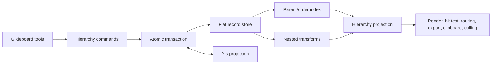

# Glideboard Phase 1 - Hierarchy, Groups, Frames, Lock, and Visibility HLD

- **Status:** Implemented
- **Scope:** `packages/glideline`, `packages/glideboard`, collaboration, and export
- **Roadmap:** [Remaining Gap Analysis and Implementation Roadmap](./remaining-gap-analysis-and-implementation-roadmap.md)
- **Foundation:** [Correctness and Data-Safety Implementation Plan](./correctness-and-data-safety-implementation-plan.md)

## 1. Goal

Add one hierarchy model for nested groups and frames without breaking geometry, order, history, collaboration, clipboard, export, or culling.

Phase 1 includes page/parent ownership, parent-local coordinates, groups, frames, and inherited lock/visibility. Layers, snapping, alignment, page UI, and auto-layout are later phases.

## 2. Architecture



Records stay flat and keyed by ID. `parentId` defines hierarchy; child lists are always derived. The completed transaction and Yjs authority model remains unchanged.

## 3. Key Decisions

| Area | Decision |
| --- | --- |
| Ownership | Every shape has required `parentId: PageId \| ShapeId` |
| Root shapes | Parent directly to a page |
| Shape parents | Only registered containers, initially group or frame |
| Coordinates | `x`, `y`, and `rotation` are parent-local |
| Children | Derived from `childrenByParent`; never stored on containers |
| Ordering | Existing `(index, id)` order, scoped to each parent |
| Validation | Reject missing parents, invalid containers, cycles, and invalid ancestry atomically |
| Legacy `pageId` | Replaced by `parentId` during migration |

Delivery is staged safely: store v5 established the explicit hierarchy envelope, and store v6 migrated nested records to parent-local coordinates before transform composition was enabled.

The world transform is composed through ancestors:

```text
world(shape) = world(parent) * local(shape)
```

Reparenting converts the existing world transform into the new parent's local space, so the shape does not visually move.

## 4. Core Components

| Component | Responsibility |
| --- | --- |
| Hierarchy service | Parent, ancestor, descendant, root, and ordered-child queries; graph validation |
| Transform service | Nested local/world transforms, bounds, outlines, inversion, and subtree cache invalidation |
| Hierarchy projection | Deterministic depth-first paint order and effective lock/visibility |
| Command gateway | Group, ungroup, reparent, lock, and hide as atomic policy-checked commands |
| Container utilities | Group-derived geometry and frame visual/containment behavior |

The transform service remains the only geometry authority for rendering, hit testing, selection, routing, handles, culling, and export.

## 5. Container Behavior

| Behavior | Group | Frame |
| --- | --- | --- |
| Visual | None | Border, title, background, optional clipping |
| Bounds | Derived from descendants | Persisted frame bounds |
| Move/rotate | Transforms descendants | Transforms descendants |
| Resize | Resizes descendants through shape contracts | Changes frame bounds only |
| Drop capture | No | Reparents eligible dropped shapes |
| Delete | Deletes subtree | Delete removes subtree; Remove Frame keeps content |

Grouping requires compatible siblings under one parent. Group and ungroup preserve world geometry and relative order in one transaction.

Group resize must not persist an arbitrary scale matrix. Descendant shape resize contracts handle text, strokes, bindings, and custom geometry.

Frame containment is committed on pointer-up. Entering or leaving a rotated frame must preserve page-space geometry.

## 6. Lock and Visibility

Effective state is inherited from ancestors:

- locked shapes render but cannot be ordinarily selected or mutated;
- hidden shapes do not render, hit-test, route as obstacles, export normally, or enter ordinary selection;
- trusted remote/load/system transactions continue through existing capabilities;
- changing a container invalidates the affected subtree projection.

## 7. Commands

Phase 1 adds these operations to the existing command gateway:

```ts
groupShapes(ids: ShapeId[]): ShapeId
ungroupShapes(ids: ShapeId[]): ShapeId[]
reparentShapes(ids: ShapeId[], parentId: PageId | ShapeId): void
setLocked(ids: ShapeId[], locked: boolean): void
setHidden(ids: ShapeId[], hidden: boolean): void
```

Each command validates the complete candidate graph, computes transformed records, then publishes one store/history/Yjs commit. Selection drill-in is ephemeral editor state, not a document mutation.

## 8. Integration Impact

| Subsystem | Change |
| --- | --- |
| Selection/hits | Container-first selection, explicit drill-in, subtree bounds, effective state |
| Rendering/export | Deterministic tree traversal, composed transforms, visibility, frame clipping |
| Routing/culling | Descendant world geometry and subtree invalidation |
| Clipboard/delete | Preserve hierarchy closure; delete containers as subtrees |
| Collaboration | Validate and project parent changes atomically through existing Yjs records |

## 9. Migration

One store migration will:

1. create or reuse a default page;
2. parent root shapes to that page;
3. preserve existing page-space values in store v5 so the structural migration cannot move content;
4. initialize `isLocked` and `isHidden` to `false`;
5. normalize sibling order per parent;
6. remove legacy `pageId` after successful conversion;
7. validate the full graph before atomic replacement.

Store v6 converts nested coordinates to parent-local values before hierarchy rendering is enabled. It preserves world geometry for rotated shapes and arrows.

Unknown records remain opaque. Failure leaves the source document untouched and returns a typed load report.

## 10. Delivery Slices

1. [Complete] Schema, validation, and default-page migration.
2. [Complete] Nested transforms, hierarchy order, and consumer updates.
3. [Complete] Group commands, selection, resize, clipboard, export, and collaboration.
4. [Complete] Frame tool, containment, resize, clipping, and removal behavior.
5. [Complete] Inherited lock/visibility across commands and projections.

Each slice stays behind a document capability/version gate until migration and multi-client compatibility tests pass.

## 11. Acceptance Gates

- Group then ungroup preserves geometry for rotated nested content.
- Reparenting into or out of a rotated frame preserves world geometry.
- Render, hit test, routing, clipboard, export, collaboration, and culling agree on hierarchy.
- Each structural command creates one undo entry and one Yjs transaction.
- Legacy documents migrate without data loss or visual movement.
- Invalid parents, cycles, and locked mutations fail atomically.
- Hidden descendants cannot appear through alternate UI or API paths.

## 12. Confirmed Interaction Decisions

- Group drill-in: one click selects the group; double-click enters it; Escape exits the group context.
- Frame clipping: off by default and configurable per frame. Clipped content is hidden and cannot be hit-tested outside the frame, but its geometry is unchanged.
- Frame deletion: Delete/Backspace removes the frame and its descendants. **Remove Frame, Keep Content** reparents direct children while preserving world geometry and order.
- Empty groups: group creation requires eligible children; a group is removed automatically when its final child leaves.

All structural operations are atomic and produce one undo entry.
