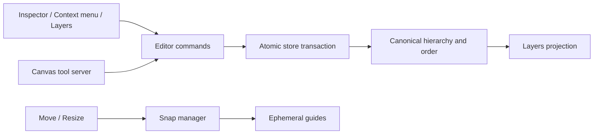

# Glideboard Phase 2 - Arrange, Precision, Snapping, and Layers HLD

- **Status:** Implemented
- **Scope:** `packages/glideline`, `packages/glideboard`, canvas tool server, and demo
- **Roadmap:** [Remaining Gap Analysis and Implementation Roadmap](./remaining-gap-analysis-and-implementation-roadmap.md)

## 1. Architecture

## 2. Commands

- Align edges or centers in page space.
- Distribute centers or equal gaps.
- Match intrinsic width, height, or both.
- Flip around the selection axis.
- Tidy into a row or grid.
- Nudge by page-space pixels.
- Set page position, intrinsic size, and rotation precisely.

Selected ancestors own their subtrees, preventing nested shapes from moving twice. Commands convert page deltas through each shape parent and produce one undo entry.

## 3. Snapping

`SnapManager` owns settings and ephemeral guides:

- object edges and centers;
- equal gaps;
- matching resize dimensions;
- grid intersections;
- zoom-adjusted screen-pixel tolerance;
- Alt bypass;
- separate grid visibility and grid snapping.

Moving subtrees and their ancestors are excluded from snap targets.

## 4. Layers

The layers panel reads the canonical page/parent/order projection and supports:

- page, group, frame, and shape hierarchy;
- selection and Shift multi-selection;
- inline rename;
- sibling reorder;
- drag reparent with engine cycle validation;
- lock and visibility;
- expand/collapse and locate on canvas.

## 5. Product Surfaces

- Inspector: position, size, rotation, aspect lock, reset rotation, arrange controls.
- Context menu: common align, distribute, and flip operations.
- Keyboard: Arrow 1px, Shift+Arrow 10px, platform Select All and existing hierarchy/order shortcuts.
- Canvas tool server: `arrange_shapes`, `set_shape_geometry`, and `reparent_shapes`.
